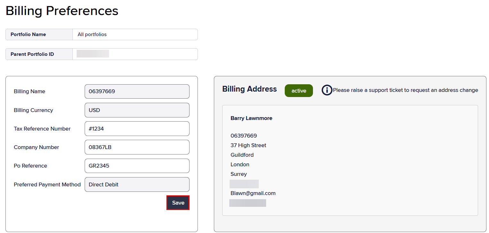

# How to manage billing preferences in Infinity


This read-only page is available only to users with Admin or Finance Infinity roles. For more information, see Integra Roles.


Billing preferences define how the customer's account is billed. They include invoice delivery details, payment methods, and billing information.

## Viewing the billing preferences

To view the Infinity billing preferences:

1. On the left menu, select **Finance**.
2.  Select **Billing Preferences**.

    

    The **Billing Preferences** page contains the following information:

    | Field                    | Description                                                                                                                                                                                                               |
    | ------------------------ | ------------------------------------------------------------------------------------------------------------------------------------------------------------------------------------------------------------------------- |
    | Portfolio Name           | A friendly name for identifying the portfolio, usually the company name followed by a geographic region or project.                                                                                                       |
    | Parent Portfolio ID      | The unique identifier for the super portfolio.                                                                                                                                                                            |
    | Billing Name             | A short friendly description for the business code.                                                                                                                                                                       |
    | Billing Currency         | The three-letter ISO 4217 alphabetic currency code assigned to the portfolio.                                                                                                                                             |
    | Tax Reference            | The unique tax code identifier for the company assigned to the portfolio, which informs the VAT rates that are applied to the invoice. Tax codes, together with business codes, inform how tax is handled on the invoice. |
    | Company ID               | A unique identifier assigned to the company when it is registered with a government authority or regulatory body.                                                                                                         |
    | Order Reference          | The customer's Purchase Order reference that appears on the invoice.                                                                                                                                                      |
    | Preferred Payment Method | 
The customer's preferred payment method, either:
<ul><li>Direct debit</li><li>AWS</li><li>Invoice</li><li>Credit card</li></ul>                                                                                     |
    | Billing Address          | The customer's billing address for invoices and correspondence. This is a read-only field. To edit the address, see Creating a ticket.                                                                                    |

To sort the search results view by column name:

* Select a column name to sort results in ascending (`a-z`; `1-9`) or descending (`z-a`; `9-1`) order.

## Updating the billing preferences

You can update the following fields:

* Tax Reference
* Company ID
* Order Reference

To update the billing preferences:

1.  On the **Billing Preferences** page, replace the existing values as required.

    
2. Select **Save** to commit your changes.
