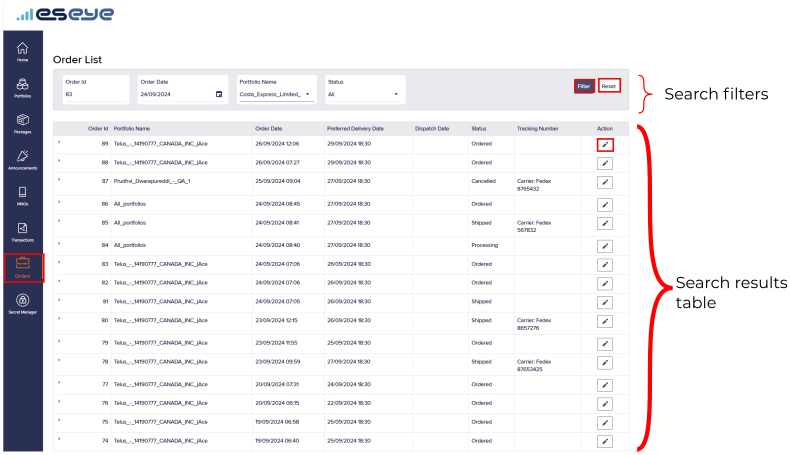
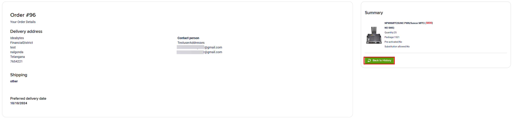
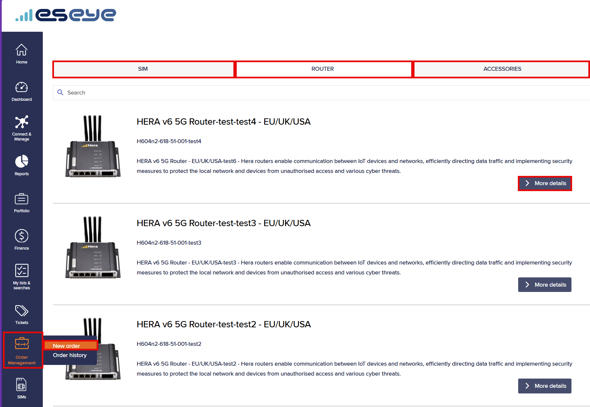
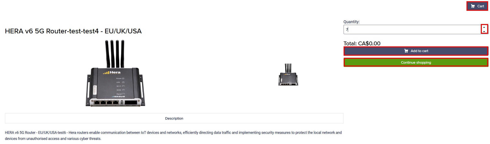
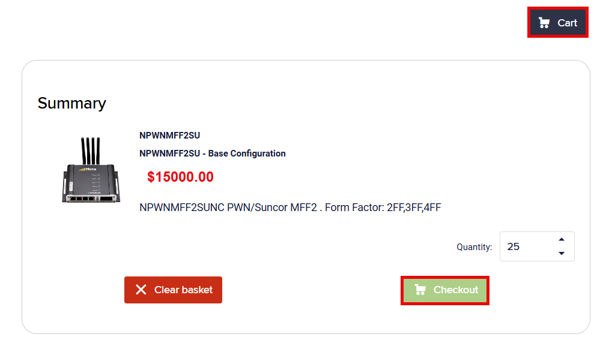
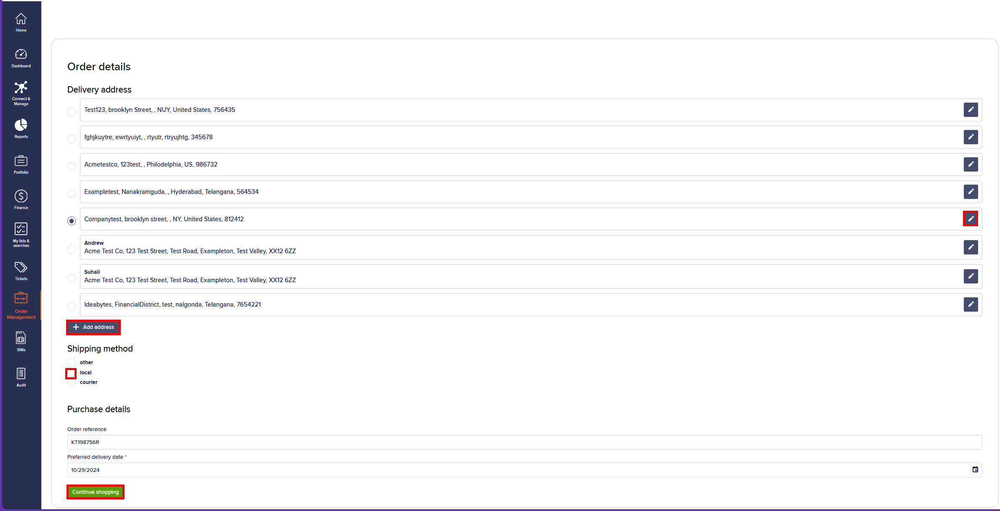
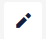
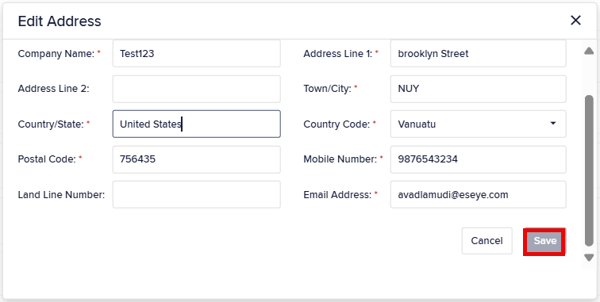

# How to place an order using Infinity

To access orders in Infinity:

* On the left menu, select **Order Management** to display the **Orders List**.

### Order statuses

Infinity creates an order when a customer places an order. Sales Admin can also create an order in Lynx for a PO or other request.

The following table describes the order statuses:

| Status              | Description                                                                                                                                                                                                                                                                                     |
| ------------------- | ----------------------------------------------------------------------------------------------------------------------------------------------------------------------------------------------------------------------------------------------------------------------------------------------- |
| Ordered             | An order has been created in Infinity.                                                                                                                                                                                                                                                          |
| Processing          | Integra is processing the order. For more information, see [Creating an order](how-to-place-an-order-using-infinity.md#creating-an-order).                                                                                                                                                      |
| Shipped             | The Logistics team has shipped the hardware items for the order.                                                                                                                                                                                                                                |
| Returned by Carrier | The shipping carrier returned the package to the sender, merchant, or warehouse.                                                                                                                                                                                                                |
| Delivered           | The order is delivered to the customer who had placed the order.                                                                                                                                                                                                                                |
| Cancelled           | The order is invalid.                                                                                                                                                                                                                                                                           |
| Return Raised       | A return process starts after product delivery for a faulty or defective product.                                                                                                                                                                                                               |
| Return Received     | The seller, merchant, or warehouse has received the returned product.                                                                                                                                                                                                                           |
| Return Completed    | The return has been processed.                                                                                                                                                                                                                                                                  |
| Return Rejected     | 
The seller or merchant declined the return request for one or more reasons:
<ul><li>The product does not meet return criteria.</li><li>The return window has expired.</li><li>The product is non-refundable.</li><li>The customer tampered with or used the product improperly.</li></ul> |

## Viewing orders

To view orders:

1. On the left menu, select **Order Management**.
2. Select **Order history** to view the **Orders List**.


Use the [search filters](how-to-place-an-order-using-infinity.md#filtering-orders) to view orders that match specified criteria.


### Filtering orders

The search filters provide different ways to filter the list of orders and only show results which match the criteria defined in **any** of the applied search filters.

To search for the order that matches the specified criteria:

1.  Enter values for any of the **Search filters**.

    The **Search filters** list contains the following fields:

    | Field    | Description                              |
    | -------- | ---------------------------------------- |
    | Order ID | Enter the order ID.                      |
    | Status   | Select a status from the drop-down list. |
2. Select **Filter** to display the search results matching the specified [search filter attributes](how-to-place-an-order-using-infinity.md#filtering-orders).
3.  Select the **Order ID** to view the **Summary** and **Order details** pages.

    

    Select **Back to History** to return to the **Orders List**.
4. Select **Reset** to clear the search filter values.

### Viewing the search results table

#### Viewing more results

Some pages return results in a continuous list. At the end of the list, select **View More** to see more items.

The **Search results** list contains the following fields:

| Field         | Description                                                                                                                                                                                                                                                                                                                                                                                                                                                                                                                                                                                                                                                                                                                                                                                                           |
| ------------- | --------------------------------------------------------------------------------------------------------------------------------------------------------------------------------------------------------------------------------------------------------------------------------------------------------------------------------------------------------------------------------------------------------------------------------------------------------------------------------------------------------------------------------------------------------------------------------------------------------------------------------------------------------------------------------------------------------------------------------------------------------------------------------------------------------------------- |
| Order ID      | The unique order identifier. An order defines the purchase request, attributes such as billing and shipping addresses, and order items.                                                                                                                                                                                                                                                                                                                                                                                                                                                                                                                                                                                                                                                                               |
| Dispatch Date | The date and time when the order was dispatched.                                                                                                                                                                                                                                                                                                                                                                                                                                                                                                                                                                                                                                                                                                                                                                      |
| Order Date    | The date and time when the order was made.                                                                                                                                                                                                                                                                                                                                                                                                                                                                                                                                                                                                                                                                                                                                                                            |
| Status        | 
The order status, either:
<ul><li><strong>All:</strong> Any status.</li><li><strong>Ordered:</strong> Order placed.</li><li><strong>Processing:</strong> Order is being processed.</li><li><strong>Shipped:</strong> Order shipped.</li><li><strong>Returned by Carrier:</strong> Carrier return.</li><li><strong>Delivered:</strong> Delivered to the customer.</li><li><strong>Cancelled:</strong> Order is invalid.</li><li><strong>Return Raised:</strong> Return requested.</li><li><strong>Return Received:</strong> Returned item received.</li><li><strong>Return Completed:</strong> Return processed.</li><li><strong>Return Rejected:</strong> Return rejected.</li></ul>
For more information, see <a href="how-to-place-an-order-using-infinity.md#creating-an-order">Creating an order</a>.
 |
| Tracking ID   | The order tracking reference.                                                                                                                                                                                                                                                                                                                                                                                                                                                                                                                                                                                                                                                                                                                                                                                         |

To sort the search results view by column name:

* Select a column name to sort the results in ascending (`a-z`; `1-9`) or descending (`z-a`; `9-1`) order.

## Creating an order

You can create an order for configured equipment, new hardware, SIMs, or replacement SIMs.


Orders for SIMs or SIM-enabled hardware, such as a Hera router, must specify a package.


To create an order in Infinity:

1. On the left menu, select **Order Management**.
2.  Select **New order** to view the available products.

    
3. Under the relevant tab, select **More Details** to access the purchasing page.
4. Select the **SIM**, **Router**, or **Accessories** tab.

Enter the required attributes:

| Attribute            | Description                                                                                                                                                                                                              |
| -------------------- | ------------------------------------------------------------------------------------------------------------------------------------------------------------------------------------------------------------------------ |
| **SIM**              |                                                                                                                                                                                                                          |
| Package              | The short unique label with no spaces. Select the package to associate with the SIM.                                                                                                                                     |
| Pre-activated        | 
Determines whether SIMs are active after delivery:
<ul><li><strong>Yes:</strong> Activate SIMs after delivery.</li><li><strong>No:</strong> Activate SIMs using Infinity or the API.</li></ul>                     |
| Substitution allowed | 
Determines whether an alternative is offered when an item is unavailable:
<ul><li><strong>Yes:</strong> Receive a similar available item.</li><li><strong>No:</strong> Wait until the item is available.</li></ul> |
| Quantity             | Number of units charged. Use the scroll bar to select the quantity. The minimum is 25.                                                                                                                                   |
| **Router**           |                                                                                                                                                                                                                          |
| Configuration        | The unique product configuration identifier. Select a configuration to apply it to the router.                                                                                                                           |
| Quantity             | Number of units charged. Use the scroll bar to select the quantity. The minimum is one.                                                                                                                                  |
| **Accessories**      |                                                                                                                                                                                                                          |
| Quantity             | Number of units charged. Use the scroll bar to select the quantity. The minimum is one.                                                                                                                                  |

5.  Select **Add to cart** to add the selected item to the cart.

    
6.  To purchase more items, select **Continue shopping** to return to the **Orders List** page.

    The newly added item appears in the **Orders List** on the **Orders History** page. Infinity assigns a unique order ID. For more information, see [Viewing orders](how-to-place-an-order-using-infinity.md#viewing-orders).
7.  Select the cart to display the **Summary** page.

    
8. Select **Checkout**, and provide payment details to complete the purchase.

### Adding items to an order

To add items to an existing order in Infinity:

1. From the list of items, select **More Details** to access the purchasing page.
2.  Select **Add to Cart** to add the selected item to the cart.

    

    Repeat this procedure to add another item to the cart. For more information, see [Creating an order](how-to-place-an-order-using-infinity.md#creating-an-order).

## Updating orders

You can amend the order for an item to:

* Modify the shipping and delivery address.
* Modify the preferred delivery date.

To update an order in Infinity:

1. From the list of items, select **More Details** to access the purchasing page.
2.  Select the order details icon to display the **Order Details** page.

    
3.  Alongside the delivery address, select the edit icon.

    

    Select **Add Address** to display the **Create New Address** dialog.

    In the **Create New Address** or **Edit Address** dialog, enter or change the address attributes:

    

    #### Create New Address or Edit Address fields

    | Field           | Description                                                                                                                            |
    | --------------- | -------------------------------------------------------------------------------------------------------------------------------------- |
    | First Name      | The user's given name.                                                                                                                 |
    | Last Name       | The user's surname.                                                                                                                    |
    | Company Name    | The company that is located at this portfolio address.                                                                                 |
    | Address Line 1  | The street address (including the building number and street name) or the P.O. Box.                                                    |
    | Address Line 2  | The apartment or suite number, building name, or floor.                                                                                |
    | Town/City       | The town or city where the portfolio address is located.                                                                               |
    | Country/State   | The county, state, or province where the portfolio address is located.                                                                 |
    | Country Code    | The ISO 3166-1 alpha-2 standard identifier, representing countries, dependent territories, and special areas of geographical interest. |
    | Postal Code     | A short alphanumeric string that identifies a mail delivery area.                                                                      |
    | Mobile Number   | The user's full mobile phone number, including the country code, without leading zeros or spaces.                                      |
    | Landline Number | The user's full fixed line phone number, including the country code, without leading zeros or spaces.                                  |
    | Country Code    | The country code for the portfolio address.                                                                                            |
    | Email Address   | A valid business email address, where the user receives emails.                                                                        |
4. Select **Save** to apply the changes.
5. To modify the shipping method, select one of the following:
   * **other** — Alternative or specialised shipping methods, such as freight or bulk shipping.
   * **local** — Deliveries within a region or city.
   * **courier** — Deliveries through a professional courier company, such as DHL or FedEx.
6.  To modify purchase details, enter values for the following fields:

    | Field                   | Description                                                      |
    | ----------------------- | ---------------------------------------------------------------- |
    | Order Reference         | A customer-supplied reference.                                   |
    | Preferred delivery date | The date by which the customer is expected to receive the order. |
7. Select **Continue Shopping** to return to the purchasing page.

## Deleting orders

To delete an order in Infinity:

1. From the list of items, select **More Details** to access the purchasing page.
2.  Select the cart icon to display the **Summary** page.

    
3. Select **Clear basket** to remove the item from the shopping cart.
