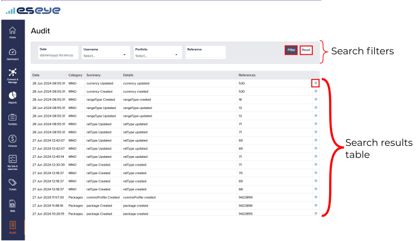
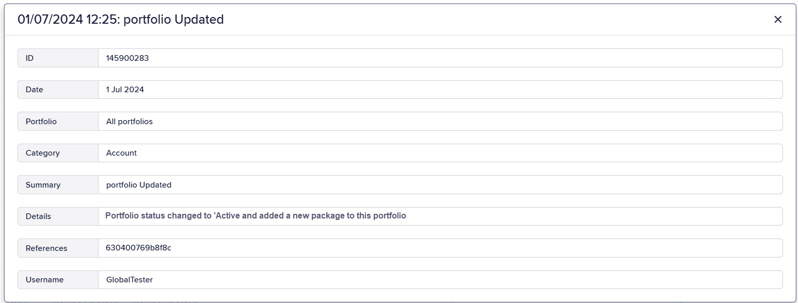

# About Infinity audit

The Audit Log allows you to search and review records of every action taken and every change made to all SIMs, portfolios, packages associated with your user account. Overall, Infinity audit feature provides valuable insights into your device usage, helping you optimize costs, enhance security, and ensure regulatory compliance.

The purpose of having an audit log is to provide a central repository for all important actions and events that have occurred under your portfolio. This is to ensure we are compliant with security best practices whilst promoting transparency.

#### Benefits of Audit Log

* Users can access tamper-proof event records​
* Allows filtering of events by Portfolio.
* Enables filtering of events by Username.
* Centralizes all audit categories into one location.

To access Infinity Audit:

On the left menu, select Audit to display your audit records.

## Viewing Alerts

### Applying search filters

The search filters provide different ways to filter the list of audits and only show results which match the criteria defined in **all** of the applied search filters.

To search for the audit record that matches the specified criteria:

1.  Enter values for any of the Search filter attributes.

    #### About Search filter attributes

    | Field     | Description                                                                |
    | --------- | -------------------------------------------------------------------------- |
    | Date      | Enter the date in the format `dd/mm/yyyy` and timestamp format `hh:mm:ss`. |
    | Username  | Select from the About Infinity audit drop-down list.                       |
    | Portfolio | Select from the Portfolio drop-down list.                                  |
    | Reference | Enter the Reference.                                                       |
2. Select Filter to display the Search results list matching the specified Search filter attributes.
3. Select Reset to clear the specified values from the search filters to display the Viewing search results list.

### Viewing search results list

**Viewing more results**

Some pages return results in a continuous list. Select View More at the end of the list to see more items.

The Search Results list contain the following fields:

| Field     | Description                                                                                                                                                         |
| --------- | ------------------------------------------------------------------------------------------------------------------------------------------------------------------- |
| Date      | The date and time of the change, formatted as `dd/mm/yyyy hh:mm:ss`.                                                                                                |
| Category  | The list of audit categories.                                                                                                                                       |
| Summary   | A short summary about the change made to the audit record.                                                                                                          |
| Details   | Explanation about the audit change.                                                                                                                                 |
| Reference | The [how-to-view-and-manage-sim-details.md](../sim-estate-management/how-to-view-and-manage-sim-details.md "mention") of the SIM on which the user made the change. |

### Viewing audit record details

To view additional details about the audit record:

1. From the Search Results list, select alongside the preferred Audit Record row.
2.  An example of a detailed view of audit record is as shown below:

    

    The audit record contains the following fields.

    | Field     | Description                                                                                                                                                         |
    | --------- | ------------------------------------------------------------------------------------------------------------------------------------------------------------------- |
    | ID        | The audit record identifier.                                                                                                                                        |
    | Date      | The date and time of the change, formatted as `dd/mm/yyyy hh:mm:ss`.                                                                                                |
    | Portfolio | A friendly name for identifying the portfolio, usually the company name followed by a geographic region or project.                                                 |
    | Category  | The unique audit record category identifier. An audit record category may describe a service item, MNO, tariff, or package.                                         |
    | Summary   | A short summary about the change made to the audit record.                                                                                                          |
    | Details   | Explanation about the audit change.                                                                                                                                 |
    | Reference | The [how-to-view-and-manage-sim-details.md](../sim-estate-management/how-to-view-and-manage-sim-details.md "mention") of the SIM on which the user made the change. |
    | Username  | Name of the user that made the change.                                                                                                                              |
