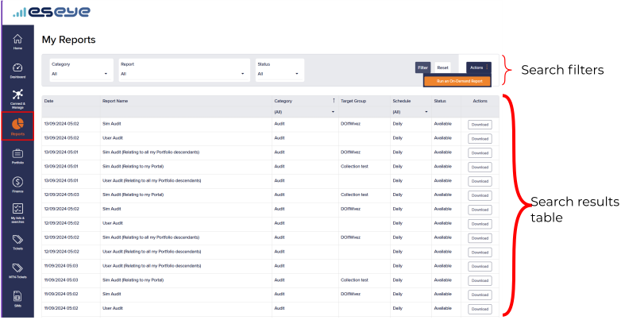
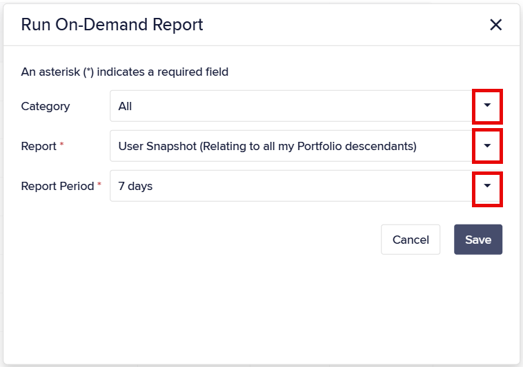

# About Infinity reports

Infinity provides preconfigured reports. You can:

* [View reports](about-infinity-reports.md#viewing-infinity-reports).
* [Download reports](about-infinity-reports.md#downloading-reports).
* [Generate on-demand reports](about-infinity-reports.md#generating-on-demand-reports).

For regular reports, see [how-to-manage-infinity-reports.md](how-to-manage-infinity-reports.md "mention").

To access Infinity reports:

1. On the left menu, select **Reports**.

<figure><figcaption></figcaption></figure>

1.  Select **My Reports**.

    

## Viewing Infinity reports

The **Reports** list contains the following fields:

| Field        | Description                                                                                                                                                                                                                                                         |
| ------------ | ------------------------------------------------------------------------------------------------------------------------------------------------------------------------------------------------------------------------------------------------------------------- |
| Date         | The date and time the report finished generating.                                                                                                                                                                                                                   |
| Report Name  | A friendly name for identifying the report, usually the company name followed by a geographic region or project. For example: SIM Usage Total, SIM Location, Subscriber Activity Snapshot, Estate, APN Modification.                                                |
| Category     | The unique report item category identifier. A report item category may describe a Supernet, Hardware, Subscriber, APN, or Device.                                                                                                                                   |
| Target Group | The group that the report is run against. For example, SIM Usage (Report Name) within the Category Device Type uses the SIM Collections as the Target Group. This means the report will display the data usage of all the SIMs within the specified SIM collection. |
| Schedule     | The unique report schedule period identifier, which identifies the set interval at which reports are automatically generated.                                                                                                                                       |
| Status       | The report status.                                                                                                                                                                                                                                                  |
| Action       | Select **Download** to view the contents of the selected report in CSV format.                                                                                                                                                                                      |

#### Schedule periods

| PeriodId | Description                  |
| -------- | ---------------------------- |
| 0        | On demand                    |
| 1        | Every 15 minutes             |
| 2        | Every 30 minutes             |
| 3        | Every 45 minutes             |
| 4        | Hourly                       |
| 5        | Every 2 hours                |
| 6        | Every 3 hours                |
| 7        | Daily                        |
| 8        | Weekly                       |
| 9        | Monthly                      |
| 10       | Quarterly (every 3 months)   |
| 11       | Bi-Annually (every 6 months) |
| 12       | Annually                     |
| 13       | Every 10 hours               |

#### Report statuses

| Status    | Description                                       |
| --------- | ------------------------------------------------- |
| All       | All reports, regardless of status.                |
| Available | The report exists and can be downloaded.          |
| Queued    | The request to generate the report has been sent. |
| Error     | The report failed to generate.                    |

### Filtering the displayed reports

Use filters to refine the **My Reports** list.

To filter the My Reports list:

1. On the **My Reports** page, select a **Category** to constrain the available reports.
2.  Select the **Report type** that you want to view.

    

You can only view reports that your permissions allow.

3. Select a **Status** to filter by report status.
4. Select **Filter** to apply your constraints.
5. Select **Reset** to clear the filter constraints.


Also see [how-to-sort-and-navigate-records.md](../sim-estate-management/how-to-sort-and-navigate-records.md "mention").


## Downloading reports

To download a report:

*   On the **My Reports** page, in the **Actions** column, select **Download** alongside the report.

    The report downloads to your local **Downloads** folder.

## Generating on-demand reports

You can instantly generate a report.

To generate an on-demand report in Infinity:

1.  On the **My Reports** page, select the **Actions** button, to the right of **Filter**, then select **Run an On-Demand report**.

    
2. Select a **Category** to constrain the available reports.
3.  Select the **Report** that you want to generate.

    

You will only see those reports that you have permission to view.

4.  Define a **Report Period** parameter to restrict how much information the report includes.

    

Reports display information based on the previous reporting period, which may not contain up-to-date or accurate information for the current point in time.

5.  Select **Save** to generate the report.

    If the report generates successfully, a green notification appears:

    > The report has been queued for creation and will be processed as soon as possible.

    If you encounter errors, contact Support.
