# Audit reports

Infinity audit reports give you visibility into user interactions with Infinity reports.

Each report header uses this format:

.png>)`REPORTTITLE-YYYY-MM-DD-FILEID-GROUPING`

### About header row attributes

| Field        | Description                                                                                  |
| ------------ | -------------------------------------------------------------------------------------------- |
| Report Title | A friendly description for identifying how a report is formatted.                            |
| Date         | The date and time of the change, formatted as `dd/mm/yyyy hh:mm:ss`.                         |
| File ID      | The unique file identifier.                                                                  |
| Grouping     | Organising the data of a report by categories such as Portal, Portfolio, Invoice, or Device. |

The reports include:

* **Account Audit Report (PDF)**. For more information, see [Viewing logging details](audit-reports.md#viewing-logging-details).
* **Account Snapshot Report (CSV)**. For more information, see [Viewing SIM card estate details](audit-reports.md#viewing-sim-card-estate-details).
* **Finance Audit Report**. For more information, see [Viewing billing information details](audit-reports.md#viewing-billing-information-details).
* **Logistics Audit Report**. For more information, see [Viewing order details](audit-reports.md#viewing-order-details).
* **Packages Audit Report**. For more information, see [Viewing package details](audit-reports.md#viewing-package-details).
* **Messaging Audit Report**. For more information, see [Viewing messaging details](audit-reports.md#viewing-messaging-details).
* **Networking Audit Report**. For more information, see [Viewing networking details](audit-reports.md#viewing-networking-details).
* **SIM Audit Report**. For more information, see [Viewing SIM auditing details](audit-reports.md#viewing-sim-auditing-details).
* **SIM Audit Log**. For more information, see [Viewing audit log for each SIM](audit-reports.md#viewing-audit-log-for-each-sim).
* **SIM Estate Audit Log**. For more information, see [Viewing SIM audit log for the estate](audit-reports.md#viewing-sim-audit-log-for-the-estate).
* **Account Statement Report**. For more information, see [Viewing billing account details](audit-reports.md#viewing-billing-account-details).

## Auditing ICC

The ICC Audit report offers a chronological record of actions and changes related to SIMs across various portfolios. It records user actions, portfolio modifications, SIM activations, provisioning requests, and IP address assignments.

It enables tracking and auditing of ICC lifecycle events and management activities. You can monitor ICC configuration changes and identify who made them, when they occurred, and what changed.

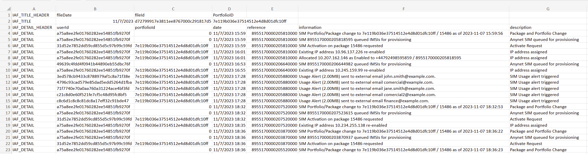

It displays the ICC Audit attributes.

### ICC Audit attributes

| Field        | Description                                                                                                                                                                                                                                                      |
| ------------ | ---------------------------------------------------------------------------------------------------------------------------------------------------------------------------------------------------------------------------------------------------------------- |
| User ID      | The unique user identifier. The user represents the human user or workload that can use the current portfolio. Users are assigned a type, which grants permissions and restricts access to system functions.                                                     |
| Portfolio ID | The unique portfolio identifier. The portfolio is the overall customer account that contains user, package, network and SIM information, and includes details such as linked addresses, contact phone numbers, tax information and billing currency information. |
| Date         | The date and time of the change, formatted as `dd/mm/yyyy hh:mm:ss`.                                                                                                                                                                                             |
| Reference    | The ICCID of the SIM on which the user made the change.                                                                                                                                                                                                          |
| Information  | The specific data or details regarding the ICCID.                                                                                                                                                                                                                |
| Description  | Report template description. This can contain customer-related information, such as an AnyNet SIM queued for provisioning, an IP address assignment, or a SIM usage alert.                                                                                       |

## Tracking APN changes

The APN Modification Report tracks changes made to APNs within a specified time period. It helps monitor and audit APN configurations.

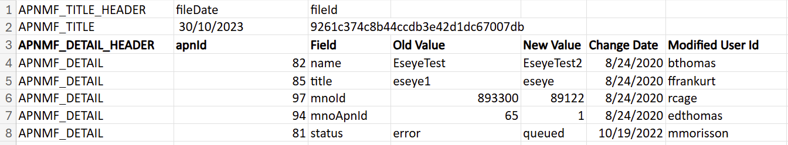

It displays the APN Modification attributes.

For developer purposes, see Billing snapshot definition.

### APN Modification attributes

| Field            | Description                                                                                                                       |
| ---------------- | --------------------------------------------------------------------------------------------------------------------------------- |
| APN ID           | The unique APN identifier.                                                                                                        |
| Field            | Lists all the APN parameters. For example, name, title, mnoId, mnoApnId, status and so on.                                        |
| Old Value        | The previous field input before it was modified.                                                                                  |
| New Value        | The updated input.                                                                                                                |
| Change Date      | The date and time that the object was modified by a user.                                                                         |
| Modified User Id | The unique identifier of the user who created or changed the object. If the database updates the object, the modifiedUserId is 0. |

## Viewing APN configurations

The APN Snapshot report provides a comprehensive view of all the current APN configurations at a specific point in time, offering a detailed overview including MNOID, status etc. across the network.

## Viewing logging details

The Account Audit Report tracks Infinity access and who is responsible for received notifications. It displays:

* Login date and time stamp, or the date and time you accessed your account.
* Name of the user who has accessed their account.

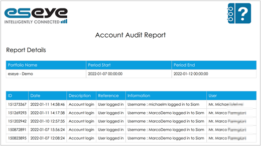

### About Account Audit Report attributes

| Field          | Description                                                                                                                                                                                               |
| -------------- | --------------------------------------------------------------------------------------------------------------------------------------------------------------------------------------------------------- |
| Portfolio Name | The portfolio name associated with the user account.                                                                                                                                                      |
| Period Start   | The initial date range on which the reports were first generated. For more information, see [how-to-manage-infinity-reports.md](how-to-manage-infinity-reports.md "mention").                             |
| Period End     | The final date range before which, the reports were generated entered in the filter criteria. For more information, see [how-to-manage-infinity-reports.md](how-to-manage-infinity-reports.md "mention"). |
| ID             | Portfolio ID associated with the user account.                                                                                                                                                            |
| Date           | Date when this report was generated.                                                                                                                                                                      |
| Reference      | Summary of user activity.                                                                                                                                                                                 |
| Information    | Description of user activity.                                                                                                                                                                             |
| User           | Name with which the user registered on the Infinity interface. For more information, see [#accessing-the-infinity-interface](../#accessing-the-infinity-interface "mention").                             |

To find the report in Infinity:

1.  From the menu, select **Activity** > **Reports** to display the **Reports** page.

    The Reports page displays a history of the generated reports.

    

    Select the report, then select an export or print option.
2. Alongside **Account Audit Report**, select the preferred export icon.

## Viewing SIM card estate details

The Account Snapshot Report provides an overview of the estate data consumed by your SIMs. It displays:

* Portfolio details, including active users, current packages, and total data usage.
* The person accessing the estate.

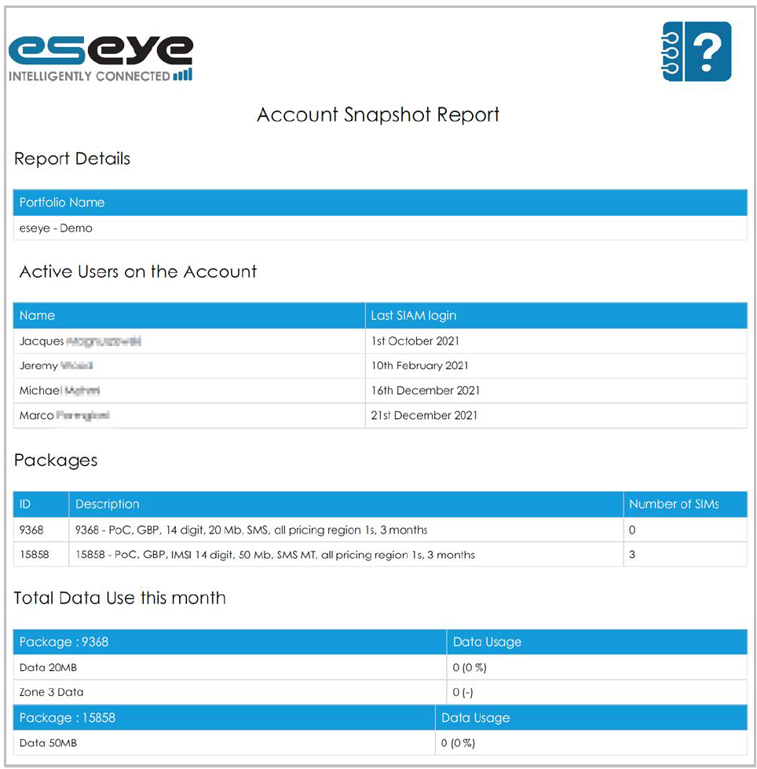

### About Account Snapshot Report attributes

| Field                       | Description                                                                              |
| --------------------------- | ---------------------------------------------------------------------------------------- |
| Portfolio Name              | The portfolio name associated with the user account.                                     |
| Active Users on the Account | Name and time of the user who has accessed the estate report.                            |
| Packages                    | Details of the package. For more information, see About viewing packages using Infinity. |
| Total Data Use this Month   | The data used by the specific package.                                                   |

## Viewing billing information details

The Finance Audit Report helps you understand your agreed contract. It displays:

* Current costs across your entire SIM card estate, or per SIM card.
* Date and time stamps when the user made changes to billing information, such as password and address updates, or payment method approval and so forth.

### Viewing billing overview for your SIM estate

The first bill page displays:

* A summary of charges.
* The total amount, including VAT.
* Eseye payment information.

Print this first page to retain the billing overview.

If your estate manages fewer than 1,000 SIMs, the bill includes individual SIM costs.

If your estate manages more than 1,000 SIMs, use **Detailed Invoice** for individual SIM records.

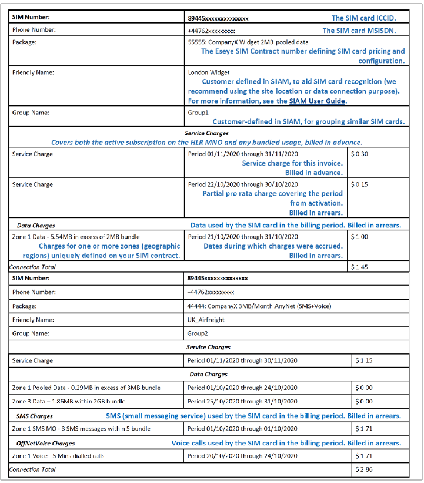

If pooled usage applies to the invoice, the billing report displays data charges. If usage exceeds the pooled allowance, the bill details data, SMS, or voice charges. For more information, see Understanding pooling.

The CSV file lists further invoice details, such as the package that incurred the charge.

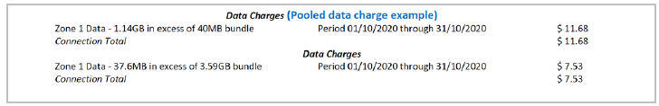

To generate a single type of report in Infinity:

1. On the left menu, select **Reports** > **View / Download**.
2. At the top right, select **Actions** > **Run a single report**.
3. Select a **Reporting Profile** or **Portfolio** report.
4.  Select the report, then select **OK**.

    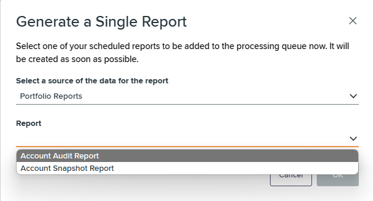

To schedule a single type of report in Infinity:

1. Under **Select a source of the data for the report**, review the selected report type.
2.  From the **Report** drop-down list, select the portfolio report type.

    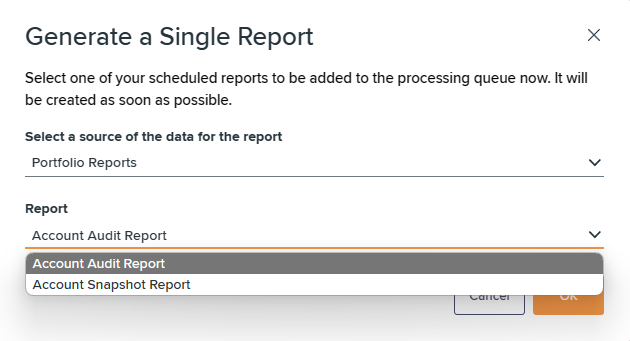


Infinity queues the report for creation and processes it as soon as possible.


## Viewing order details

The Logistics Audit Report displays:

* Date and time stamps of user activity on an order, such as:
  * When the order is placed.
  * When shipping is prepared or dispatched.

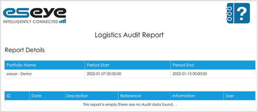

To find the report in Infinity:

1.  From the menu, select **Activity** > **Reports** to display the **Reports** page.

    The Reports page displays a history of the generated reports.

    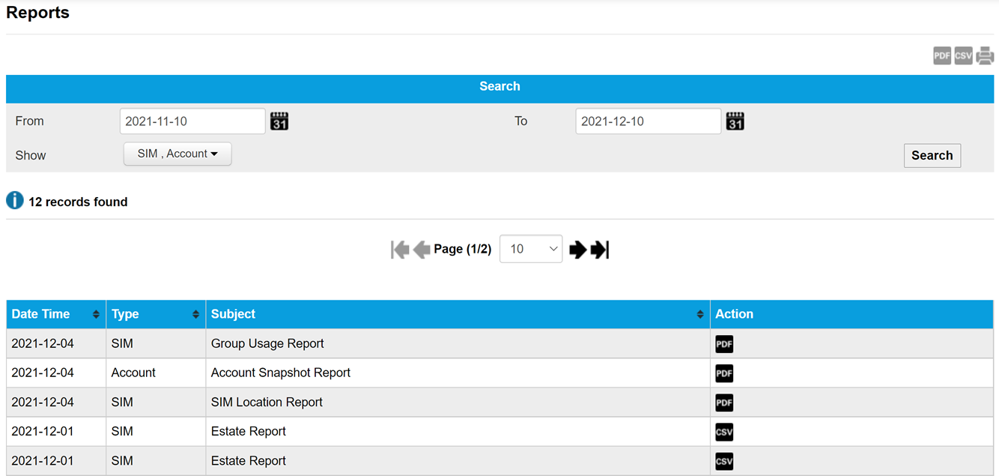

    Select an export or print option.
2. Alongside **Logistics Audit Report**, select the preferred export option.

## Viewing package details

The Packages Audit Report displays:

* Date and time stamps when the user has signed the Service Contract form that is uploaded on a SIM package.
* Name of the user responsible for the change.

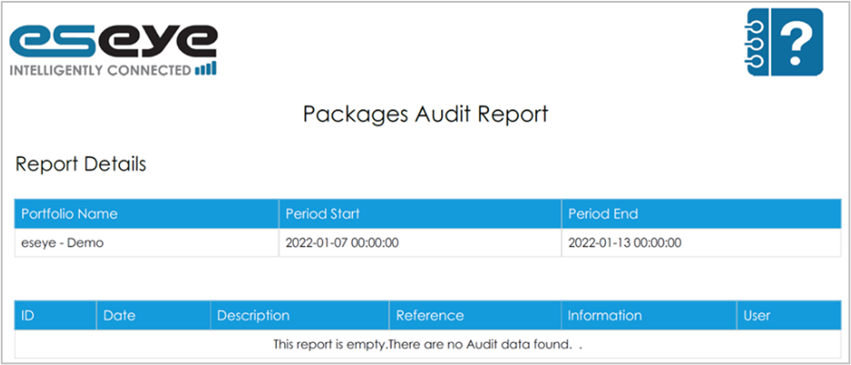

To find the report in Infinity:

1.  From the menu, select **Activity** > **Reports** to display the **Reports** page.

    The Reports page displays a history of the generated reports.

    

    Select the report, then select an export or print option.
2. Alongside **Packages Audit Report**, select the preferred export icon.

## Viewing reporting profile details

The Profiles Audit Report summarises Reporting Profile activity. For more information, see [how-to-manage-infinity-reports.md](how-to-manage-infinity-reports.md "mention").

It displays:

* Date and time stamps when the user created or edited the reporting profile.

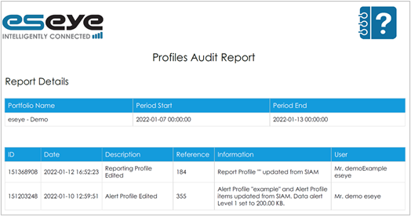

To find the report in Infinity:

1.  From the menu, select **Activity** > **Reports** to display the **Reports** page.

    The Reports page displays a history of the generated reports.

    

    Select the report, then select an export or print option.
2. Alongside **Profiles Audit Report**, select the preferred export icon.

## Viewing messaging details

The Messaging Audit Report displays:

* Date and time stamps of user activity on the SMS API or against an individual SIM card such as:
  * Password changes
  * MO POST URL changes

To generate a single type of report in Infinity:

1. On the left menu, select **Reports** > **View / Download**.
2. At the top right, select **Actions** > **Run a single report**.
3. Select a **Reporting Profile** or **Portfolio** report.
4.  Select the report, then select **OK**.

    

To find the report in Infinity:

1.  From the menu, select **Activity** > **Reports** to display the **Reports** page.

    The Reports page displays a history of the generated reports.

    

    Select the report, then select an export or print option.
2. Alongside **Messaging Audit Report**, select the preferred export icon.

## Viewing networking details

The Networking Audit Report displays:

* Visibility of network changes to help assess the impact of changes on devices.
* Assigned IP addresses.

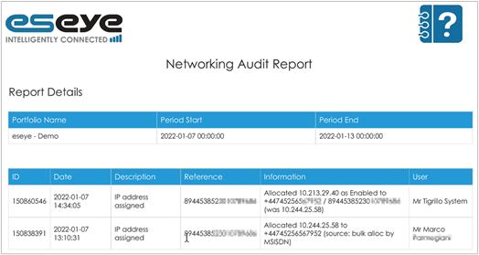

To find the report in Infinity:

1.  From the menu, select **Activity** > **Reports** to display the **Reports** page.

    The Reports page displays a history of the generated reports.

    

    Select the report, then select an export or print option.
2. Alongside **Networking Audit Report**, select the preferred export icon.

## Viewing SIM auditing details

The SIM Audit Report helps you track high-usage SIMs and limit costs. It displays:

* Details of alert triggers on specified SIMs and their recipients.
* The person responsible for using high-usage SIMs.

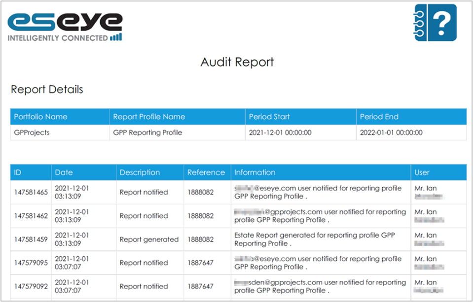

To find and generate the report in Infinity:

1.  From the menu, select **Activity** > **Reports** to display the **Reports** page.

    The Reports page displays a history of the generated reports.

    

    Select the report, then select an export or print option.
2. Alongside **SIM Audit Report**, select the preferred export icon.

## Viewing audit log for each SIM

The SIM Audit Log helps you track the details of every action implemented on a selected SIM. It displays:

* Description of the action taken.
* Date stamp of the action taken.
* Name of the user who acted on the SIM.
* Reference ID of the action.
* Additional information about the action.

For example, a new SIM audit log entry is added when a SIM is queued for provisioning or for every usage alert that is triggered on the SIM.

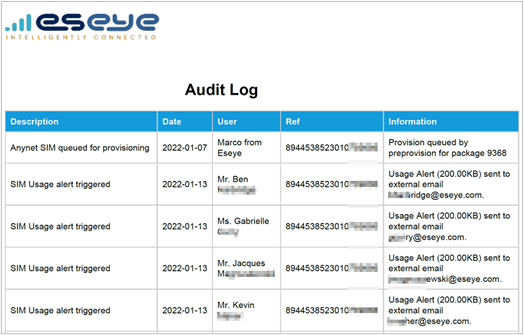

## Viewing SIM audit log for the estate

The SIM Estate Audit Log helps you track the details of every action implemented on a selected SIM estate. It displays:

* Description of the action taken on the estate.
* Date stamp of the action taken on the estate.
* Name of the user who acted on the SIM estate.
* Reference ID of the action taken on the estate.
* Additional information about the action on the SIM estate.

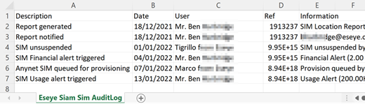

## Viewing billing account details

The Account Statement Report helps you view your billing statement. It displays:

* Outstanding balance you owe to the Eseye.


Your connectivity stops functioning when bills are unpaid.


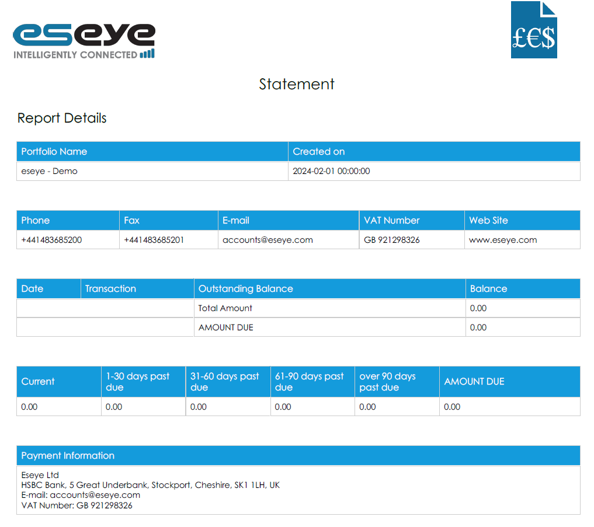

## Reviewing ICC changes

The ICC Audit report provides a chronological log of actions and changes associated with SIMs across various portfolios. It records user activities, portfolio updates, SIM activations, provisioning requests, and IP address allocations.

It enables comprehensive tracking and auditing of ICC lifecycle events and management processes.

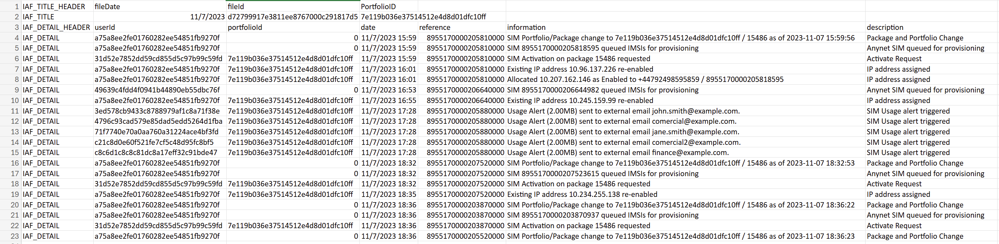

It displays the ICC Audit attributes.

### ICC Audit attributes

| Field        | Description                                                                                                                                                                                                                                                                                 |
| ------------ | ------------------------------------------------------------------------------------------------------------------------------------------------------------------------------------------------------------------------------------------------------------------------------------------- |
| User ID      | The unique user identifier. The user represents the human user or workload that can use the current portfolio. Users are assigned a type, which grants permissions and restricts access to system functions.                                                                                |
| Portfolio ID | The unique portfolio identifier. The portfolio is the overall customer account that contains user, package, network and SIM information, and includes details such as linked addresses, contact phone numbers, tax information and billing currency information.                            |
| Date         | The date and time of the change, formatted as `dd/mm/yyyy hh:mm:ss`.                                                                                                                                                                                                                        |
| Reference    | The ICCID of the SIM on which the user made the change.                                                                                                                                                                                                                                     |
| Information  | The specific data or details regarding the ICCID.                                                                                                                                                                                                                                           |
| Description  | Report template description. Notes about the report template, for internal use only. The report template description can contain details or provide other customer-related information. For example: - Anynet SIM queued for provisioning - IP address assigned - SIM Usage alert triggered |
