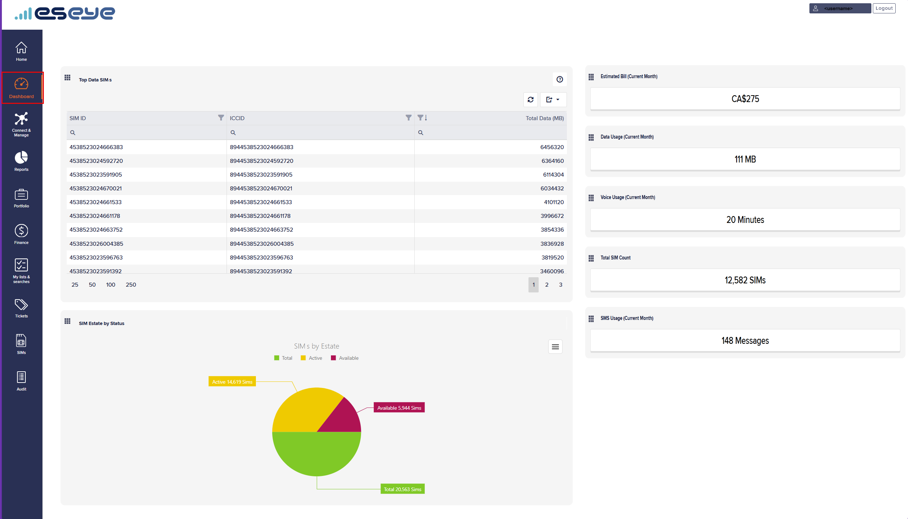

# How to display the Infinity Dashboard

The Infinity dashboard displays high-level metrics, including:

* How many Active, Available, Suspended, and Total SIMs you have.
* Business performance snapshot, using SIM data.

## Viewing the Infinity dashboard

To view the Infinity dashboard:

* On the left menu, select **Dashboard**.

<figure><figcaption></figcaption></figure>

## Viewing help information

To view tooltips:

*   At the top right of a gadget, select the help icon to view helpful information.

    

## Preconfigured gadgets

The dashboard includes these gadgets:

* **Top Data SIMs**
* **SIM Estate by Status**
* **Estimated Bill**
* **Data Usage**
* **Voice Usage**
* **Total SIM count**
* **SMS Usage**
