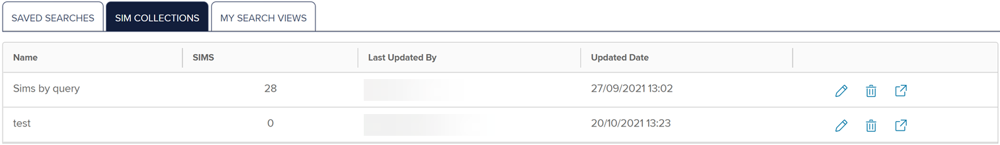
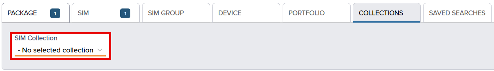
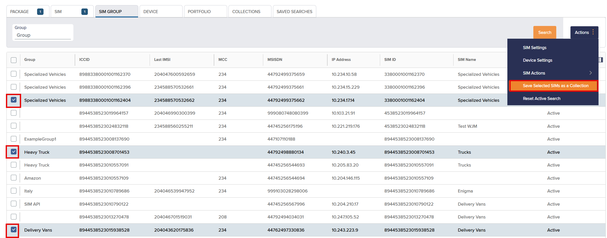
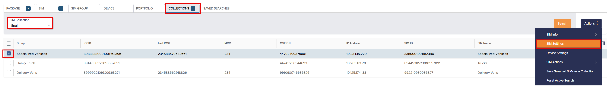
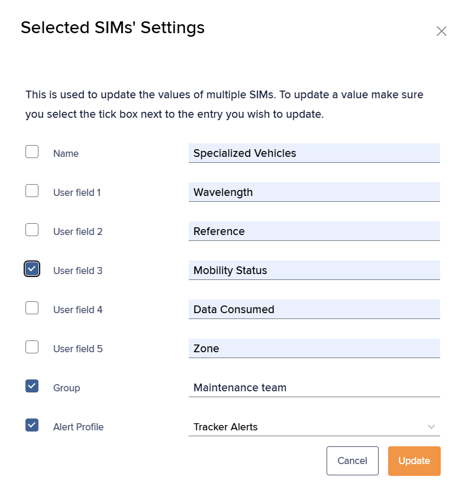

# About SIM Collections

Collections organise SIMs based on specific criteria or attributes, either as static (manually updated) or dynamic (automatically updated) groups.

Use SIM collections to:

*   Generate reports or monitor a group of SIMs.

    For example, high-usage or country-specific SIMs.
*   Apply bulk actions to a group of SIMs, saving time.

    For example, activate, deactivate, or update multiple SIMs.
*   Track and manage a group of SIMs by lifecycle stage.

    For example, newly activated or suspended SIMs.

## Viewing SIM collections

To view your SIM collections:

1. On the left menu, select **My lists & searches**.

.png>)

1.  The My Lists and Searches page appears.

    
2.  Select **SIM Collections**.

    

    The SIM Collections list contains the following fields:

    | Field           | Description                                                                                                                                                                                                                                                                                                                                                                                                                                                                                                    |
    | --------------- | -------------------------------------------------------------------------------------------------------------------------------------------------------------------------------------------------------------------------------------------------------------------------------------------------------------------------------------------------------------------------------------------------------------------------------------------------------------------------------------------------------------- |
    | Name            | The SIM collection name.                                                                                                                                                                                                                                                                                                                                                                                                                                                                                       |
    | Portfolio       | 
Displays the following:
<ul><li><strong>Portfolio Name</strong> – A friendly name for identifying the portfolio, usually the company name followed by a geographic region or project.</li><li><strong>Portfolio ID</strong> – The unique portfolio identifier. The portfolio is the overall customer account that contains user, package, network and SIM information, and includes details such as linked addresses, contact phone numbers, tax information and billing currency information.</li></ul> |
    | SIMs            | The total number of SIMs in the SIM collection.                                                                                                                                                                                                                                                                                                                                                                                                                                                                |
    | Last Updated By | The username of the user who most recently made changes to the SIM collection.                                                                                                                                                                                                                                                                                                                                                                                                                                 |
    | Updated Date    | The date and timestamp when the SIM collection was most recently changed.                                                                                                                                                                                                                                                                                                                                                                                                                                      |

## Updating a SIM collection

You can change the SIM collection name.

To update the SIM collection:

1. On the **My lists and searches** page, on the **SIM collections** tab, select .png>) alongside the collection you want to update.
2. Type a new name for the SIM collection.
3. Select **Save** to commit your change.

## Deleting a SIM collection

To delete the SIM collection:

1.  On the **My lists and searches** page, on the **SIM collections** tab, select .png>) alongside the collection you want to delete.

    A confirmation box appears.
2. Select **Confirm** to remove the SIM collection.

## Viewing SIMs by SIM collection

To view SIMs by SIM collection:

1. On the left menu, select **Connect & Manage**.

<figure><figcaption></figcaption></figure>

1.  Select **SIM and Device Search** to view the search lists.

    
2.  On the **SIM and Device Search** page, select the **Collections** tab.

    The **SIMs by SIM Collections** list contains the following fields:

    | Field      | Description                                                                                                                                                                                                                                                                                                                                                                                                                                                                                                                                                        |
    | ---------- | ------------------------------------------------------------------------------------------------------------------------------------------------------------------------------------------------------------------------------------------------------------------------------------------------------------------------------------------------------------------------------------------------------------------------------------------------------------------------------------------------------------------------------------------------------------------ |
    | Group      | The tag or label for a set of SIMs, to help identify and categorise the SIMs.                                                                                                                                                                                                                                                                                                                                                                                                                                                                                      |
    | ICCID      | The unique Integrated Circuit Card Identifier for the SIM or eUICC SIM profile.                                                                                                                                                                                                                                                                                                                                                                                                                                                                                    |
    | Last IMSI  | The most recent International Mobile Subscriber Identity (IMSI) used to authenticate the SIM on the network.                                                                                                                                                                                                                                                                                                                                                                                                                                                       |
    | MCC        | The unique three-digit ISO 3166-1 numeric Mobile Country Code, used to identify the country where the mobile network exists.                                                                                                                                                                                                                                                                                                                                                                                                                                       |
    | MSISDN     | The Mobile Station International Subscriber Directory Number (MSISDN) is a unique identifier for a mobile phone number in telecommunications. It includes the country code, mobile network code, and subscriber number. It allows routing of calls and messages to the correct device. The MSISDN contains between 8 and 18 numeric digits. It can include the `+` country code identifier, for example, `+441234567890`.                                                                                                                                          |
    | IP Address | One or more IPv4 addresses associated with the IMSI.                                                                                                                                                                                                                                                                                                                                                                                                                                                                                                               |
    | SIM ID     | The unique Eseye SIM reference number, printed on the physical SIM card.                                                                                                                                                                                                                                                                                                                                                                                                                                                                                           |
    | SIM Name   | A unique customer-defined tag or label for the SIM. It helps identify and organise the SIM.                                                                                                                                                                                                                                                                                                                                                                                                                                                                        |
    | SIM Status | 
The current SIM status, either:
<ul><li><strong>Available</strong> – The SIM or IMSI, for multi-IMSI SIMs, exists on a customer account and is assigned a package. No charges are incurred. The customer must request activation before using the SIM.</li><li><strong>Active</strong> – The SIM or IMSI, for multi-IMSI SIMs, is active on the network and ready for use. The SIM or IMSI is charged standard service and usage rates.</li></ul>
For more information, see <a href="how-to-change-sim-states.md">Understanding the SIM lifecycle</a>.
 |

### Filtering SIMs by collection

To filter the displayed SIMs by collection:

1. On the **SIM and Device Search** page, select the **Collections** tab.
2. Use the **SIM Collection** drop-down list to select the relevant collection.

To search all collections, select **No selected collection**.

The list filters immediately.

## Creating a SIM collection for a group of SIMs

You can assign one or more SIMs to a collection to easily access their details.

To create a SIM collection for a group of SIMs:

1. On the left menu, select **Connect & Manage**.

<figure><figcaption></figcaption></figure>

1.  Select **SIM and Device Search** to view the search lists.

    
2. On the **SIM and Device Search** page, select the **Collections** tab to view the SIMs by SIM collection.
3.  Select the checkbox alongside one or more displayed SIMs that you want to add to the new SIM collection.

    
4. At the top right, select **Actions** > **Save Selected SIMs as a Collection** to view the **Save a SIM Collection** dialog.
5. In the **Collection Name** box, type a unique collection name.
6.  Alternatively, use an existing collection name from the drop-down list.

    

This action will replace the existing collection with the newly selected SIMs.

7. Select **Save** to apply the new collection to the selected SIMs.

## Tagging the SIMs in a collection

When you have created a collection, you can apply up to five user-defined tags, as well as a Group tag, to that collection, or to a partial collection.

To collectively tag SIMs in a collection:

1.  On the **SIM and Device search** **Collections** tab, use the **SIM Collection** drop-down list to select the SIM collection you want to tag.

    For more information, see [Filtering the displayed SIMs by SIM Collections list](about-sim-collections.md#filtering-sims-by-collection).
2. If you want to tag all the SIMs in the displayed collection, select the checkbox in the header row to select all SIMs.
3.  If you want to tag a partial collection, select one or more checkboxes alongside the relevant SIMs only.

    
4. Select **Actions** > **SIM Settings**.
5. If required, type in values for up to five **User** fields.
6.  If required, type a **Group** name.

    
7. Select **Update** to collectively tag the selected SIMs.
