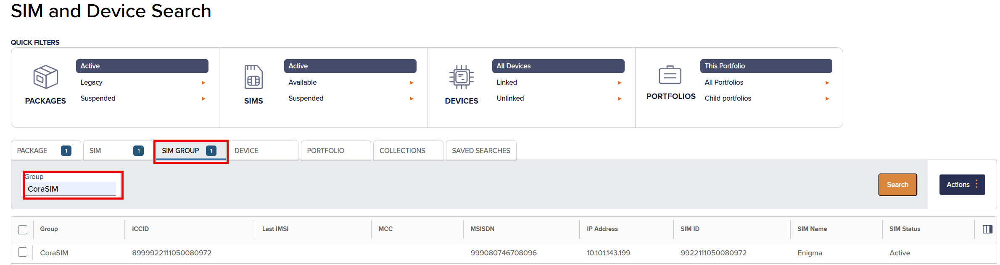
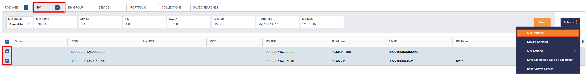
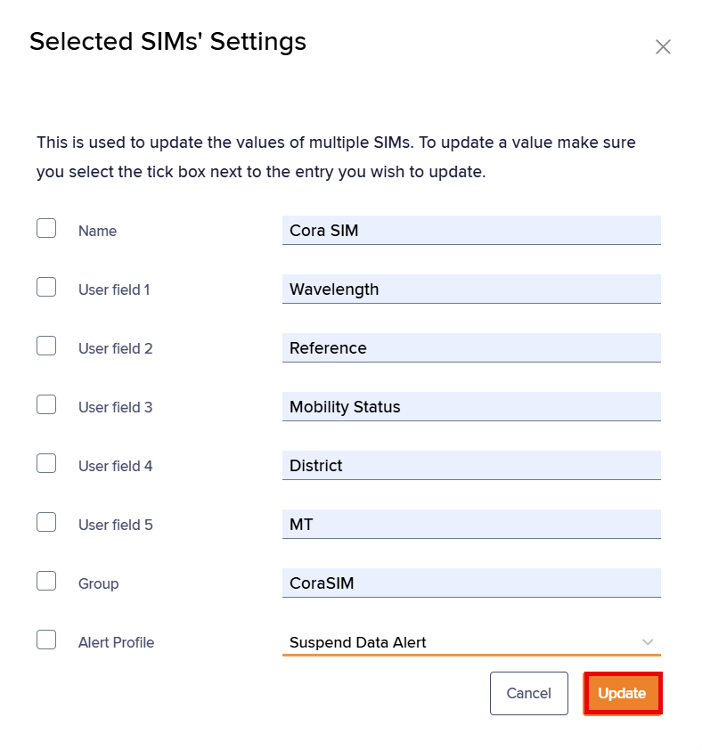

# About SIM Groups

You can tag SIMs with a group name to help identify and categorise them. For example, categorise SIMs by geographic location or product type.

To access SIM groups using SIM and Device Search:

1. On the left menu, select **Connect & Manage**.
2.  Select **SIM and Device Search** to view the **Search results** list.

    The **SIM and Device Search** page appears.

    

## Viewing SIM groups

To view the Infinity SIM Groups list:

1.  On the **SIM and Device Search** page, select the **SIM Group** tab to view SIMs by group.

    

    The SIM Group search results list contains the following fields:

    | Field      | Description                                                                                                                                                                                                                                                                                                                                                                                                                                                                                                                                                                             |
    | ---------- | --------------------------------------------------------------------------------------------------------------------------------------------------------------------------------------------------------------------------------------------------------------------------------------------------------------------------------------------------------------------------------------------------------------------------------------------------------------------------------------------------------------------------------------------------------------------------------------- |
    | Group      | The tag or label for a set of SIMs, to help identify and categorise the SIMs.                                                                                                                                                                                                                                                                                                                                                                                                                                                                                                           |
    | ICCID      | The unique Integrated Circuit Card Identifier for the SIM or eUICC SIM profile.                                                                                                                                                                                                                                                                                                                                                                                                                                                                                                         |
    | Last IMSI  | The most recent international mobile subscriber identity number (IMSI) used to authenticate the SIM on the network.                                                                                                                                                                                                                                                                                                                                                                                                                                                                     |
    | MCC        | The unique three digit ISO 3166-1 numeric mobile country code, used to identify the country where the mobile network exists.                                                                                                                                                                                                                                                                                                                                                                                                                                                            |
    | MSISDN     | The Mobile Station International Subscriber Directory Number (MSISDN) is a unique identifier for a mobile phone number in telecommunications. It includes the country code, mobile network code and subscriber number, allowing for routing of calls and messages to the correct device. The MSISDN contains between 8 and 18 numeric digits and can include the '+' country code identifier, for example: +441234567890.                                                                                                                                                               |
    | IP Address | One or more IPv4 addresses associated with the IMSI.                                                                                                                                                                                                                                                                                                                                                                                                                                                                                                                                    |
    | SIM ID     | The unique Eseye SIM reference number, printed on the physical SIM card.                                                                                                                                                                                                                                                                                                                                                                                                                                                                                                                |
    | SIM Name   | A unique customer-defined user-friendly tag or label for the SIM, to help identify and organise the SIM.                                                                                                                                                                                                                                                                                                                                                                                                                                                                                |
    | SIM Status | 
The current SIM status, either:
<ul><li><strong>available</strong> – the SIM or IMSI (for multi-IMSI SIMs) exists on a customer account and is assigned a package. No charges are incurred. The customer must request to activate the SIM for use.</li><li><strong>active</strong> – the SIM or IMSI (for multi-IMSI SIMs) is fully active on the network and ready for use. The SIM or IMSI is charged at standard service charge rates, and for any usage.</li></ul>
For more information, see <a href="how-to-change-sim-states.md">Understanding the SIM lifecycle</a>.
 |

### Filtering displayed SIM groups

To filter the search results list by SIM group:

1.  On the **SIM Group** tab, type the group name in the **Group** search filter.

    

    The list filters immediately.

## Creating SIM groups

To create a SIM group on a SIM:

1. On the **SIM and Device Search** page, select the checkbox alongside each SIM details row that you want to tag with a group name.
2.  At the top right, select **Actions** > **SIM Actions** > **SIM Settings** to display the **SIM Settings** dialog.

    
3.  Enter values for each field, and type a **Group** name.

    

    

Optionally, you can select from the <strong>Alert Profile</strong> drop-down list to assign this alert profile to this group of SIMs. For more information, see <a href="../monitoring-and-alerts/about-infinity-alert-profiles.md">Creating alert profiles</a>.

4.  Select **Update** to apply the name to the selected SIMs.

    

Consequently, the SIM group is displayed in the <strong>Search results</strong> list.

## Updating SIM groups

You can change the group name on selected SIMs.

To update SIM groups:

1. On the **SIM Group** tab, filter the search list by the **Group** name.
2. Select the checkbox alongside one or more SIMs that you want to update to a new group name.
3.  At the top right, select **Actions** > **SIM Settings** to display the **SIM Settings** dialog.

    

You can modify the appropriate field in the <strong>Selected SIMs' Settings</strong> dialog.

4. Type a new **Group** name.
5. Select **Update** to commit the new group name to the selected SIMs.
