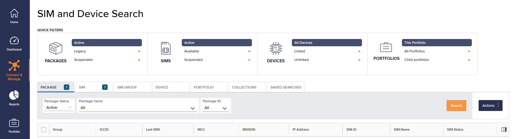
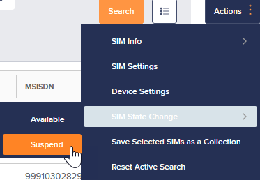
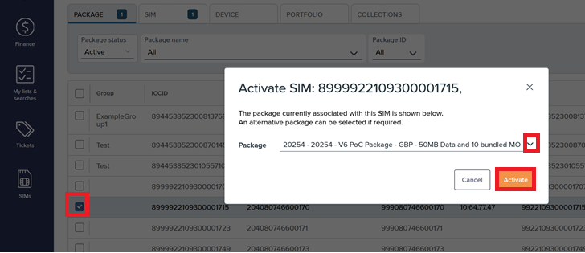
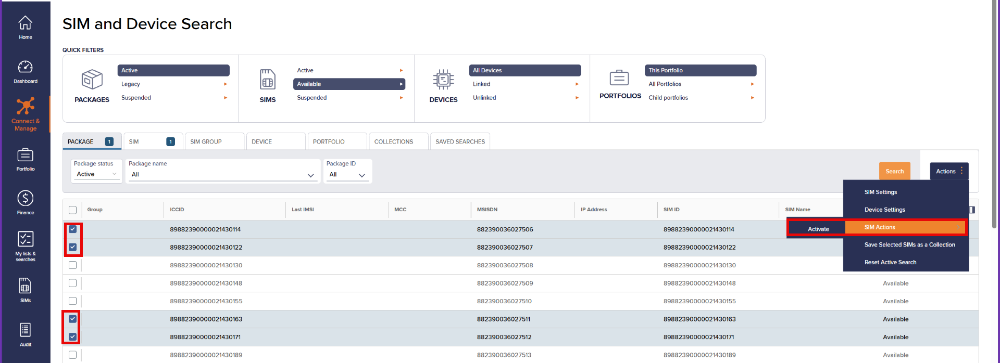
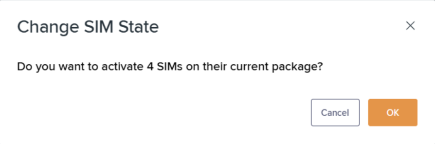

# How to change SIM states

These transitions typically happen based on user actions, billing issues, or administrative decisions within the Infinity portal. For more information, see [Understanding the SIM lifecycle](how-to-change-sim-states.md).

To access SIM States using SIM and Device Search:

1. On the left menu, select **Connect & Manage**.
2.  Select **SIM and Device Search** to view the **Search results list**.

    The **SIM and Device Search** page appears.

    

## Changing SIM states

To change the state of a single SIM:

1. On the **SIM and Device Search** page, in the **Search results list**, select the checkbox alongside the specific SIM that requires a state change.
2.  At the top right, select **Actions** > **SIM State Change** to display a list of states.

    The available states depend on the current SIM state. For more information, see [Understanding the SIM lifecycle](how-to-change-sim-states.md).
3.  Select the new state. For example:

    

    If the SIM state changes successfully, a green notification appears: "The state has been updated". The SIM appears in the list with the updated state.

    If processing is not instant, the SIM status is listed as **InProgress**.

    If you encounter errors, [contact Support](mailto:support@eseye.com).

## Activating a SIM on a different package

You can activate a SIM on a different package to its current associated package. You can only change package if the SIM is in an Available state.


Activating a SIM on a different package means that the usage costs change according to the agreements defined on that package.


To activate a SIM on a different package:

1.  Change SIM state to Active.

    For more information, see [Changing SIM states](how-to-change-sim-states.md#changing-sim-states).

    The **Activate SIM** dialog appears.
2.  Select the specific package, then select **Activate**.

    

    The SIM updates with an Active state and new package.

    * If the SIM state changes successfully, a green notification appears: "The state has been updated". The SIM appears in the list with the updated state and package.
    * If processing is not instant, the SIM status is listed as **InProgress**.

    If you encounter errors, [contact Support](mailto:support@eseye.com).

## Activating multiple SIMs

To activate multiple SIMs on their associated packages:


You can activate multiple SIMs on their respective packages, provided the SIMs are in the Available state.


1.  On the **SIM and Device Search** page, in the **Search results list**, select the checkboxes alongside the preferred SIMs that require activation.

    
2. At the top right, select **Actions** > **Activate**.
3.  Select **OK** to activate the selected SIMs.

    

    * If the SIM state changes successfully, a green notification appears: "The states have been updated". The SIMs appears in the Search results list with their respective updated states.
    * If processing is not instant, the SIM statuses are listed as **InProgress**.
    * If you encounter errors, [contact Support](mailto:support@eseye.com).
