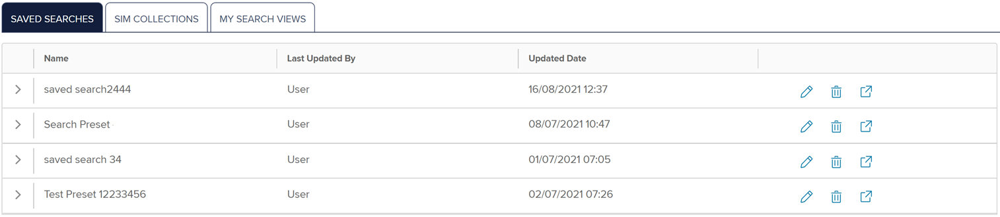
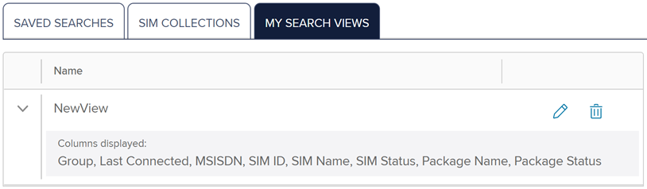
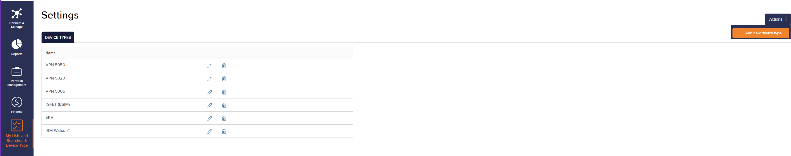

# How to find lists and searches

Use the My lists & searches page to view your list of saved searches, SIM collections and search views managed in the SIM and Device Search.

To access **My lists & searches**:

1.  On the left menu, select **My Lists and Searches & Device Type**.

    

## Viewing saved searches

To display your saved searches:

1. On the left menu, select **My Lists & Searches** > **SAVED SEARCHES**.

The **Saved Searches** tab lists the names given to your saved search views. For more information, see [Viewing SIM activity information](how-to-find-sims-and-devices.md#viewing-sim-activity-information).

The **Saved Searches** list contains the following fields:

| Field                                                            | Description                                                                                                                                                                                                                       |
| ---------------------------------------------------------------- | --------------------------------------------------------------------------------------------------------------------------------------------------------------------------------------------------------------------------------- |
| Name                                                             | The saved search name.                                                                                                                                                                                                            |
| Last updated by                                                  | The most recent user to update the saved search.                                                                                                                                                                                  |
| Updated date                                                     | The date and time when the saved search was last changed.                                                                                                                                                                         |
| .png>)       | Select to rename the saved search.                                                                                                                                                                                                |
| .png>)       | Select to delete the saved search.                                                                                                                                                                                                |
| .png>) | Select to view the SIM details in the **Search results** table and perform actions on the SIM details rows. For more information, see [Viewing search results list](how-to-find-sims-and-devices.md#viewing-search-results-list). |

## Viewing search views

To display your search views:

1. On the left menu, select **My Lists & Searches** > **My Search Views**.

The **My Search Views** tab lists the names of your saved search views. Each view defines the columns shown in the **Search results** table. For more information, see [Managing search views](how-to-find-sims-and-devices.md#managing-search-views).

The **Search Views** list contains the following fields:

| Field                                                           | Description                                                                                                                                                    |
| --------------------------------------------------------------- | -------------------------------------------------------------------------------------------------------------------------------------------------------------- |
| Name                                                            | The name of the search view on the **SIM and Device Search** page. For more information, see [Finding your SIMs and devices](how-to-find-sims-and-devices.md). |
| Columns displayed                                               | Expand the name of the search view to list the columns that are included in this search view.                                                                  |
| .png>) | Select to rename the saved search view.                                                                                                                        |
| .png>) | Select to delete the saved search view.                                                                                                                        |

## Viewing device types

To view device types:

1. On the left menu, select **My Lists and Searches** > **Device Types**.
2. Select **Settings** > **Device Types** to configure the Infinity device models.

The **Device Types** list contains the following fields:

| Field                                                     | Description                                                                                                                                                         |
| --------------------------------------------------------- | ------------------------------------------------------------------------------------------------------------------------------------------------------------------- |
| Name                                                      | A string that displays the name of the device to uniquely identify the device containing the SIM.                                                                   |
| .png>) | Select to rename the device type.                                                                                                                                   |
| .png>) | Select to delete the device type.                                                                                                                                   |
| .png>) | Select to perform a search on [Finding your SIMs and devices](how-to-find-sims-and-devices.md) with the **Device model** filter set to the device type of this row. |

## Adding device types

To add a new device type:

1. On the left menu, select **Portfolio** > **Settings**.
2. Select the **Device types** tab.
3. Select **Actions** > **Add new device type**.
4.  Type a unique name for the device model, and select **Save**.

    

The added device model appears in the list of <strong>Model</strong> drop-down list.

## Updating device types

To modify a device type:


If you modify a device type, the updated device type will appear in the associated menus. For more information, see [To link IMEI with device model](how-to-find-sims-and-devices.md#linking-devices).


1. On the left menu, select **Portfolio** > **Settings**.
2. Select the **Device types** tab.
3. Alongside the device type you want to modify, select .png>) .
4. Type a new unique name for the device model, then select **Save**.

## Deleting device types

To delete a device type:


If you delete a device type, it will no longer appear in the associated menus. For more information, see [To link IMEI with device model](how-to-find-sims-and-devices.md#linking-devices).


1. On the left menu, select **Portfolio** > **Settings**.
2. Select the **Device types** tab.
3. Alongside the device type you want to remove, select .png>).
4. Select **Confirm** to delete the device.
