# How to find SIMs and devices

Use the SIMs and Devices page to:

* Find and display information about SIMs, IoT devices, packages, packages associated with SIMs and portfolios.
* Save searches for future use, and save the results as CO and GR.

To access the Infinity SIMs and Devices:

1. On the left menu, select **Connect & Manage**.
2.  Select **SIM and Device Search** to view the list of SIMs and devices.

    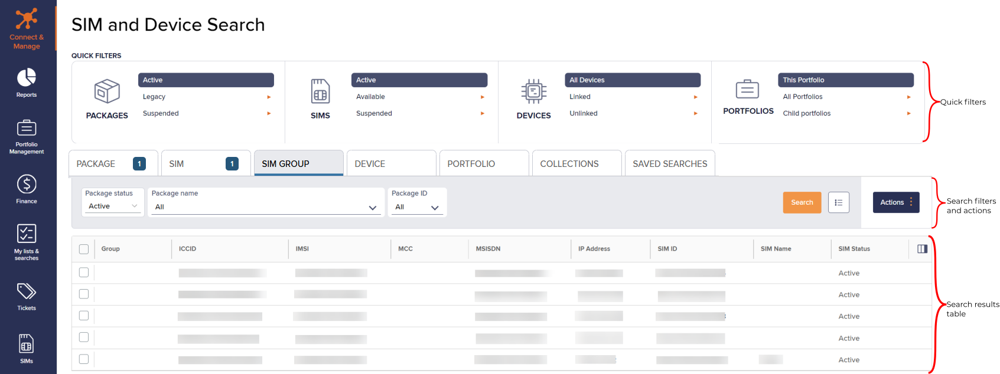

***

## Viewing SIMs and Devices

The Search results list contain the following fields:

### Device columns

| Column        | Description                                                                                                                                                                                               |
| ------------- | --------------------------------------------------------------------------------------------------------------------------------------------------------------------------------------------------------- |
| Device Model  | A string that displays the name of the device to uniquely identify the device containing the SIM.                                                                                                         |
| Device Status | 
Whether or not the SIM is linked to a device:
<ul><li><strong>Linked</strong> – the SIM has an IMEI assigned.</li><li><strong>Unlinked</strong> – the SIM does not have an IMEI assigned.</li></ul> |
| IMEI          | International Mobile Equipment Identity. The unique 15-digit International Mobile Equipment Identity serial number that identifies the device on the cellular network.                                    |
| Manufacturer  | The device manufacturer name.                                                                                                                                                                             |
| Modem         | The modem manufacturer name.                                                                                                                                                                              |

### SIM columns

| Column         | Description                                                                                                                                                                                                                                                                                                                                                                                                               |
| -------------- | ------------------------------------------------------------------------------------------------------------------------------------------------------------------------------------------------------------------------------------------------------------------------------------------------------------------------------------------------------------------------------------------------------------------------- |
| Group          | The identifying name given to the selected SIMs with user-defined fields. For more information, see [Finding your SIMs and devices](how-to-find-sims-and-devices.md).                                                                                                                                                                                                                                                     |
| ICCID          | The unique Integrated Circuit Card Identifier for the SIM or eUICC SIM profile.                                                                                                                                                                                                                                                                                                                                           |
| IMSI           | 
International Mobile Subscriber Identity number. Identifies a cellular network subscriber. The network operator that provided the IMSI uses it to authenticate a SIM (and the IoT device containing the SIM) on the network.
<blockquote>
Contains between 15 and 16 numeric digits.
</blockquote>                                                                                                             |
| Last Connected | The date (by default is UTC) that the device last successfully connected to the network.                                                                                                                                                                                                                                                                                                                                  |
| MCC            | Mobile Country Code. A 3 digit unique identifier for a country. The MCC is also the first part of the IMSI.                                                                                                                                                                                                                                                                                                               |
| MSISDN         | The Mobile Station International Subscriber Directory Number (MSISDN) is a unique identifier for a mobile phone number in telecommunications. It includes the country code, mobile network code and subscriber number, allowing for routing of calls and messages to the correct device. The MSISDN contains between 8 and 18 numeric digits and can include the '+' country code identifier, for example: +441234567890. |
| IP Address     | One or more IPv4 addresses associated with the IMSI.                                                                                                                                                                                                                                                                                                                                                                      |
| SIM ID         | Unique identifier for the SIM.                                                                                                                                                                                                                                                                                                                                                                                            |
| SIM Name       | isThe friendly name for the SIM.                                                                                                                                                                                                                                                                                                                                                                                          |
| SIM Status     | 
The current SIM state:
<ul><li><strong>Available</strong></li><li><strong>Active</strong></li><li><strong>Suspended</strong></li><li><strong>Terminated</strong></li></ul>
For more information, see <a href="how-to-change-sim-states.md">Understanding the SIM lifecycle</a>.
                                                                                                                               |

### Package columns

| Column          | Description                                                                                                                                                                                                                                                                                                                                                                                                                                                                                                                                                                                                                                                                                    |
| --------------- | ---------------------------------------------------------------------------------------------------------------------------------------------------------------------------------------------------------------------------------------------------------------------------------------------------------------------------------------------------------------------------------------------------------------------------------------------------------------------------------------------------------------------------------------------------------------------------------------------------------------------------------------------------------------------------------------------- |
| Contract Expiry | that evThe end date of the current contract.                                                                                                                                                                                                                                                                                                                                                                                                                                                                                                                                                                                                                                                   |
| Package ID      | The unique identifier for the package.                                                                                                                                                                                                                                                                                                                                                                                                                                                                                                                                                                                                                                                         |
| Package Name    | The package name that contains an unique package ID and a brief description of the package..                                                                                                                                                                                                                                                                                                                                                                                                                                                                                                                                                                                                   |
| Package Status  | 
The package status, either:
<ul><li><strong>Active</strong> – approved and ready for use.</li><li><strong>Legacy</strong> – a redundant package that is required for auditing purposes on past transactions, but is not available for use.</li><li><strong>Pending</strong> – awaiting approval to change into another state. Not available for use.</li><li><strong>Suspended</strong> – available for use but you cannot continue to assign SIMs to it. However, you can manage the lifecycle of the SIMs that already exist within this package.</li><li><strong>Unsigned</strong> – awaiting the customer's signature and Eseye Ltd final approval. Not available for use.</li></ul> |

### Portfolio columns

| Column         | Description                                                           |
| -------------- | --------------------------------------------------------------------- |
| Portfolio ID   | A 32 character unique identifier for the portfolio.                   |
| Portfolio Name | The portfolio name associated with the package that contains the SIM. |

### Filtering the displayed SIM details list

The Search results list displays the search results of the search performed using the search filters. Scroll down to display more results. You can filter SIMs and devices using both quick filters and search filters.

The number of results displayed depends on the screen size.

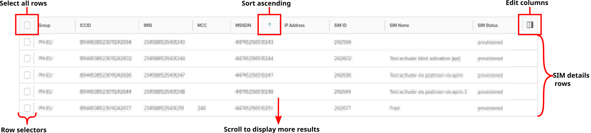

To sort the search results view by column name:

* Select a column name to sort the results in ascending (a-z; 1-9) or descending (z-a; 9-1) order.

#### Applying quick filters

QUICK FILTERS is the filter engine to facilitate searching using the default parameters such as Active Packages, Active SIMs, All Devices and This Portfolio.

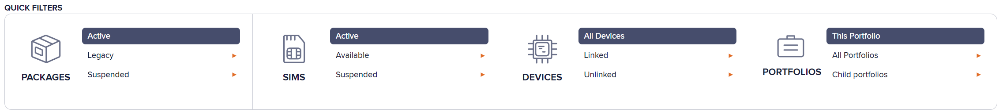

To apply a quick filter:

Select a value for one of the following fields:

* Under **Devices**, select the [**Device Status**](how-to-find-sims-and-devices.md#device-columns) to use as a search filter.
* Under **SIMs**, select the [**SIM Status**](how-to-find-sims-and-devices.md#sim-columns) to use as a search filter.
* Under **Packages**, select the [**Package Status**](how-to-find-sims-and-devices.md#package-columns) to use as a search filter.
* Under **Portfolios**, select to filter packages and SIMs for:
  * **All portfolios:** Lists Home and Child portfolios.
  * **Child portfolios:** Lists the particular site/department/territory of the Home country or direct descendants of the Home portfolios.
  * **This portfolio:** Identifies the portfolio that you want to view.


Not all SIM status and package status values are available as quick filters.


Changing the value in the quick filter applies the value to the relevant field on the search filter tab. Changing the value on the search filters tab also updates the relevant quick filter.


Each time you refresh the page, the quick filter displays the default view.


#### Applying search filters

Search filters refine search results to match your preferences using selected parameters.

To find the specific package/ SIM/ device/ portfolio/ collection:

1. Select **Connect and Manage** > **SIM and Device Search**.
2. Filter by the respective:
   * [**Package columns**](how-to-find-sims-and-devices.md#package-columns)
   * [**SIM columns**](how-to-find-sims-and-devices.md#sim-columns)
   * [**SIM group**](about-sim-groups.md)
   * [**Device columns**](how-to-find-sims-and-devices.md#device-columns)
   * [**Portfolio columns**](how-to-find-sims-and-devices.md#portfolio-columns)
   * [**Finding your SIMs and devices**](how-to-find-sims-and-devices.md#viewing-sims-and-devices)
   * **Saved searches**

Select for the filtered search results to display in the Search results list.

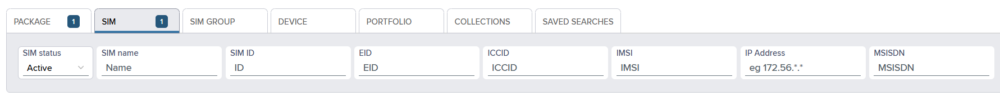

The Search results list displays information regarding the selected parameters in SIM details rows.


The numeric value on the filter tab displays the number of applied search filters on that tab.


## Saving active searches

The tabs in the search filters and actions pane enable you to filter the search results by device, SIM, SIM group, package, portfolio and SIM collection information.

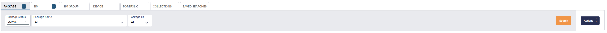

To save the active search:

1. In the Search results list, select to display the Saved Searches dialog.
2.  Under **Save the current search**, type an unique name for the saved search.

    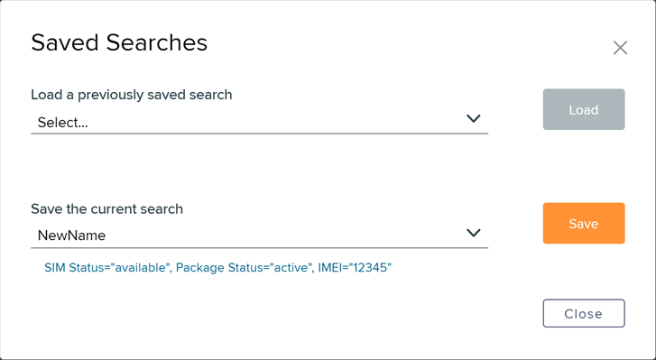
3. Select **Save** to display the name in the Search results list.

To load a previously saved search:

1. In the Search results list, select to display the Saved Searches dialog.
2.  Under **Load a previously saved search**, drop-down list to select the name you had provided for a previously saved search view.

    
3. Select **Load** for your previous search view to display in the Search results list.

## Viewing search results list

The Search results list displays the SIM details rows that match the criteria in [Saving active searches](how-to-find-sims-and-devices.md#saving-active-searches). Scroll down to display more results.


The number of results displayed depends on the screen size.


### Managing views for SIM details rows

The allows the following tasks based on whether you have selected one or multiple rows in the Search results list.

## Viewing SIM activity information

To display SIM activity information:

1. In the Search results list, select the checkbox alongside the specific SIM details row.
2. At the top right, select **Actions** > **SIM Info** > **Activity** to display the **SIM activity** dialog.

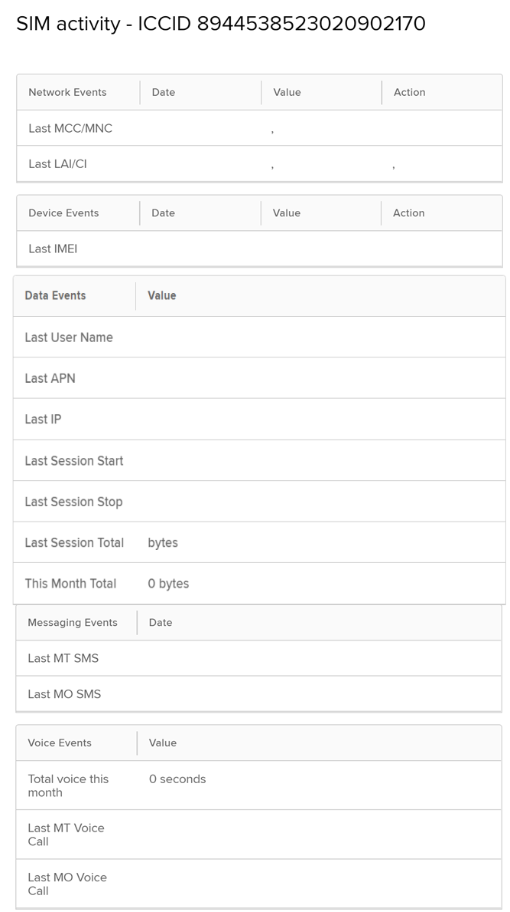

#### About SIM activity attributes

| Field                |                                  | Description                                                                                                                                                                                                                                                                                          |
| -------------------- | -------------------------------- | ---------------------------------------------------------------------------------------------------------------------------------------------------------------------------------------------------------------------------------------------------------------------------------------------------- |
| Report title         |                                  | Title of the report including the ICCID number and date and time of report generation.                                                                                                                                                                                                               |
| **Network events**   |                                  |                                                                                                                                                                                                                                                                                                      |
|                      | Last MCC / MNC                   | The date and time of the last connection. The Value column displays the mobile country code (MCC) and mobile network code (MNC), with the network name shown in brackets.                                                                                                                            |
|                      | Last LAI /CI                     | The date and time of the last connection. The Value column displays the last location area identifier (LAI) and cellular identifier (CI). The Action column displays a map icon () if LAI and CI data is present. Select the map icon to display the last recorded location information in map form. |
| **Device events**    |                                  |                                                                                                                                                                                                                                                                                                      |
|                      | Last IMEI                        | The ‘Date Time’ of the last IMEI connection. Value displays the last IMEI(International Mobile Equipment Identity) that the SIM connected to.                                                                                                                                                        |
| **Data Events**      |                                  |                                                                                                                                                                                                                                                                                                      |
|                      | Last User Name                   | The user name of the last person to use the device.                                                                                                                                                                                                                                                  |
|                      | Last APN                         | The most recently recorded Access Point Name that the device module used to successfully open a data session.                                                                                                                                                                                        |
|                      | Last IP                          | The most recently recorded APN IP address that the SIM used for the network connection.                                                                                                                                                                                                              |
|                      | Last Session Start               | The start time of the last session.                                                                                                                                                                                                                                                                  |
|                      | Last Session Stop                | The end time of the last session.                                                                                                                                                                                                                                                                    |
|                      | Last Session Total               | The quantity of data used (in bytes, kilobytes, megabytes or gigabytes) in the last session.                                                                                                                                                                                                         |
|                      | This Month Total                 | The total amount of data used this month (in bytes, kilobytes, megabytes or gigabytes).                                                                                                                                                                                                              |
| **Messaging Events** |                                  |                                                                                                                                                                                                                                                                                                      |
|                      | Last MT SMS                      | The ‘Date Time’ of the last received SMS. The ‘MSISDN’ column displays the MSISDN of the device that sent the SMS.                                                                                                                                                                                   |
|                      | Last MO SMS                      | The ‘Date Time’ of the last sent SMS. The ‘MSISDN’ column displays the MSISDN of the device that received the SMS.                                                                                                                                                                                   |
| **Voice Events**     |                                  |                                                                                                                                                                                                                                                                                                      |
|                      | Total voice this month (seconds) | The total number of seconds of voice calls used this month.                                                                                                                                                                                                                                          |
|                      | Last MT Voice Call               | The data and time of the last mobile terminated voice call.                                                                                                                                                                                                                                          |
|                      | Last MO Voice Call               | The data and time of the last mobile originated voice call.                                                                                                                                                                                                                                          |

## Viewing SIM network settings

To display SIM network settings:

1. In the Search results list, select the checkbox alongside one or more displayed SIM details rows.
2.  At the top right, select **Actions** > **SIM Info** > **Network Settings** to display the **Network Information** dialog.

    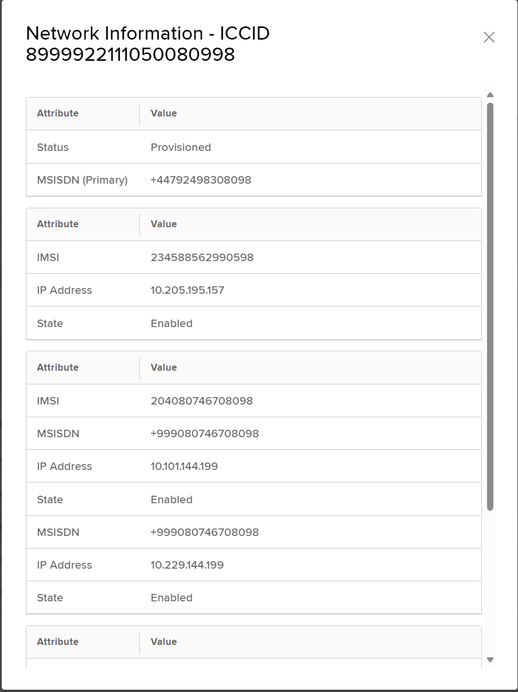

    #### About Network Information attributes

    | Field         | Attribute    | Description                                                                                                                                                                                                                                                                                                                                                                                                                                                                                                                                                                                                                                                                                                                                                                                                                                                                                                                                                                                                                                                                                             |
    | ------------- | ------------ | ------------------------------------------------------------------------------------------------------------------------------------------------------------------------------------------------------------------------------------------------------------------------------------------------------------------------------------------------------------------------------------------------------------------------------------------------------------------------------------------------------------------------------------------------------------------------------------------------------------------------------------------------------------------------------------------------------------------------------------------------------------------------------------------------------------------------------------------------------------------------------------------------------------------------------------------------------------------------------------------------------------------------------------------------------------------------------------------------------- |
    | ICCID         |              | 
Integrated Circuit Card Identifier for SIM cards or profiles (when using an eUICC SIM). For more information, see <a href="https://app.gitbook.com/s/zlTL8FVu6GaQkB5i1TRY/anynet-sims/esim-and-remote-provisioning/about-euicc-sim-profiles">About eUICC SIM profiles</a>.
<blockquote>
Contains 14 and 20 numeric digits and starts with 89 or 99.
</blockquote>                                                                                                                                                                                                                                                                                                                                                                                                                                                                                                                                                                                                                                                                                                                            |
    |               | Status       | 
The current SIM state:
<ul><li><strong>Available</strong></li><li><strong>Active</strong></li><li><strong>Suspended</strong></li><li><strong>Terminated</strong></li></ul>
For more information, see <a href="how-to-change-sim-states.md">Understanding the SIM lifecycle</a>. If the SIM status is Available, you can change the status to Active.
                                                                                                                                                                                                                                                                                                                                                                                                                                                                                                                                                                                                                                                                                                                                        |
    |               | Change State | 
Select to display the SIM Change State dialog where you can change the state of the SIM from Active to Suspended or Terminated.

If the SIM is suspended, you can update its status to either Terminate or Unsuspend.
                                                                                                                                                                                                                                                                                                                                                                                                                                                                                                                                                                                                                                                                                                                                                                                                                                                                       |
    | **Attribute** |              |                                                                                                                                                                                                                                                                                                                                                                                                                                                                                                                                                                                                                                                                                                                                                                                                                                                                                                                                                                                                                                                                                                         |
    |               | IMSI         | 
International Mobile Subscriber Identity number. Identifies a cellular network subscriber. The network operator that provided the IMSI uses it to authenticate a SIM (and the IoT device containing the SIM) on the network.
<blockquote>
Contains between 15 and 16 numeric digits.
</blockquote>
If the SIM has multiple IMSIs, each is displayed as a new row (attribute) in this list.
                                                                                                                                                                                                                                                                                                                                                                                                                                                                                                                                                                                                                                                                                             |
    |               | MSISDN       | 
The Mobile Station International Subscriber Directory Number (MSISDN) is a unique identifier for a mobile phone number in telecommunications. It includes the country code, mobile network code and subscriber number, allowing for routing of calls and messages to the correct device. The MSISDN contains between 8 and 18 numeric digits and can include the '+' country code identifier, for example: +441234567890.

For SIMs with <a href="https://app.gitbook.com/s/zlTL8FVu6GaQkB5i1TRY/anynet-sims/how-anynet-sims-work/understanding-multi-imsi-functionality">About multi-IMSI accounts</a>, one MSISDN is designated as the primary MSISDN.

For IoT devices that support receiving instructions via SMS, you must use the primary MSISDN when sending MT SMS messages from your mobile phone or when using the <a href="https://app.gitbook.com/s/0xQKujz8nVihyxgGvU7r/sms/overview">SMS API introduction</a>.
                                                                                                                                                           |
    |               | IP Address   | 
One or more IPv4 addresses associated with the IMSI.

When using About regionalised routing, this list displays multiple IP addresses for the same IMSI, where each IP address corresponds to either the:
<ul><li><strong>Home data centre</strong> – the data centre at which the operator's network terminates.</li><li><strong>Local data centre</strong> – a region-specific data centre based on proximity to devices on the operator's network.</li></ul>
Internet traffic is normally egressed onto the internet from the data centre connected to the operator. This means that the source IP address may change if the device is routed from a different data centre.

When Eseye use OTA messages to switch IMSIs or profiles, the IP address will change because the Eseye data centres that assign the IP addresses and use different IP address ranges for each operator. (For more information, see <a href="https://app.gitbook.com/s/zlTL8FVu6GaQkB5i1TRY/anynet-sims/how-anynet-sims-work/understanding-multi-imsi-functionality">About multi-IMSI accounts</a>.
 |

## Viewing SIM messaging information

To display SIM messaging information:

1. In the Search results list, select the checkbox alongside the specific SIM details row.
2.  At the top right, select **Actions** > **SIM Info** > **Messaging** to display the **SIM Messaging** dialog.

    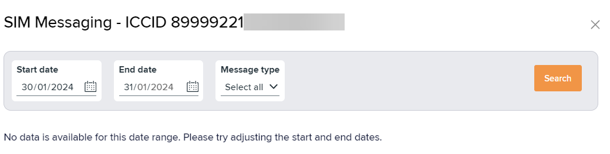
3. Specify the below parameters when filtering the messaging information:
   * **Start date and End date** – displays the messaging information within the chosen time range.
   * **Message type** – filters messages on SMS direction: SMS MO (mobile originated), SMS MT (mobile terminated) or Select all (for both directions).
   * Select to list the SMS messages sent or received by the selected SIM.

## Linking devices

To link IMEI with device model:

1. In the Search results list, select the checkbox alongside the specific SIM details row.
2.  At the top right, select **Actions** > **Device Settings** to display the **Device Settings** dialog.

    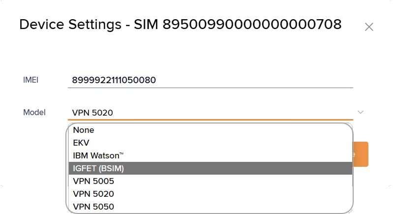
3.  Type new inputs for the IMEI and choose from the Model drop-down list. For more information, see [Viewing device types](how-to-find-lists-and-searches.md#viewing-device-types).

    You can enter IMEI for a new device also known as [Custom IMEI](how-to-view-and-manage-sim-details.md#about-sim-details-attributes).
4. Select **Save** to update the values for all selected SIMs.

To reset the active search:

1. In the search filters pane, select **Actions**.
2. Select **Reset Active Search** to remove all values from the search filter parameters on every tab.


**Reset Active Search** clears all filter values except [**SIM Status**](how-to-find-sims-and-devices.md#sim-columns), which resets to **Available**, and [**Package Status**](how-to-find-sims-and-devices.md#package-columns), which resets to **Active**.


## Managing search views

To save, load and modify the search result view:

1.  In the Search results list, select to display the **Search Results View** dialog that displays the column names.

    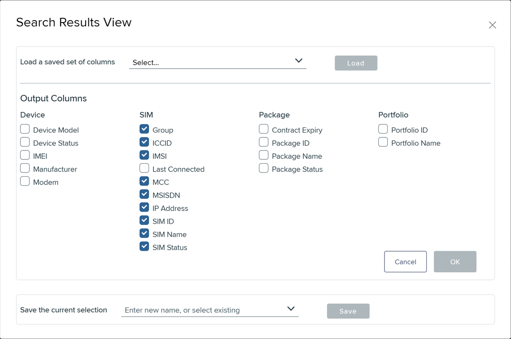
2.  Perform one of the following:

    To save a search view:

    * Under **Save the current selection**, either select an existing saved result view to overwrite, or type an unique name for a new custom result view.
    * Select **Save** for the specific output columns to display in the Search results view.

    To load an existing search view:

    * Use the **Load a saved set of columns** list to select a previously saved result view.
    * By default, the interface displays all the column names for Device, SIM, Package and Portfolio.
    * Select **Load** to update the selected output columns.

    To modify the current search view:

    * Under **Output Columns**, select/ clear the check boxes next to the column names you wish to display/ hide.
3. Select **OK** for the changes to reflect in the Search results list.
