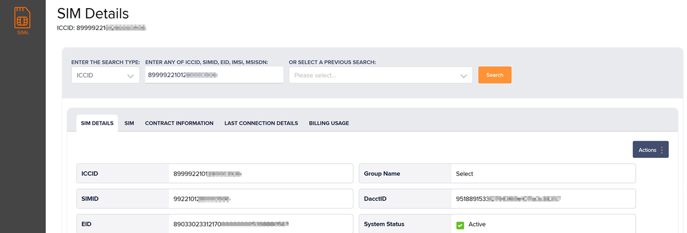
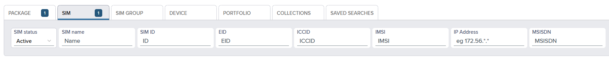
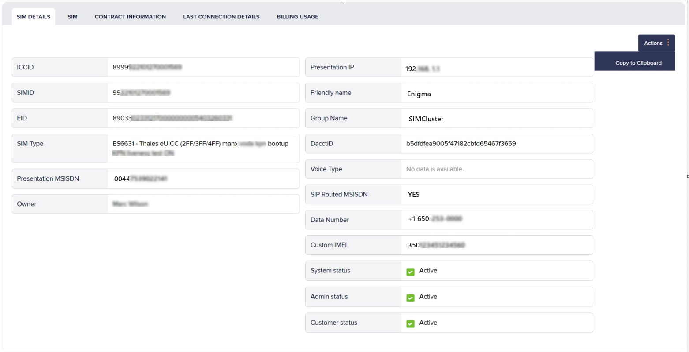
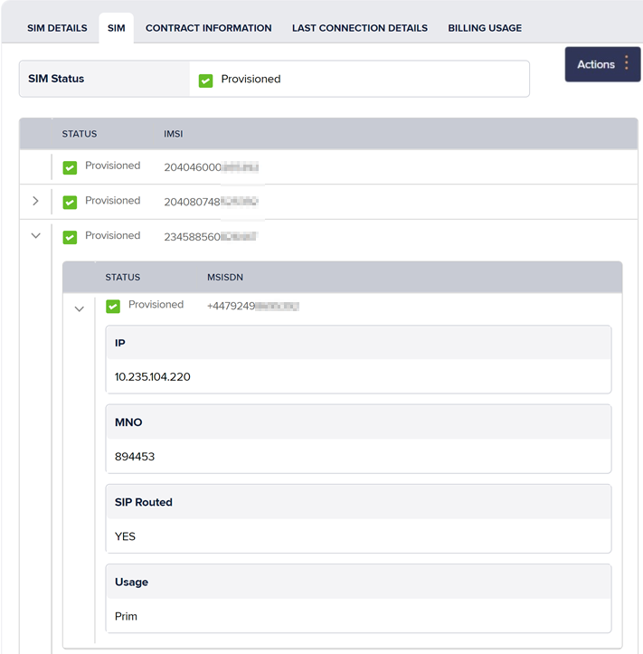
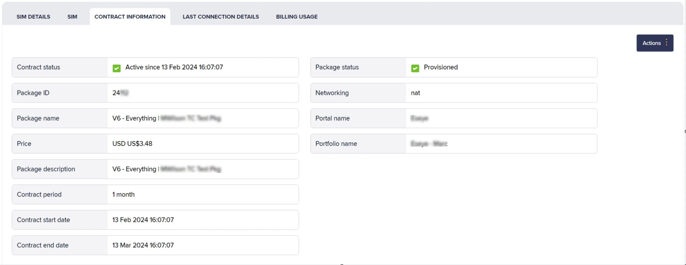
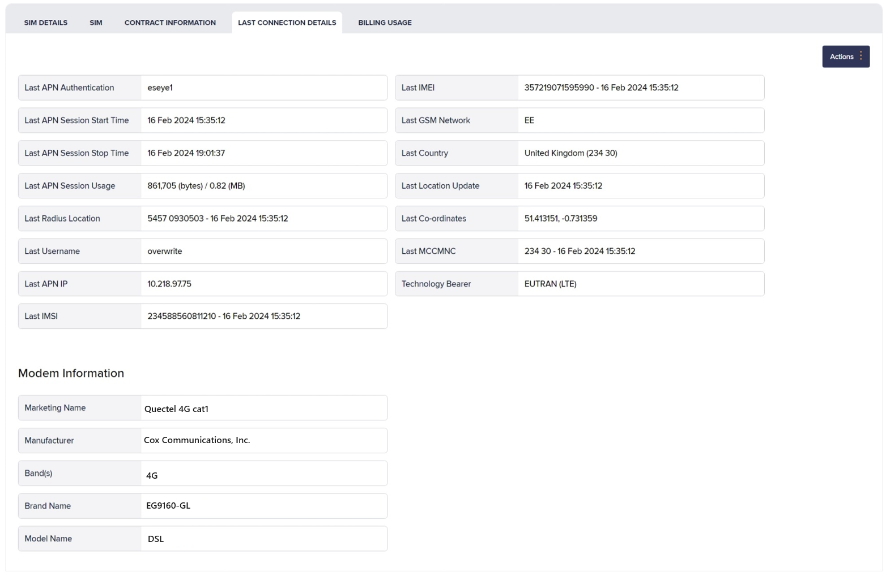
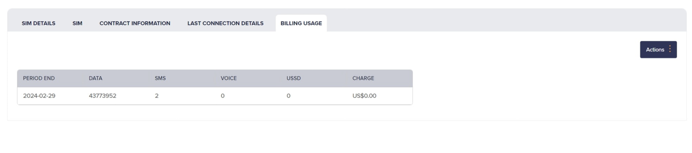

# How to view and manage SIM details

On the left menu, select **SIMs** to search for a SIM and display related information.


When you [search for a SIM](how-to-view-and-manage-sim-details.md#about-search-fields), Infinity displays the following information associated with the SIM.


SIMs is divided into the following sections:

* SIM Details: For more information, see [Viewing general information for a relevant SIM](how-to-view-and-manage-sim-details.md#viewing-general-information-for-a-relevant-sim).
* SIM: For more information, see [Viewing connectivity status information](how-to-view-and-manage-sim-details.md#viewing-connectivity-status-information).
* Contract Information: For more information, see [Viewing contract information](how-to-view-and-manage-sim-details.md#viewing-contract-information).
* Last Connection details: For more information, see [Viewing last recorded network connection](how-to-view-and-manage-sim-details.md#viewing-last-recorded-network-connection).
* Billing usage: For more information, see [Viewing billing usage](how-to-view-and-manage-sim-details.md#viewing-billing-usage).

## About search fields

The search fields enable you to search for a SIM.

### About SIM search identifiers

ICCID

Integrated Circuit Card Identifier for SIM cards or profiles (when using an eUICC SIM). For more information, see [About eUICC SIM profiles](https://app.gitbook.com/s/zlTL8FVu6GaQkB5i1TRY/anynet-sims/esim-and-remote-provisioning/about-euicc-sim-profiles).

Contains 14 and 20 numeric digits and starts with 89 or 99.

SIM ID

SIM Identifier. The unique serial number printed on the SIM provided by Eseye.

Contains between 8 and 20 numeric digits. This is valid only for eUICC SIMs.

EID

Embedded Universal Integrated Circuit Card (eUICC) Identifier. The unique global serial number that identifies an eUICC, for Remote SIM Provisioning and eUICC management purposes. For more information, see [eUICC Identifier (EID)](https://app.gitbook.com/s/zlTL8FVu6GaQkB5i1TRY/anynet-sims/esim-and-remote-provisioning/euicc-overview#euicc-identifier-eid).

IMSI

International Mobile Subscriber Identity number. Identifies a cellular network subscriber. The network operator that provided the IMSI uses it to authenticate a SIM (and the IoT device containing the SIM) on the network.

Contains between 15 and 16 numeric digits.

MSISDN

The Mobile Station International Subscriber Directory Number (MSISDN) is a unique identifier for a mobile phone number in telecommunications. It includes the country code, mobile network code and subscriber number, allowing for routing of calls and messages to the correct device. The MSISDN contains between 8 and 18 numeric digits and can include the '+' country code identifier, for example: +441234567890.

To search for a SIM or group of SIMs:

1. On the left menu, select **SIMs**.
2. Select the **Search type** drop-down list.
3. Provide a value in **Enter an** [**ICCID**](#user-content-fn-1)[^1]**,** [**SIMID**](#user-content-fn-2)[^2]**,** [**EID**](#user-content-fn-3)[^3]**, or** [**IMSI**](#user-content-fn-4)[^4]**:**.
4.  Select **Search** to view the results in the **Search results** table.

    Up to 10 saved searches are stored in your search history of your current user session.

To display a previously saved search:

1. On the left menu, select **SIMs**.
2. In the **Select a previous search** drop-down list, select **Search** to display the below tabs for your relevant SIM.

### About Search fields attributes

| Field           | Description                                                                                                                                                                                                                                                                                                                                                                                                                    |
| --------------- | ------------------------------------------------------------------------------------------------------------------------------------------------------------------------------------------------------------------------------------------------------------------------------------------------------------------------------------------------------------------------------------------------------------------------------ |
| Search type     | 
The identifier type to use in the search string field:
<ul><li><strong>ICCID</strong></li><li><strong>SIM ID</strong></li><li><strong>EID</strong></li><li><strong>IMSI</strong></li></ul>                                                                                                                                                                                                                               |
| Search string   | 
The search string of the selected type used to identify the SIM.
<blockquote>
You must specify the full string for the selected search type (ICCID, SIM ID, EID, <a href="how-to-view-and-manage-sim-details.md#about-sim-search-identifiers">IMSI</a>, <a href="how-to-view-and-manage-sim-details.md#about-sim-attributes">MSISDN</a>, etc). The search does not return values for partial matches.
</blockquote> |
| Previous search | Select from your search history to display information for a previously searched SIM.                                                                                                                                                                                                                                                                                                                                          |

## Viewing general information for a relevant SIM

To display general information about your specific SIM:

1. In the **Search results** table, select the checkbox alongside the relevant SIM details row.
2. Select the **SIM Details** tab.

At the top right, select **Actions** > **Copy to Clipboard** to copy the content from this tab to the clipboard. Paste the information in a `.CSV` file, notepad, word, email or any other text editor.

On this tab, if data is unavailable for any field, the information for that particular field is not copied.

### About SIM details attributes

| Field                   | Description                                                                                                                                                                                                                                                                                                                                                          |
| ----------------------- | -------------------------------------------------------------------------------------------------------------------------------------------------------------------------------------------------------------------------------------------------------------------------------------------------------------------------------------------------------------------- |
| ICCID[^1]               | Integrated Circuit Card Identifier for SIM cards or profiles (when using an eUICC SIM). For more information, see [About eUICC SIM profiles](https://app.gitbook.com/s/zlTL8FVu6GaQkB5i1TRY/anynet-sims/esim-and-remote-provisioning/about-euicc-sim-profiles).Contains 14 and 20 numeric digits and starts with 89 or 99.                                           |
| SIM ID[^2]              | SIM Identifier. The unique serial number printed on the SIM provided by Eseye.Contains between 8 and 20 numeric digits. This is valid only for eUICC SIMs.                                                                                                                                                                                                           |
| EID[^3]                 | Embedded Universal Integrated Circuit Card (eUICC) Identifier. The unique global serial number that identifies an eUICC, for Remote SIM Provisioning and eUICC management purposes. For more information, see [eUICC Identifier (EID)](https://app.gitbook.com/s/zlTL8FVu6GaQkB5i1TRY/anynet-sims/esim-and-remote-provisioning/euicc-overview#euicc-identifier-eid). |
| SIM Type                | A textual description that identifies the SIM type and its capabilities and specifications. This field typically includes the SIM part number (ES code for Eseye SIMs), package, form factor and MNO identifier.                                                                                                                                                     |
| Presentation MSISDN[^5] | Currently active MSISDN.                                                                                                                                                                                                                                                                                                                                             |
| Owner                   | The portfolio account owner name. The person responsible for the SIM.                                                                                                                                                                                                                                                                                                |
| Presentation IP         | Currently active IP Address that is used in the recent data session.                                                                                                                                                                                                                                                                                                 |
| Friendly Name           | The identifying name given to the SIM by the user.                                                                                                                                                                                                                                                                                                                   |
| Group Name              | The identifying name given to the selected SIMs with user-defined fields.                                                                                                                                                                                                                                                                                            |
| Dacct ID                | The unique destination account identifier (Dacct ID) used internally that identifies chargeable actions on the SIM.                                                                                                                                                                                                                                                  |
| Voice Type              | The type voice message in Voice Resource Units (VRUs). For example, when an account balance reaches zero for a pre-paid customer or warning that the balance is low before a call and even during the call.                                                                                                                                                          |
| SIP Routed MSISDN[^5]   | 
Whether or not data sent and received from this MSISDN is routed using the session initiation protocol (SIP).
<ul><li><strong>YES</strong> – indicates data is routed using SIP.</li><li><strong>NO</strong> – indicates data is not routed using SIP.</li></ul>                                                                                               |
| Data Number             | The data usage of the SIM presented in numerical format. For more information, see [Understanding data usage per SIM](how-to-view-and-manage-sim-details.md#viewing-billing-usage).                                                                                                                                                                                  |
| Custom IMEI             | The user-defined IMEI. For information about, see [To link IMEI with device model](how-to-find-sims-and-devices.md#linking-devices):.                                                                                                                                                                                                                                |
| System status           | Status automatically set by the system for the user's portfolio. For example, if the user exceeds the set [About Infinity alerts](../monitoring-and-alerts/about-infinity-alerts.md) threshold, the system status changes from Active to Suspend. This field is read-only.                                                                                           |
| Admin status            | Status set internally by the system administrator for the user's portfolio account. For example, if the user exceeds the set [About Infinity alerts](../monitoring-and-alerts/about-infinity-alerts.md) threshold, the admin status changes from Active to Suspend. This field is read-only and cannot be changed by the user.                                       |
| Customer status         | Status set by the customer for their own portfolio account. This state can be manually changed by the user. For more information, see [Managing portfolios](../portfolio-and-billing/how-to-manage-portfolios.md).                                                                                                                                                   |
| Last IMSI[^4]           | The last IMSI number used to authenticate the SIM on the network.                                                                                                                                                                                                                                                                                                    |
| Last IMSI Date[^4]      | The date and time stamp that the IMSI was last recorded.                                                                                                                                                                                                                                                                                                             |
| Last Lat                | The last IMSI number used to authenticate the SIM on the network.                                                                                                                                                                                                                                                                                                    |
| LAST IMSI[^4]           | The last IMSI number used to authenticate the SIM on the network.                                                                                                                                                                                                                                                                                                    |
| LAST IMSI[^4]           | The last IMSI number used to authenticate the SIM on the network.                                                                                                                                                                                                                                                                                                    |

## Viewing connectivity status information

To display connectivity information for each IMSI/ IMSIs associated with single/ multiple profiles:

1. In the **Search results** table., select the checkbox alongside the relevant SIM details row.
2. Select the **SIM** tab.

At the top right, select **Actions** > **Copy to Clipboard** to copy the content from this tab to the clipboard. Paste the information in a `.CSV` file, notepad, word, email or any other text editor.

On this tab, if data is unavailable for any field, the information for that particular field is not copied.

### About SIM attributes

| Field                | Description                                                                                                                                                                                                                                                                                                                                                                                    |
| -------------------- | ---------------------------------------------------------------------------------------------------------------------------------------------------------------------------------------------------------------------------------------------------------------------------------------------------------------------------------------------------------------------------------------------- |
| SIM Status / Status  | 
The current SIM state:
<ul><li><strong>Available</strong> (indicated by ☑️ )</li><li><strong>Provisioned</strong>: indicates that SIM is transitioning from 1 state to another.</li><li><strong>Active</strong> (indicated by ✅)</li><li><strong>Suspended</strong></li></ul>
For more information, see <a href="how-to-change-sim-states.md">Understanding the SIM lifecycle</a>.
 |
| IMSI[^4]             | One or more IMSI assigned to the SIM.                                                                                                                                                                                                                                                                                                                                                          |
| Expanded information | Select  to expand the multiple profile information for each IMSI within the SIM.                                                                                                                                                                                                   |
| Status               | 
The current provisioning status for the IMSI:
<ul><li><strong>available</strong></li><li><strong>requested</strong></li><li><strong>provisioned</strong></li><li><strong>unrequested</strong></li><li><strong>unprovisioned</strong></li><li><strong>suspended</strong></li><li><strong>disabled</strong></li><li><strong>cancelled</strong></li><li><strong>deleted</strong></li></ul>  |
| MSISDN[^5]           | A list of MSISDN assigned to the SIM.                                                                                                                                                                                                                                                                                                                                                          |
| IP Address           | IP addresses assigned to the SIM.                                                                                                                                                                                                                                                                                                                                                              |
| MNO                  | A six digit unique identifier for the IMSI mobile network operator (MNO).                                                                                                                                                                                                                                                                                                                      |
| SIP Routed           | 
Whether or not data sent and received from this MSISDN is routed using the session initiation protocol (SIP).
<ul><li><strong>YES</strong> – indicates data is routed using SIP.</li><li><strong>NO</strong> – indicates data is not routed using SIP.</li></ul>                                                                                                                         |
| Usage                | 
The usage type for the:
<ul><li><strong>data</strong></li><li><strong>voice</strong></li><li><strong>SMS</strong></li></ul>                                                                                                                                                                                                                                                              |

## Viewing contract information

To display service contract information of your SIM:

1. In the **Search results** table, select the checkbox alongside the relevant SIM details row.
2. Select the **Contract Information** tab.

For more information, see [About Service Contracts associated with your SIM](https://app.gitbook.com/s/2pbiEZepRfUhnzoMb7nU/reports/finance-reports#service-contract-pdf).

At the top right, select **Actions** > **Copy to Clipboard** to copy the content from this tab to the clipboard. Paste the information in a `.CSV` file, notepad, word, email or any other text editor.

On this tab, if data is unavailable for any field, the information for that particular field is not copied.

### About Contract information attributes

| Field               | Description                                                                                                                                                                                                                                                                                                                                                                                                                                                                                                                                                                                                                                                                                    |
| ------------------- | ---------------------------------------------------------------------------------------------------------------------------------------------------------------------------------------------------------------------------------------------------------------------------------------------------------------------------------------------------------------------------------------------------------------------------------------------------------------------------------------------------------------------------------------------------------------------------------------------------------------------------------------------------------------------------------------------- |
| Contract Status     | 
The SIM contract status:
<ul><li><strong>active</strong></li><li><strong>suspended</strong></li><li><strong>cancelled</strong></li><li><strong>deleted</strong></li></ul>
When active, this field also displays the contract start date (dd Mmm yyyy) and start time (hh🇲🇲ss)
                                                                                                                                                                                                                                                                                                                        |
| Package ID          | The unique package identifier.                                                                                                                                                                                                                                                                                                                                                                                                                                                                                                                                                                                                                                                                 |
| Package name        | The package name which usually contains the customer account name and data allowance.                                                                                                                                                                                                                                                                                                                                                                                                                                                                                                                                                                                                          |
| Price               | Service charge for the current SIM, displayed in the agreed contract currency.                                                                                                                                                                                                                                                                                                                                                                                                                                                                                                                                                                                                                 |
| Package description | Detailed description of the package.                                                                                                                                                                                                                                                                                                                                                                                                                                                                                                                                                                                                                                                           |
| Contract period     | The SIM contract billing cycle.                                                                                                                                                                                                                                                                                                                                                                                                                                                                                                                                                                                                                                                                |
| Contract start date | The start date of the current contract.                                                                                                                                                                                                                                                                                                                                                                                                                                                                                                                                                                                                                                                        |
| Contract end date   | The end date of the current contract.                                                                                                                                                                                                                                                                                                                                                                                                                                                                                                                                                                                                                                                          |
| Package status      | 
The package status, either:
<ul><li><strong>Active</strong> – approved and ready for use.</li><li><strong>Legacy</strong> – a redundant package that is required for auditing purposes on past transactions, but is not available for use.</li><li><strong>Pending</strong> – awaiting approval to change into another state. Not available for use.</li><li><strong>Suspended</strong> – available for use but you cannot continue to assign SIMs to it. However, you can manage the lifecycle of the SIMs that already exist within this package.</li><li><strong>Unsigned</strong> – awaiting the customer's signature and Eseye Ltd final approval. Not available for use.</li></ul> |
| Networking          | 
The networking type in use, either:
<ul><li><strong>NAT</strong> – network address translation.</li><li><strong>VPN</strong> – virtual private network.</li><li><strong>Fixed IP</strong> – fixed IP address.</li></ul>                                                                                                                                                                                                                                                                                                                                                                                                                                                                  |
| Portal name         | The name of the portal associated with the SIM.                                                                                                                                                                                                                                                                                                                                                                                                                                                                                                                                                                                                                                                |
| Portfolio name      | The name of the portfolio that contains the package associated with the SIM.                                                                                                                                                                                                                                                                                                                                                                                                                                                                                                                                                                                                                   |

## Viewing last recorded network connection

To display your SIM's most recently recorded network connection:

1. In the **Search results** table, select the checkbox alongside the relevant SIM details row.
2. Select the **Last Connection** tab.

At the top right, select **Actions** > **Copy to Clipboard** to copy the content from this tab to the clipboard. Paste the information in a `.CSV` file, notepad, word, email or any other text editor.

On this tab, if data is unavailable for any field, the information for that particular field is not copied.

The following table describes the fields on the Last Connection Details tab.

| Field                       | Description                                                                                                                                                                                                                                                                                                                                                                                                                                                                                                                                                                                                              |
| --------------------------- | ------------------------------------------------------------------------------------------------------------------------------------------------------------------------------------------------------------------------------------------------------------------------------------------------------------------------------------------------------------------------------------------------------------------------------------------------------------------------------------------------------------------------------------------------------------------------------------------------------------------------ |
| Last APN Authentication     | The most recently recorded Access Point Name that the device module used to successfully open a RADIUS data session.                                                                                                                                                                                                                                                                                                                                                                                                                                                                                                     |
| Last APN Session Start Time | The most recently recorded APN data session start date and time.                                                                                                                                                                                                                                                                                                                                                                                                                                                                                                                                                         |
| Last APN Session Stop Time  | The most recently recorded APN data session stop date and time.                                                                                                                                                                                                                                                                                                                                                                                                                                                                                                                                                          |
| Last APN Session Usage      | The amount of data used during the most recently recorded APN data session.                                                                                                                                                                                                                                                                                                                                                                                                                                                                                                                                              |
| Last Radius Location        | 
The SIM's most recently recorded RADIUS location, in the following format:

<code>&#x3C;LAI> &#x3C;CI> - &#x3C;date></code>

<strong>where:</strong>
<ul><li><strong>&#x3C;LAI></strong> – Location Area Identity (LAI). A hexadecimal value representing the cellular tower location where the SIM last connected.</li><li><strong>&#x3C;CI></strong> – Cell Identification (CI). The unique cell identifier assigned to the base station in the location area where the SIM last connected.</li><li><strong>&#x3C;date></strong> – the date and time when the LAI and CI were last recorded.</li></ul> |
| Last Username               | The username used to authenticate the last opened data session.                                                                                                                                                                                                                                                                                                                                                                                                                                                                                                                                                          |
| Last APN IP                 | The most recently recorded APN IP address that the SIM used for the network connection.                                                                                                                                                                                                                                                                                                                                                                                                                                                                                                                                  |
| Last IMSI                   | The most recently recorded IMSI used for the network connection.                                                                                                                                                                                                                                                                                                                                                                                                                                                                                                                                                         |
| Last IMEI                   | The most recently recorded International Mobile Equipment Identity (IMEI) number.                                                                                                                                                                                                                                                                                                                                                                                                                                                                                                                                        |
| Last GSM Network            | The most recently recorded 2G mobile network used by the SIM.                                                                                                                                                                                                                                                                                                                                                                                                                                                                                                                                                            |
| Last Country                | The most recently recorded country in which the SIM connected to the cellular network.                                                                                                                                                                                                                                                                                                                                                                                                                                                                                                                                   |
| Last Location Update        | The date and time when the most recent LAI and CI information was captured.                                                                                                                                                                                                                                                                                                                                                                                                                                                                                                                                              |
| Last Co-ordinates           | The last position of the cell tower or the last location of the device.                                                                                                                                                                                                                                                                                                                                                                                                                                                                                                                                                  |
| Last MCCMNC                 | The most recently recorded Mobile Country Code (MCC) and Mobile Network Code (MNC), and the date and time of the last connection.                                                                                                                                                                                                                                                                                                                                                                                                                                                                                        |
| Technology Bearer           | The most recently recorded Radio Access Technology (RAT) used to connect to the mobile network.                                                                                                                                                                                                                                                                                                                                                                                                                                                                                                                          |
| Modem Information           |                                                                                                                                                                                                                                                                                                                                                                                                                                                                                                                                                                                                                          |
| Marketing Name              | Easy-to-read model name of the modem.                                                                                                                                                                                                                                                                                                                                                                                                                                                                                                                                                                                    |
| Manufacturer                | The name of the company that manufactures the modem.                                                                                                                                                                                                                                                                                                                                                                                                                                                                                                                                                                     |
| Band(s)                     | The ranges of radio frequencies that a module can use to communicate with a cellular network. Different bands have different characteristics, such as speed, coverage, and compatibility. The supported bands are related to the module manufacturer's supported frequency bands, for example, 2G, ,3G, 4G or 5G. A modem that supports more bands can connect to more networks and have better performance.                                                                                                                                                                                                             |
| Brand Name                  | The marketing name of the modem associated with a particular brand.                                                                                                                                                                                                                                                                                                                                                                                                                                                                                                                                                      |
| Model Name                  | The name of the model of the modem.                                                                                                                                                                                                                                                                                                                                                                                                                                                                                                                                                                                      |

## Viewing billing usage

To display your SIMs last month billing information:

1. In the **Search results** table, select the checkbox alongside the relevant SIM details row.
2. Select the **Billing Usage** tab.

At the top right, select **Actions** > **Copy to Clipboard** to copy the content from this tab to the clipboard. Paste the information in a `.CSV` file, notepad, word, email or any other text editor.

On this tab, if data is unavailable for any field, the information for that particular field is not copied.

### About Billing usage attributes

| Field      | Description                                                                                                                                                                                                                                                                                        |
| ---------- | -------------------------------------------------------------------------------------------------------------------------------------------------------------------------------------------------------------------------------------------------------------------------------------------------- |
| PERIOD END | The final day of the most recent billing cycle. Usage after this date is not supplied on this tab. ask Istvan                                                                                                                                                                                      |
| DATA       | The amount of data (in bytes) that the SIM used during this billing period.                                                                                                                                                                                                                        |
| SMS        | The number of SMS messages that the device sent or received during this billing period. Is this outside of contract?                                                                                                                                                                               |
| Voice      | 
The total amount (in seconds) of voice calls made or received by the device during this billing period.
<blockquote>
Only for existing customers with voice included in their contract.
</blockquote>                                                                                   |
| USSD       | Only for customers who have 2G and 3G networks provisioned on the current package. The number of USSD messages that the device has received during this billing period.                                                                                                                            |
| Charge     | The total cost for this billing period, rounded to two decimal places and displayed in the currency agreed on the contract. For more information, see [Understanding Service Contracts and packages](https://app.gitbook.com/s/2pbiEZepRfUhnzoMb7nU/reports/finance-reports#service-contract-pdf). |

[^1]: Integrated Circuit Card Identifier for SIM cards or profiles (when using an eUICC SIM). For more information, see [About eUICC SIM profiles](https://app.gitbook.com/s/zlTL8FVu6GaQkB5i1TRY/anynet-sims/esim-and-remote-provisioning/about-euicc-sim-profiles).

    Contains 14 and 20 numeric digits and starts with 89 or 99.

[^2]: SIM Identifier. The unique serial number printed on the SIM provided by Eseye.

    Contains between 8 and 20 numeric digits. This is valid only for eUICC SIMs.

[^3]: Embedded Universal Integrated Circuit Card (eUICC) Identifier. The unique global serial number that identifies an eUICC, for Remote SIM Provisioning and eUICC management purposes. For more information, see [eUICC Identifier (EID)](https://app.gitbook.com/s/zlTL8FVu6GaQkB5i1TRY/anynet-sims/esim-and-remote-provisioning/euicc-overview#euicc-identifier-eid).

[^4]: International Mobile Subscriber Identity number. Identifies a cellular network subscriber. The network operator that provided the IMSI uses it to authenticate a SIM (and the IoT device containing the SIM) on the network.

    Contains between 15 and 16 numeric digits.

[^5]: The Mobile Station International Subscriber Directory Number (MSISDN) is a unique identifier for a mobile phone number in telecommunications. It includes the country code, mobile network code and subscriber number, allowing for routing of calls and messages to the correct device. The MSISDN contains between 8 and 18 numeric digits and can include the '+' country code identifier, for example: +441234567890.
