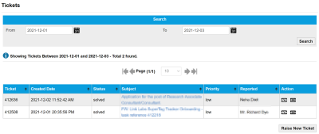

# Get support and manage tickets

The Support page is where you raise new, and manage existing, support tickets.

## Tickets page

The Tickets page lets you search all of your support tickets.

### Search

Filter the list of support tickets created between the From and To dates.

Select the calendar icon () to display a calendar from which you can select the required date.

Select Search to update the records in the results table.

### Results

**Viewing more results**

Some pages return results in a continuous list. Select View More at the end of the list to see more items.

The following tables describes the fields on the tickets page.

| Field            | Description                                                                                                                                                                                               |
| ---------------- | --------------------------------------------------------------------------------------------------------------------------------------------------------------------------------------------------------- |
| Ticket           | Unique identifier for the ticket that Infinity Classic assigns after the ticket is raised.                                                                                                                |
| Created Date     | The date (YY-MM-DD) and time (hh:flag\_mm:ss) that the ticket was raised.                                                                                                                                 |
| Status           | The current status of the ticket, which can be: New, Pending, On hold, Solved or Closed.                                                                                                                  |
| Subject          | The title of the ticket. Select the text to display ticket details on the [View Ticket page](get-support-and-manage-tickets.md#to-edit-an-existing-ticket).                                               |
| Priority         | The importance of the ticket: Low, Normal, High and Critical.                                                                                                                                             |
| Reported         | The name of the user who raised the ticket.                                                                                                                                                               |
| Action           |  – Edit ticket information.  – Close the ticket. |
| Raise New Ticket | Select to raise a new ticket.                                                                                                                                                                             |

### To raise a new ticket

1. Display the Support > Ticket menu.
2. Select Raise New Ticket, which displays the New Ticket page.
3. Supply the following information:

* Title
* Message
* Classification
* Priority

4. Select Create New Ticket.

### To edit an existing ticket

1. Display the Support > Ticket menu.
2. Search for and identify the ticket you want to edit in the results table.
3. Select the  icon, which displays the View Ticket dialog.
4. Edit the following information:

* Title
* Message
* Classification
* Priority

5. Select Create New Ticket.
