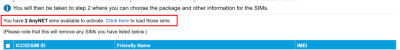
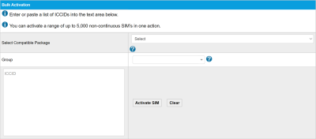

# Activate SIMs

A SIM must be activated before it can connect to a network. You can activate SIMs using the:

* **Infinity Classic web interface**, which enables you to:
* [Activate individual SIMs](activate-sims.md#activate-individual-sims)
* [Bulk activate a box of SIMs](activate-sims.md#bulk-activate-a-box-of-sims) (containing up to 200 SIMs with consecutive SIM numbers)
* [Bulk activate up to 5000 SIMs non-consecutive SIMs](activate-sims.md#bulk-activate-sims-using-the-bulk-activation-tool) (using the bulk activation tool)
* **Tigrillo API**, which provides an [activateSIMs](https://docs.eseye.com/Content/API/Tigrillo/activateSIMs.htm) API command to activate SIMs.

## Activate individual SIMs

Activating individual SIMs uses the ICCID (SIM ID), which is typically printed on individual SIMs as shown in [Understanding AnyNet SIM numbers](https://docs.eseye.com/Content/SIMs/ConsecutiveSIMs.htm).

### Before you begin

Before activating one or more SIM cards, you must:

* Have a signed Service Contract form agreeing to the associated costs.
* Ensure that all SIMs you want to activate in a single operation are of the same type (for example, all AnyNet SIMs and no other operator-supplied SIMs).
* Associate the SIMs with a package, using the tariff ID.
* Ensure that the tariff ID is the same for all SIMs you want to activate at the same time.
* Ensure your payments are up to date.
* For bulk activations, ensure you have set up Groups, Device Models and Alert Profiles.

To activate individual SIMs using Infinity Classic:

1. Log in to Infinity Classic, then select SIMS > Activate.
2. If you have pre-provisioned SIMs, select the link above the SIM Activation table to insert the SIMs into the table. For example: 
3. For each SIM you want to activate, type the ICCID/SIM ID, the optional Friendly Name, and the IMEI.
4. If you require more lines, select Insert Line in the drop-down list, then select Perform Action. To delete a line, select the checkbox alongside the relevant SIM. Select Delete Line in the drop-down list, then select Perform Action. A confirmation box appears. Select Yes to remove the line. To duplicate a line, select the checkbox alongside the relevant SIM. Select Duplicate Line in the drop-down list, then select Perform Action. A confirmation box appears. Select Yes to remove the line.
5. Activate the SIM(s): The Activate SIM - Step 2 of 2 page appears.

* To activate specific SIMs, select the check boxes alongside the relevant SIMs, then select Activate Selected SIMs.
* To activate all the SIMs in the table, select Activate All SIMs.

6. Using the Select Compatible Package drop-down list, which only displays tariffs assigned to the account, select the tariff to apply to all the SIMs.
7. Using the optional Group drop-down list, select the group name that will appear on invoices for easy SIM identification.
8. Using the optional User Fields, type in free text to help further identify the SIMs.
9. Using the Device Model drop-down list, select the device model to which the SIMs are assigned.
10. Using the Alert Profile drop-down list, select the alert profile for the SIMs.
11. Select Activate Request to activate the SIMs. The activation process can take up to 60 minutes. When activated, the SIMs become live on the network.

## Bulk activate a box of SIMs

Eseye provide SIMs in boxes of 200. The SIMs in each box have consecutive SIM numbers which enables you to activate an entire box at a time using the first and last SIM numbers in the sequence of 200.

### Before you begin

Before activating one or more SIM cards, you must:

* Have a signed Service Contract form agreeing to the associated costs.
* Ensure that all SIMs you want to activate in a single operation are of the same type (for example, all AnyNet SIMs and no other operator-supplied SIMs).
* Associate the SIMs with a package, using the tariff ID.
* Ensure that the tariff ID is the same for all SIMs you want to activate at the same time.
* Ensure your payments are up to date.
* For bulk activations, ensure you have set up Groups, Device Models and Alert Profiles.

To bulk activate a box of SIMs using Infinity Classic:

1. Using Infinity Classic, go to: SIMs > Bulk Activate.
2. In the Bulk SIM boxfull activation box, in the First field, type the lowest numerical SIM number from the box to activate. 
3. In the Last field, type the highest numerical SIM number from the box to activate. You can activate up to 200 consecutive SIMs. The final digit in the SIM number is a check digit. For more information, see [Understanding AnyNet SIM numbers](https://docs.eseye.com/Content/SIMs/ConsecutiveSIMs.htm).
4. Select Activate. The Activate SIM - Step 2 of 2 page appears.
5. Using the Select Compatible Package drop-down menu, select the agreed tariff to apply to all the SIMs. Only the tariffs assigned to the account are available for selection.
6. Using the optional Group drop-down menu, select the group name that will appear on invoices. Groups can help identify SIMs.
7. Using the optional User Fields, type in free text to help further identify the SIMs.
8. Using the Device Model drop-down menu, select the device model to which the SIMs are assigned.
9. Using the Alert Profile drop-down menu, select the alert profile for the SIMs.
10. Select Activate Request to activate the SIMs. The activation process can take up to 60 minutes. When activated, the SIMs become live on the network.

## Bulk activate SIMs using the bulk activation tool

Infinity Classic provides a bulk activation tool which enables you to active up to 5000 SIMs by uploading a list of ICCID/SIM numbers.

### Before you begin

Before activating one or more SIM cards, you must:

* Have a signed Service Contract form agreeing to the associated costs.
* Ensure that all SIMs you want to activate in a single operation are of the same type (for example, all AnyNet SIMs and no other operator-supplied SIMs).
* Associate the SIMs with a package, using the tariff ID.
* Ensure that the tariff ID is the same for all SIMs you want to activate at the same time.
* Ensure your payments are up to date.
* For bulk activations, ensure you have set up Groups, Device Models and Alert Profiles.

To bulk activate SIMs using the Infinity Classic Bulk Activation tool:

1. Using Infinity Classic, go to: SIMs > Bulk Activate.
2. In the Bulk Activation box, use the Select Compatible Package drop-down menu to select the agreed tariff to apply to all the SIMs. Only the tariffs assigned to the account are available for selection. 
3. Using the optional Group drop-down menu, select the group name that will appear on invoices. Groups can help identify SIMs.
4. In the ICCID box, paste the list of SIM numbers you want to activate, one per line. You can paste up to 5000 non-consecutive SIM numbers. Select Clear to remove all ICCID values from the list.
5. Select Activate SIM to activate the SIMs. The activation process can take up to 60 minutes. When activated, the SIMs become live on the network.

## Next step

Next: Manage SIMs
