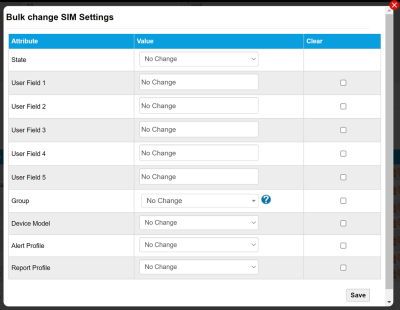

# Manage SIMs

This section describes how to manage your SIMs through the [SIM lifecycle](https://docs.eseye.com/Content/Billing/Billing_SIMLifecycle.htm), which includes:

* [Changing SIM states](manage-sims.md#changing-sim-states)
* [Updating SIM details](manage-sims.md#updating-sim-details)
* [Creating SIM groups](manage-sims.md#creating-sim-groups)
* Ordering SIMs
* Activating SIMs
* Suspending SIMs
* Terminating SIMs

## Changing SIM states

The SIM state can be change from one state to another as described in the [SIM lifecycle](https://docs.eseye.com/Content/Billing/Billing_SIMLifecycle.htm).

To change individual SIM states in Infinity Classic:

1. Go to: SIMS > SIMs List > Action 
2. Select Change State.
3. In the Requested State drop-down menu, select the required action.
4. Select Request.

## Updating SIM details

You can update SIM details using the:

* **Infinity Classic portal**, which enables you to:
* Update details for individual SIMs
* Bulk update details for SIMs
* **Tigrillo API**, using the setSIMDetail[s](https://docs.eseye.com/Content/API/Tigrillo/setSIMDetail.htm) command. For more information, see [POST /Japi/Tigrillo/setSIMDetail](https://docs.eseye.com/Content/API/Tigrillo/setSIMDetail.htm).

To update details for individual SIMs using Infinity Classic:

1. Go to: SIMS > SIMs List > Action 
2. Select Edit.
3. Edit the SIM Settings and select Save.

To bulk update details for multiple SIMs using Infinity Classic:

1. Use the row check boxes to select the SIMs on which to perform the bulk action.
2. Below the results table, use the dropdown list to select Change Settings.
3. Select Perform Bulk Actions to display to Bulk change SIM Settings dialog. 
4. Update the required fields on the dialog and select Save.
5. Wait for the dialog to confirm the changes, then close the dialog.

## Creating SIM groups

To configure a SIM Group name in Infinity Classic:

1. Go to: SIMS > SIM List > Action 
2. On the SIM Settings page, select Edit.
3. In the Group Name drop-down menu, select an existing group. Alternatively, type the name of a new group. This will appear in the Group list when you save your changes.
4. Select Save.

To assign a group to multiple SIMs in Infinity Classic:

The first column in the SIM list is a checkbox.

1. Select the checkbox alongside each SIM you want to assign the Group Name to. Select the column header checkbox to select all SIMs in the list.
2. At the bottom of the SIM list, in the drop-down box, select Change Settings.
3. Select Perform Bulk Action.  The Bulk change SIM Settings form appears.
4. Using the Group drop-down menu, select the Group Name for the chosen SIMs. Alternatively, type the name of a new group. This will appear in the Group list when you save your changes.
5. Select Save to save your changes.
6. Close Bulk change SIM Settings.

## Next step

Next: Monitor SIMs and devices
