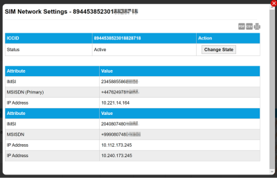

# Terminate SIMs

When a SIM is terminated, the SIM stops connecting to the network. Service charges will stop unless the SIM is in contract, in which case you are liable for the rest of the service charges up until the end date of the contract.

Termination is not instant – Eseye must verify the termination. There may also be cancellation costs associated with terminating a SIM.

After a SIM is terminated it can be re-provisioned by changing the state.

You can terminate SIMs using the:

* **Infinity Classic portal**, which enables you to:
* [Terminate individual SIMs](terminate-sims.md#terminating-individual-sims)
* [Bulk terminate up to 5000 SIMs non-consecutive SIMs](terminate-sims.md#terminating-sims-in-bulk) (using the bulk termination tool)
* **Tigrillo API**, which provides a [terminateSIMs](https://docs.eseye.com/Content/API/Tigrillo/terminateSIMs.htm) API command to terminate SIMs.

## Terminating individual SIMs

To terminate an individual SIM requires you to identify the SIM using its ICCID (SIM ID).

To terminate an individual SIM in Infinity Classic:

1. Using Infinity Classic, go to: SIMs > SIMs List.
2. Use the search fields to find the SIM to terminate.
3. For the SIM to terminate, in the Actions column, select the  icon to display the network settings for the SIM. 
4. Select Change State.
5. In the Requested State drop-down menu, select Terminate SIM.
6. Select Request. SIMs that are not in contract are queued for termination. Termination is not instant – Eseye must verify the termination.

## Terminating SIMs in bulk

You can terminate up to 5000 non-consecutive SIMs at a time using the Bulk Termination tool.

To bulk terminate SIMs in Infinity Classic:

If you terminate SIMs that are currently in contract, you are liable for the rest of the service charges up until the end date of the contract.

1. Using Infinity Classic, go to: SIMs > Bulk Termination. 
2. In the ICCID box, paste the list of SIM numbers you want to terminate, one per line. You can paste up to 5000 non-consecutive SIM numbers. Select Clear to remove all ICCID values from the list.
3. Select Terminate to terminate the SIMs. SIMs that are not in contract are queued for termination. Termination is not instant – Eseye must verify the termination. SIMs that are currently in contract will incur further service charges.
4. If a warning appears listing in contract SIMs, and you want to continue with the termination, select Terminate All SIMs. You will receive a separate termination invoice with the remaining service charges in one lump sum, unless you have made a prior alternative arrangement with Accounts.
