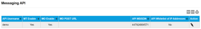

# Configure the Messaging API

The Messaging API page configures the sending of MT SMS and receiving of MO SMS messages for this account.

Select the export to PDF (), export to CSV () or print () buttons to export or print the information displayed on the page.

The following table describes the fields on the Messaging API page and Edit Messaging API dialog.

| Field                         | Description                                                                                                                                                                                                                                          |
| ----------------------------- | ---------------------------------------------------------------------------------------------------------------------------------------------------------------------------------------------------------------------------------------------------- |
| API Username                  | Username used to authenticate messaging API (SMS API) requests.                                                                                                                                                                                      |
| API Password                  | Password used to authenticate messaging API (SMS API) requests.                                                                                                                                                                                      |
| MT Enable                     | Whether the user is permitted to send MT messages.                                                                                                                                                                                                   |
| MO Enable                     | Whether the user is permitted to send MO messages.                                                                                                                                                                                                   |
| MO POST URL                   | The URL to which the [AnyNet Messaging Service](https://docs.eseye.com/Content/GettingStarted/SMS/UnderstandingSMS.htm#AnyNetMessagingService) sends MO SMS messages from SIMs associated with the user.                                             |
| API MSISDN                    | The MSISDN to which to send MO SMS messages from IoT devices with AnyNet SIMs. Eseye can assign two API MSISDNs for each MO POST URL. Eseye provide the MSISDN(s) to use. To request a second API MSISDN for this account, contact customer support. |
| API Whitelist Enable          | Select to enable the API Allowlist, which only accepts requests from the IP addresses in the comma-separated list of IP addresses (defined below).                                                                                                   |
| API Whitelist of IP Addresses | A comma-separated list of IP addresses that are allowed to [send requests to the messaging API](https://docs.eseye.com/Content/API/SMS/SMSAPIIntro.htm) (SMS API).                                                                                   |
| Action                        |  – select to edit the fields above.                                                                                                                                                |

## Related tasks

Back to overview
