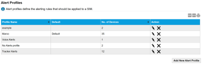
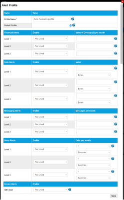

# Create alert profiles

The Alert profiles page enables you to send alerts, or suspend SIMs when Financial, Data, Messaging, Voice or Device limits are reached.

Select the export to PDF (), export to CSV () or print () buttons to export or print the information displayed on the page.

The following table describes the fields on the alert profile page.

| Field                 | Description                                                                                                                                                                                                                                             |
| --------------------- | ------------------------------------------------------------------------------------------------------------------------------------------------------------------------------------------------------------------------------------------------------- |
| Profile Name          | Unique name for the alert profile.                                                                                                                                                                                                                      |
| Default               | If a profile is set as the Default, this indicates that all new SIMs are assigned to this profile unless otherwise specified.                                                                                                                           |
| No. of Devices        | The number of devices using this alert profile.                                                                                                                                                                                                         |
| Action                |  – [edit the alert profile](create-alert-profiles.md#add-edit-alert-profile-dialog).  – delete the alert profile. |
| Add New Alert Profile | Select to [add a new alert profile](create-alert-profiles.md#add-edit-alert-profile-dialog).                                                                                                                                                            |

### Add/Edit alert profile dialog

To display the Alert Profile dialog, add or edit an alert profile.

The following table describes the fields on the Alert Profile dialog.

| Field                      | Description                                                                                                                                                                                                                                                                                                                                                                  |
| -------------------------- | ---------------------------------------------------------------------------------------------------------------------------------------------------------------------------------------------------------------------------------------------------------------------------------------------------------------------------------------------------------------------------- |
| Name                       |                                                                                                                                                                                                                                                                                                                                                                              |
| Profile Name               | Unique name for the alert profile.                                                                                                                                                                                                                                                                                                                                           |
| Default Profile            | If a profile is set as the Default, this indicates that all new SIMs are assigned to this profile unless otherwise specified.                                                                                                                                                                                                                                                |
| Financial Alerts           | Define up to three levels of financial alerts that are triggered when the SIM charges for the current billing period exceed the overage thresholds defined (below) for each level.                                                                                                                                                                                           |
| Enable                     | For each alert level, select one of the following: Not used – do not alert users when SIM exceeds the configured alert level threshold. Alert – sends an email to every user assigned to the package for the SIM that exceeded the alert level threshold. Suspend – suspends the SIM that has exceeded the the alert level threshold.                                        |
| Value of Overage per month | For each alert level, specify a value for the amount over the agreed monthly cost of the bundle that will trigger an alert. The values for alert level 1 must be lower than alert level 2, which must be lower than alert level 3. You must not include the currency icon in the value.                                                                                      |
| Data Alerts                | Define up to three levels of data alerts that are triggered when the data usage for the SIM in the current billing period exceeds the thresholds defined (below) for each level.                                                                                                                                                                                             |
| Enable                     | For each alert level, select one of the following: Not used – do not alert users when SIM exceeds the configured alert level threshold. Alert – sends an email to every user assigned to the package for the SIM that exceeded the alert level threshold. Suspend – suspends the SIM that has exceeded the the alert level threshold.                                        |
| Value                      | For each alert level, specify the value and units for the amount of data used in the current billing period that will trigger an alert. The units can be bytes, kilobytes, megabytes, gigabytes or expressed as a percentage of the data usage defined in the bundle. The values for alert level 1 must be lower than alert level 2, which must be lower than alert level 3. |
| Messaging Alerts           | Define up to three levels of messaging alerts that are triggered when the number of SMS messages sent in the current billing period exceeds the thresholds defined (below) for each level.                                                                                                                                                                                   |
| Enable                     | For each alert level, select one of the following: Not used – do not alert users when SIM exceeds the configured alert level threshold. Alert – sends an email to every user assigned to the package for the SIM that exceeded the alert level threshold. Suspend – suspends the SIM that has exceeded the the alert level threshold.                                        |
| Messages per month         | For each alert level, specify the number of SMS messages sent in the current billing period that will trigger an alert. The values for alert level 1 must be lower than alert level 2, which must be lower than alert level 3.                                                                                                                                               |
| Voice Alerts               | Define up to three levels of voice alerts that are triggered when total duration of all calls in the current billing period exceeds the thresholds defined (below) for each level.                                                                                                                                                                                           |
| Enable                     | For each alert level, select one of the following: Not used – do not alert users when SIM exceeds the configured alert level threshold. Alert – sends an email to every user assigned to the package for the SIM that exceeded the alert level threshold. Suspend – suspends the SIM that has exceeded the the alert level threshold.                                        |
| Calls per month            | For each alert level, specify the total duration of calls (in seconds, minutes or hours) in the current billing period that will trigger an alert. The values for alert level 1 must be lower than alert level 2, which must be lower than alert level 3.                                                                                                                    |
| Device Alerts              | Trigger a device alert when the SIM is being used by an IMEI for which it is not registered.                                                                                                                                                                                                                                                                                 |
| IMEI Alert                 | Select one of the following: Not used – do not use device alerts. Alert – sends an email to every user assigned to the package for the SIM when there is an IMEI mismatch. Suspend – suspends the SIM when there is an IMEI mismatch.                                                                                                                                        |
| Save                       | Select to save the changes to the alerts.                                                                                                                                                                                                                                                                                                                                    |

## Related tasks

Back to overview
