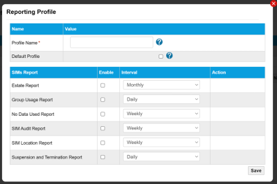

# Create reporting profiles

The Reporting Profile page defines report profiles that you assign to SIMs on the SIM Settings page.

Select the export to PDF (), export to CSV () or print () buttons to export or print the information displayed on the page.

The following table describes the fields on the Reporting Profile page.

| Field                  | Description                                                                                                                                                                                        |
| ---------------------- | -------------------------------------------------------------------------------------------------------------------------------------------------------------------------------------------------- |
| Profile Name           | Unique name for the report profile.                                                                                                                                                                |
| Default                | If a profile is set as the Default, this indicates that all new SIMs are assigned to this profile unless otherwise specified.                                                                      |
| No. of Devices         | The number of SIMs assigned to this reporting profile. You assign SIMs to devices on the SIM Settings page.                                                                                        |
| Action                 |  – edit the report profile.  – delete the reporting profile. |
| Add New Report Profile | Select to display the Add Report Profile dialog (below) where you add a new report profile.                                                                                                        |

### Add/Edit report profile dialog

The Add/Edit Report Profile dialog is where you can add a new report profile or edit existing report profiles.

The following table describes the fields on the Add/Edit Report Profile dialog.

| Field        | Description                                                                                                                                                                                                                                                                                                                                                                                                                                                                                                                                                                                                                                                                                                                                                                                                                                                                                                                                                                                                        |
| ------------ | ------------------------------------------------------------------------------------------------------------------------------------------------------------------------------------------------------------------------------------------------------------------------------------------------------------------------------------------------------------------------------------------------------------------------------------------------------------------------------------------------------------------------------------------------------------------------------------------------------------------------------------------------------------------------------------------------------------------------------------------------------------------------------------------------------------------------------------------------------------------------------------------------------------------------------------------------------------------------------------------------------------------ |
| Profile Name | Unique name for the report profile.                                                                                                                                                                                                                                                                                                                                                                                                                                                                                                                                                                                                                                                                                                                                                                                                                                                                                                                                                                                |
| Default      | If a profile is set as the Default, this indicates that all new SIMs are assigned to this profile unless otherwise specified.                                                                                                                                                                                                                                                                                                                                                                                                                                                                                                                                                                                                                                                                                                                                                                                                                                                                                      |
| SIMs Report  | Displays a row for each of the following SIM reports: Estate Report – monthly report that provides a breakdown of individual SIM usage and details, contract terms, network changes, and SIM status, authentication and location information. Group Usage Report – daily, weekly or monthly report that displays data usage across all SIMs. No Data Used Report – weekly or monthly report that displays the ICCID and MSIDSN of active devices that have not used any data in the past month, including the SIM status and where the device was last seen. SIM Audit Report – weekly or monthly report that displays alert triggers on specified SIMs. SIM Location Report – weekly or monthly report that displays the number of devices per country for all SIMs in your estate. Suspension and Termination Report – daily, weekly or monthly report that displays when a SIM status was initiated, including all activations, terminations, manual suspensions, and alerted suspensions, by ICCID and MSISDN. |
| Enable       | Select the check box to enable the report.                                                                                                                                                                                                                                                                                                                                                                                                                                                                                                                                                                                                                                                                                                                                                                                                                                                                                                                                                                         |
| Interval     | Specify whether the report is generated Daily, Weekly or Monthly.                                                                                                                                                                                                                                                                                                                                                                                                                                                                                                                                                                                                                                                                                                                                                                                                                                                                                                                                                  |
| Action       | Only displayed when editing the report profile. Select Run Now to trigger the report.                                                                                                                                                                                                                                                                                                                                                                                                                                                                                                                                                                                                                                                                                                                                                                                                                                                                                                                              |
| Save         | Select the add/edit the reporting profile.                                                                                                                                                                                                                                                                                                                                                                                                                                                                                                                                                                                                                                                                                                                                                                                                                                                                                                                                                                         |

## Related tasks

Back to overview
