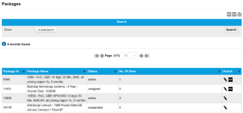

# Manage SIM packages

The SIM packages page lists all of the packages associated with this account, and enables you to view and edit package information.

### Search

Use Show to filter the packages to display: Select All, Active, Suspended, Legacy, Unsigned.

Select Search to update the records in the results table.

### Results

Select the export to PDF (), export to CSV () or print () buttons to export or print the information displayed on the page.

The following table describes the columns displayed for the SIM Audit Log records.

| Field        | Description                                                                                                                                                                                                                                                                                  |
| ------------ | -------------------------------------------------------------------------------------------------------------------------------------------------------------------------------------------------------------------------------------------------------------------------------------------- |
| Package ID   | Unique identifier for the [package](https://docs.eseye.com/Content/Billing/Billing_Packages.htm).                                                                                                                                                                                            |
| Package Name | Name of the package which typically contains information about the package items.                                                                                                                                                                                                            |
| Status       | The status of the package: Active Suspended Unsigned Legacy                                                                                                                                                                                                                                  |
| No. of SIMs  | The number of SIMs assigned to the package.                                                                                                                                                                                                                                                  |
| Actions      |  – edit package details (friendly name, status)  – download [service contracts](https://docs.eseye.com/Content/Billing/Billing_Packages.htm#About2). |

## Related tasks

Back to overview
