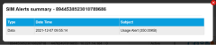

# Find and filter SIMs

The SIMs List page provides search filters to identify SIMs that meet a certain criteria, a table of results to list the filtered SIMs and action buttons to perform actions on one or more SIMs in the list.

By default, the SIM List page displays the SIMs provisioned on your account.

Select the export to PDF (), export to CSV () or print () buttons to export or print the information displayed on the page.

### Search filters

The search filters provide different ways to filter the list of SIMs and only show results which match the criteria defined in **all** of the applied search filters.

The following table describes the fields available on the search filters pane.

| Field          | Description                                                                                                                                                                                                                                                                                                                                                                                                                                                                                                                                                                                                                                                                                                                                                                                                                                                                                                                                                           |
| -------------- | --------------------------------------------------------------------------------------------------------------------------------------------------------------------------------------------------------------------------------------------------------------------------------------------------------------------------------------------------------------------------------------------------------------------------------------------------------------------------------------------------------------------------------------------------------------------------------------------------------------------------------------------------------------------------------------------------------------------------------------------------------------------------------------------------------------------------------------------------------------------------------------------------------------------------------------------------------------------- |
| Search For     | Specify a search string, the fields to which it is compared and the criteria that defines whether the SIM matches. To use the Search For filters Select one or more of the following fields from the drop-down list: ICCID MSISDN SIMID IP Friendly Name IMEI Select one of the following criteria, which determine how the search string (below) is compared to the selected fields (above): Starting With – show results where any of the selected fields (above) start with the search string (below). Ending With – show results where any of the selected fields (above) end with the search string (below). Containing – show results where any of the selected fields (above) contain the search string. Matching – show results where any of the selected fields (above) exactly match the search string. Specify the search string used to compare to the selected fields. Leave the search string blank to search across all SIMs assigned to your account. |
| Group          | Select the name of the group to restrict the results to only include SIMs that are part of the selected SIM group/collection.                                                                                                                                                                                                                                                                                                                                                                                                                                                                                                                                                                                                                                                                                                                                                                                                                                         |
| SIM State      | Select to only show SIMs that are currently in one of the following [SIM states](https://docs.eseye.com/Content/Billing/Billing_SIMLifecycle.htm): All – show SIMs in any SIM state. Terminated Available Active Suspended PendingTermination                                                                                                                                                                                                                                                                                                                                                                                                                                                                                                                                                                                                                                                                                                                         |
| SIM Package    | Select a [package](https://docs.eseye.com/Content/Billing/Billing_Packages.htm) to only show SIMs that belong to the selected package. Select All to show SIMs that belong to any package.                                                                                                                                                                                                                                                                                                                                                                                                                                                                                                                                                                                                                                                                                                                                                                            |
| SIM Data Usage | Select to filter SIMs based on the amount of data they have used. All SIMs Only SIMs with no data usage Only SIMs with data usage                                                                                                                                                                                                                                                                                                                                                                                                                                                                                                                                                                                                                                                                                                                                                                                                                                     |
| Search         | Select to display the results table for the selected search filters.                                                                                                                                                                                                                                                                                                                                                                                                                                                                                                                                                                                                                                                                                                                                                                                                                                                                                                  |

### Results table

**Viewing more results**

Some pages return results in a continuous list. Select View More at the end of the list to see more items.

The following table describes the columns displayed after performing a search.

| Field               | Description                                                                                                                                                                                                                                                                                                                                                                                                                                                                                                                                                                                                                                                                                                                                                                                                                                                                                                                                                             |
| ------------------- | ----------------------------------------------------------------------------------------------------------------------------------------------------------------------------------------------------------------------------------------------------------------------------------------------------------------------------------------------------------------------------------------------------------------------------------------------------------------------------------------------------------------------------------------------------------------------------------------------------------------------------------------------------------------------------------------------------------------------------------------------------------------------------------------------------------------------------------------------------------------------------------------------------------------------------------------------------------------------- |
| Friendly Name       | An optional, user-defined name that can be used to help identify the SIM. For example, the site location or purpose of the data connection.                                                                                                                                                                                                                                                                                                                                                                                                                                                                                                                                                                                                                                                                                                                                                                                                                             |
| ICCID               | Integrated Circuit Card Identifier for SIM cards or profiles (when using an eUICC SIM). For more information, see [About eUICC SIM profiles](https://docs.eseye.com/Content/GettingStarted/eSIM/Profiles.htm#top). Contains 14 and 20 numeric digits and starts with 89 or 99.                                                                                                                                                                                                                                                                                                                                                                                                                                                                                                                                                                                                                                                                                          |
| MSISDN              | The Mobile Station International Subscriber Directory Number (MSISDN) is a unique identifier for a mobile phone number in telecommunications. It includes the country code, mobile network code and subscriber number, allowing for routing of calls and messages to the correct device. The MSISDN contains between 8 and 18 numeric digits and can include the '+' country code identifier, for example: +441234567890.                                                                                                                                                                                                                                                                                                                                                                                                                                                                                                                                               |
| IP                  | The IPv4 address of the device containing the SIM.                                                                                                                                                                                                                                                                                                                                                                                                                                                                                                                                                                                                                                                                                                                                                                                                                                                                                                                      |
| Data Usage          | The total monthly data usage by the SIM for the current billing period.                                                                                                                                                                                                                                                                                                                                                                                                                                                                                                                                                                                                                                                                                                                                                                                                                                                                                                 |
| Group               | The name of the group (SIM collection) to which you assigned the SIM.                                                                                                                                                                                                                                                                                                                                                                                                                                                                                                                                                                                                                                                                                                                                                                                                                                                                                                   |
| Status              | The current SIM state: Available Active Suspended Terminated For more information, see [Understanding the SIM lifecycle](https://docs.eseye.com/Content/Billing/Billing_SIMLifecycle.htm).                                                                                                                                                                                                                                                                                                                                                                                                                                                                                                                                                                                                                                                                                                                                                                              |
| Alert               | Displays the level of the data alert (if threshold is reached) defined in the alert profile associated with the SIM. If there is a data alert level shown, the table cell is highlighted and you can select the cell to display the SIM Alerts Summary.                                                                                                                                                                                                                                                                                                                                                                                                                                                                                                                                                              |
| Action              |  – Summary of activity  – Settings  – Network settings  – Contract settings  – Billing  – Messaging  – RADIUS  – NetFlow  – Control Panel  – SIM Audit Log |
| Perform Bulk Action | Only the Change Settings bulk action is available on this page. Select Change Settings to display the SIM Settings dialog, where you change the SIM state and other settings for the selected rows.                                                                                                                                                                                                                                                                                                                                                                                                                                                                                                                                                                                                                                                                                                                                                                     |

## Related tasks

Back to overview
