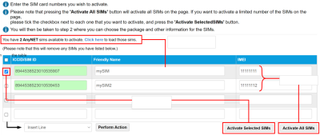

# Use the Activate page

The Activate page provides a table where you specify the SIMs to activate. If you have a number of pre-provisioned SIMs, this page displays a link which loads the ICCID numbers of all pre-provisioned SIMs into the table.

To activate SIMs in bulk, see [Bulk Activate page](use-the-activate-page.md#bulk-activate-page).

The following table describes the fields on the Activate page.

| Field                  | Description                                                                                                                                                                                                                                                                    |
| ---------------------- | ------------------------------------------------------------------------------------------------------------------------------------------------------------------------------------------------------------------------------------------------------------------------------ |
| ICCID/SIM ID           | Integrated Circuit Card Identifier for SIM cards or profiles (when using an eUICC SIM). For more information, see [About eUICC SIM profiles](https://docs.eseye.com/Content/GettingStarted/eSIM/Profiles.htm#top). Contains 14 and 20 numeric digits and starts with 89 or 99. |
| Friendly Name          | An optional, user-defined name that can be used to help identify the SIM. For example, the site location or purpose of the data connection.                                                                                                                                    |
| IMEI                   | International Mobile Equipment Identity. The unique 15-digit International Mobile Equipment Identity serial number that identifies the device on the cellular network.                                                                                                         |
| Activate Selected SIMs | Select check boxes next to the SIMs you want to activate and select Activate Selected SIMs.                                                                                                                                                                                    |
| Activate All SIMs      | Select Activate All SIMs to activate all of the SIMs in the table.                                                                                                                                                                                                             |
| Perform Action         | Use the Insert Line, Delete Line, Duplicate Line actions and Perform Action button to add/remove/duplicate rows in the table of SIMs to activate.                                                                                                                              |

## Related tasks

Back to overview
