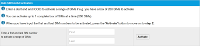

# Use the Bulk Activate page

You can activate consecutive SIMs one box at a time (up to 200 SIMs), or using the Bulk Activation tool (up to 5000 non-consecutive SIMs).

The following table describes the fields on the Bulk Activate page.

| Field                           | Description                                                                                                                                                                                                                               |
| ------------------------------- | ----------------------------------------------------------------------------------------------------------------------------------------------------------------------------------------------------------------------------------------- |
| **Bulk SIM boxfull activation** | Activates consecutive SIMs one box at a time (up to 200 SIMs). The final digit in the SIM number is a check digit. For more information, see [Understanding AnyNet SIM numbers](https://docs.eseye.com/Content/SIMs/ConsecutiveSIMs.htm). |
| First                           | The lowest numerical SIM number from the box to activate.                                                                                                                                                                                 |
| Last                            | The highest numerical SIM number from the box to activate.                                                                                                                                                                                |
| Activate                        | Select to activate the SIMS.                                                                                                                                                                                                              |
| **Bulk Activation**             | Activates up to 5000 non-consecutive SIMs.                                                                                                                                                                                                |
| Select Compatible Package       | The agreed tariff to apply to all the SIMs. Only the tariffs assigned to the account are available for selection.                                                                                                                         |
| Group                           | The group name that will appear on invoices. Groups can help identify SIMs.                                                                                                                                                               |
| ICCIDs                          | A list of SIM numbers you want to activate, one per line. You can paste up to 5000 non-consecutive SIM numbers.                                                                                                                           |
| Activate SIM                    | Select to activate the SIMs. The activation process can take up to 60 minutes. When activated, the SIMs become live on the network.                                                                                                       |
| Clear                           | Removes all ICCID values from the list.                                                                                                                                                                                                   |

## Related tasks

Back to overview
