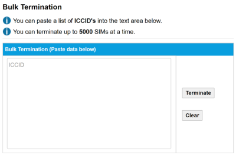

# Use the Bulk Termination page

You can terminate up to 5000 non-consecutive SIMs at a time using the Bulk Termination tool.

If you terminate SIMs that are currently in contract, you are liable for the rest of the service charges up until the end date of the contract.

The following table describes the fields on the Bulk Termination page.

| Field     | Description                                                                                                                                                                                                                     |
| --------- | ------------------------------------------------------------------------------------------------------------------------------------------------------------------------------------------------------------------------------- |
| ICCIDs    | A list of SIM numbers you want to terminate, one per line. You can paste up to 5000 non-consecutive SIM numbers.                                                                                                                |
| Terminate | Select to terminate the SIMs. SIMs that are not in contract are queued for termination. Termination is not instant – Eseye must verify the termination. SIMs that are currently in contract will incur further service charges. |
| Clear     | Removes all ICCID values from the list.                                                                                                                                                                                         |

## Related tasks

Back to overview
