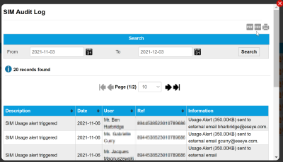

# View the estate SIM audit log

The SIM Audit Log enables you to search records of every action taken and every change made to all SIMs associated with the user account.

Select the export to PDF (), export to CSV () or print () buttons to export or print the information displayed on the page.

### Search

The search enables you to filter the list of SIM audit log records between a From and To date.

Select the calendar icon () to display a calendar from which you can select the required date.

### Results

**Viewing more results**

Some pages return results in a continuous list. Select View More at the end of the list to see more items.

The following table describes the columns displayed for the SIM Audit Log records.

| Field       | Description                                                |
| ----------- | ---------------------------------------------------------- |
| Description | Description of the activity or change.                     |
| Date        | The date of the change in the following format YYYY-MM-DD. |
| User        | The name of the user that made the change.                 |
| Ref         | The ICCID of the SIM on which the user made the change.    |
| Information | Detailed description about the change made.                |

## Related tasks

Back to overview
