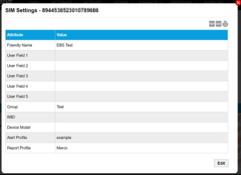

# Update SIM settings

To display or edit the settings for a SIM, on the SIM List page menu, select  next to the chosen SIM.

Select the export to PDF (), export to CSV () or print () buttons to export or print the information displayed on the page.

The following table describes the fields displayed in the SIM settings report.

| Field              | Description                                                                                                                                                                                      |
| ------------------ | ------------------------------------------------------------------------------------------------------------------------------------------------------------------------------------------------ |
| Friendly Name      | An optional, user-defined name that can be used to help identify the SIM. For example, the site location or purpose of the data connection.                                                      |
| User Field 1 ... 5 | Optional text boxes used to identify the SIM.                                                                                                                                                    |
| Group              | The name of the group (SIM collection) to which you assigned the SIM. When editing this field, use the text box to define a new group box or use the drop-down list to select an existing group. |
| IMEI               | International Mobile Equipment Identity. The unique 15-digit International Mobile Equipment Identity serial number that identifies the device on the cellular network.                           |
| Device Model       | The device model(s) created on your account.                                                                                                                                                     |
| Alert Profile      | Lists the alert profiles assigned to the SIM.                                                                                                                                                    |
| Report Profile     | Lists the report profiles assigned to the SIM.                                                                                                                                                   |
| Edit               | Select to edit the fields for this SIM.                                                                                                                                                          |

## Related tasks

Back to overview
