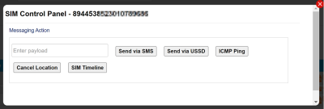

# Use the SIM control panel

To send a test SMS, test USSD, or ICMP ping to the SIM, on the SIM List page menu, select  next to the chosen SIM.

The following table describes the fields displayed on the SIM Control Panel.

| Field           | Description                                                                                                                                                                                                                                                                                                                                                                                                                                                                                                                                                                                                                                                                                                                                                                                                            |
| --------------- | ---------------------------------------------------------------------------------------------------------------------------------------------------------------------------------------------------------------------------------------------------------------------------------------------------------------------------------------------------------------------------------------------------------------------------------------------------------------------------------------------------------------------------------------------------------------------------------------------------------------------------------------------------------------------------------------------------------------------------------------------------------------------------------------------------------------------- |
| Enter Payload   | Specify the text to send to the SIM via SMS or USSD.                                                                                                                                                                                                                                                                                                                                                                                                                                                                                                                                                                                                                                                                                                                                                                   |
| Send via SMS    | Select to send the payload (defined above) to the device via a test SMS message.                                                                                                                                                                                                                                                                                                                                                                                                                                                                                                                                                                                                                                                                                                                                       |
| Send via USSD   | Select to send the payload (defined above) to the device via a test USSD message.                                                                                                                                                                                                                                                                                                                                                                                                                                                                                                                                                                                                                                                                                                                                      |
| ICMP Ping       | Select to perform an [ICMP ping](https://docs.eseye.com/Content/Connectivity/PingService.htm).                                                                                                                                                                                                                                                                                                                                                                                                                                                                                                                                                                                                                                                                                                                         |
| Cancel Location | Select to remove the subscriber from the [HLR](https://docs.eseye.com/Content/Glossary/Hlr.htm) using the location cancellation procedure defined in sections 3.6.1.3 and 4.2 in [3GPP TS 23.012](https://www.3gpp.org/DynaReport/23012.htm). This causes a failure in the next attempt (by the modem in the device) to send data, which typically causes the device firmware to restart the connection. Restarting the connection can be useful if you suspect the firmware or modem are in an unusual state, or to terminate data sessions. For example, if an operator API gateway does not support [RADIUS](https://docs.eseye.com/Content/Glossary/RADIUS.htm) packet of disconnect (PoD) messages, the cancel location procedure can terminate the data session between the device and the operator API gateway. |
| SIM Timeline    | Select to display a timeline of SIM activity for all IMSIs related to the ICCID.                                                                                                                                                                                                                                                                                                                                                                                                                                                                                                                                                                                                                                                                                                                                       |

## Related tasks

Back to overview
