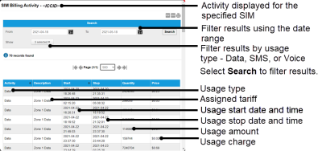

# View billing activity

To display the settings for a SIM, on the SIM List page menu, select  next to the chosen SIM. This displays a breakdown of the activity of the SIM. This is the only place to view the SMS activity of a SIM including the data, SMS, and voice usage and subsequent charges.

Select the export to PDF (), export to CSV () or print () buttons to export or print the information displayed on the page.

### Search

The search enables you to filter the billing records.

| Field   | Description                                                                                                                                                                                                                            |
| ------- | -------------------------------------------------------------------------------------------------------------------------------------------------------------------------------------------------------------------------------------- |
| From To | Filter the list of billing records between the From and To dates. Select the calendar icon () to display a calendar from which you can select the required date. |
| Show    | Select which activities are shown. By default, all activities (Data, SMS and Voice) are shown.                                                                                                                                         |
| Search  | Select to filter the billing records using the values in the From, To and Show fields.                                                                                                                                                 |

### Results

**Viewing more results**

Some pages return results in a continuous list. Select View More at the end of the list to see more items.

The following table describes the fields displayed in the Billing report.

| Field       | Description                                                                                                |
| ----------- | ---------------------------------------------------------------------------------------------------------- |
| Activity    | The usage type: Data, SMS or Voice.                                                                        |
| Description | Textual description of the assigned tariff.                                                                |
| Start       | Start date and time for the usage measurement.                                                             |
| Stop        | Stop date and time for the usage measurement.                                                              |
| Quantity    | The amount of data (bytes, unless otherwise stated), SMS (number of SMS messages) or voice (seconds) used. |
| Price       | The calculated charge for the current usage.                                                               |

## Related tasks

Back to overview
