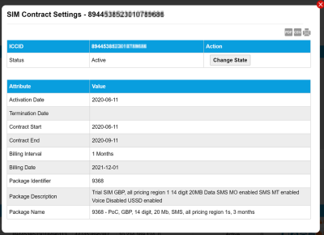

# View contract settings

To display the settings for a SIM, on the SIM List page menu, select  next to the chosen SIM.

Select the export to PDF (), export to CSV () or print () buttons to export or print the information displayed on the page.

The following table describes the fields displayed in the SIM Contract Settings report.

| Field         |                                                                                                                                                                                                                                                                                | Description                                                                                                                                                                                                          |
| ------------- | ------------------------------------------------------------------------------------------------------------------------------------------------------------------------------------------------------------------------------------------------------------------------------ | -------------------------------------------------------------------------------------------------------------------------------------------------------------------------------------------------------------------- |
| **ICCID**     | Integrated Circuit Card Identifier for SIM cards or profiles (when using an eUICC SIM). For more information, see [About eUICC SIM profiles](https://docs.eseye.com/Content/GettingStarted/eSIM/Profiles.htm#top). Contains 14 and 20 numeric digits and starts with 89 or 99. |                                                                                                                                                                                                                      |
|               | Status                                                                                                                                                                                                                                                                         | The current SIM state: Available Active Suspended Terminated For more information, see [Understanding the SIM lifecycle](https://docs.eseye.com/Content/Billing/Billing_SIMLifecycle.htm).                           |
|               | Change State                                                                                                                                                                                                                                                                   | Select to display the SIM Change State dialog where you can change the state of the SIM from Active to Suspended or Terminated. If the SIM is suspended, you can update its status to either Terminate or Unsuspend. |
| **Attribute** |                                                                                                                                                                                                                                                                                |                                                                                                                                                                                                                      |
|               | Activation Date                                                                                                                                                                                                                                                                | The date of the most recent activation.                                                                                                                                                                              |
|               | Termination Date                                                                                                                                                                                                                                                               | The date the SIM contract is due to be terminated (if applicable).                                                                                                                                                   |
|               | Contract Start                                                                                                                                                                                                                                                                 | The date on which the SIM contract started.                                                                                                                                                                          |
|               | Contract End                                                                                                                                                                                                                                                                   | The date the SIM contract ends.                                                                                                                                                                                      |
|               | Billing Interval                                                                                                                                                                                                                                                               | The frequency of invoices.                                                                                                                                                                                           |
|               | Billing Date                                                                                                                                                                                                                                                                   | The date of the next billing invoice.                                                                                                                                                                                |
|               | Package Identifier                                                                                                                                                                                                                                                             | Unique identifier for the package.                                                                                                                                                                                   |
|               | Package Description                                                                                                                                                                                                                                                            | Brief summary of the package contents.                                                                                                                                                                               |
|               | Package Name                                                                                                                                                                                                                                                                   | The user-defined name assigned to the package.                                                                                                                                                                       |

## Related tasks

Back to overview
