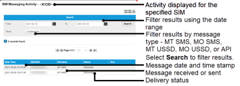

# View messaging activity

To display a log of the messaging activity for a SIM, on the SIM List page menu, select  next to the chosen SIM.

### Search

The search enables you to filter the messaging records.

| Field   | Description                                                                                                                                                                                                                                                                                                                                                    |
| ------- | -------------------------------------------------------------------------------------------------------------------------------------------------------------------------------------------------------------------------------------------------------------------------------------------------------------------------------------------------------------- |
| From To | Filter the list of messages between the From and To dates. Select the calendar icon () to display a calendar from which you can select the required date.                                                                                                                                |
| Show    | Select which messages to show in the results table: Select all – shows all messages. MT SMS – Mobile-terminated SMS (sent to the device) MO SMS – Mobile-originated SMS (sent from the device) MT USSD – Unstructured Supplementary Service Data (USSD) message (sent to the device) MO USSD – USSD message (sent from the device) API – API-generated message |
| Search  | Select to filter the billing records using the values in the From, To and Show fields.                                                                                                                                                                                                                                                                         |

### Results

**Viewing more results**

Some pages return results in a continuous list. Select View More at the end of the list to see more items.

The following table describes the fields displayed in the messaging report.

| Field     | Description                                                                                                                                                                                                                                                                                                                                                                                                               |
| --------- | ------------------------------------------------------------------------------------------------------------------------------------------------------------------------------------------------------------------------------------------------------------------------------------------------------------------------------------------------------------------------------------------------------------------------- |
| Date Time | The date and time that the device sent or received the message.                                                                                                                                                                                                                                                                                                                                                           |
| MSISDN    | The Mobile Station International Subscriber Directory Number (MSISDN) is a unique identifier for a mobile phone number in telecommunications. It includes the country code, mobile network code and subscriber number, allowing for routing of calls and messages to the correct device. The MSISDN contains between 8 and 18 numeric digits and can include the '+' country code identifier, for example: +441234567890. |
| Direction | Whether the message was an MT SMS, MO SMS, MT USSD, MO USSD or API message.                                                                                                                                                                                                                                                                                                                                               |
| Status    | The status of the SMS message: Recieved, Sent, Blocked or Delivered.                                                                                                                                                                                                                                                                                                                                                      |
| Text      | The text contained in the SMS message.                                                                                                                                                                                                                                                                                                                                                                                    |

## Related tasks

Back to overview
