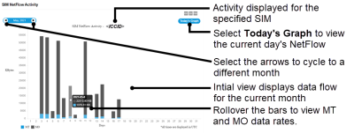
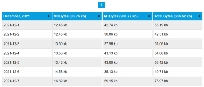

# View NetFlow activity

To display the NetFlow activity for a SIM, on the SIM List page menu, select  next to the chosen SIM. NetFlow data enables you to track traffic flow and volume per SIM, and outputs Mobile Terminated (MT) and Mobile Originated (MO) data in a graph that you can drill into.

The NetFlow dialog displays a graphical breakdown of data transmission over time. The blue bars are MT (received), and the black bars are MO (sent) data transmissions. The default view displays an entire month of data, with each bar representing one day. You can change the current data window using the arrows above the graph.

Selecting one bar will update to show a new graph with one bar representing an hour and the whole graph covering a day. Selecting an hour bar will update to show a new graph, with one bar representing a minute and the whole graph covering an hour.

If you would like to receive NetFlow data in greater detail, speak to your Account Manager about the Push API. For more information, see [Monitoring and administering network usage](https://docs.eseye.com/Content/Connectivity/PushIntro.htm).

### Results table

The table below the graph provides a breakdown of the data in the graph in tabular form.

To scroll through all of the pages, use the numbers above the table.

The following table describes the fields represented in the table and graph.

| Field                  | Description                                                                          |
| ---------------------- | ------------------------------------------------------------------------------------ |
| Date (Day/Hour/Minute) | Displays the day, hour or minute representing one of the bars on the bar chart.      |
| MO Bytes               | The data usage for mobile originated data for the SIM over the selected time window. |
| MT Bytes               | The data usage for mobile terminated data for the SIM over the selected time window. |
| Total Bytes            | The total data usage across all bars on the chart.                                   |

## Related tasks

Back to overview
