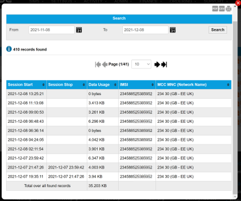

# View RADIUS activity

To display the log of network authentication information for a SIM, on the SIM List page menu, select  next to the chosen SIM.

Select the export to PDF (), export to CSV () or print () buttons to export or print the information displayed on the page.

If you would like to receive RADIUS data in greater detail, speak to your Account Manager about the Push API. For more information, see [Monitoring and administering network usage](https://docs.eseye.com/Content/Connectivity/PushIntro.htm).

### Search

The search enables you to filter the list of RADIUS log records between a From and To date.

Select the calendar icon () to display a calendar from which you can select the required date.

### Results

**Viewing more results**

Some pages return results in a continuous list. Select View More at the end of the list to see more items.

The following table describes the fields displayed in the RADIUS session log.

| Field         | Description                                                                                                                                                                                                                                                             |
| ------------- | ----------------------------------------------------------------------------------------------------------------------------------------------------------------------------------------------------------------------------------------------------------------------- |
| Session Start | The date and time that the RADIUS session started.                                                                                                                                                                                                                      |
| Session Stop  | The date and time that the RADIUS session stopped.                                                                                                                                                                                                                      |
| Data Usage    | The data usage of the session.                                                                                                                                                                                                                                          |
| IMSI          | International Mobile Subscriber Identity number. Identifies a cellular network subscriber. The network operator that provided the IMSI uses it to authenticate a SIM (and the IoT device containing the SIM) on the network. Contains between 15 and 16 numeric digits. |
| MCC MNC       | The [MCC](https://docs.eseye.com/Content/Glossary/MCC.htm) and [MNC](https://docs.eseye.com/Content/Glossary/MNC.htm) connected to in the session.                                                                                                                      |
| Total         | Total data usage across all sessions in the search results.                                                                                                                                                                                                             |

## Related tasks

Back to overview
