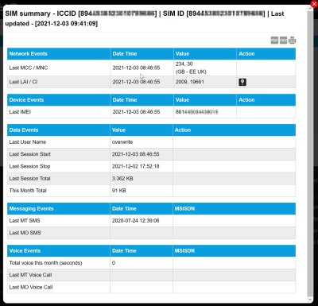

# View SIM activity

To display the summary of activity for a SIM, on the SIM List page menu, select  next to the chosen SIM.

Select the export to PDF (), export to CSV () or print () buttons to export or print the information displayed on the page.

The following table describes the fields displayed in the summary of activity report.

| Field                |                                                                                        | Description                                                                                                                                                                                                                                                                                                                                                           |
| -------------------- | -------------------------------------------------------------------------------------- | --------------------------------------------------------------------------------------------------------------------------------------------------------------------------------------------------------------------------------------------------------------------------------------------------------------------------------------------------------------------- |
| Report title         | Title of the report including the ICCID number and date and time of report generation. |                                                                                                                                                                                                                                                                                                                                                                       |
| **Network events**   |                                                                                        |                                                                                                                                                                                                                                                                                                                                                                       |
|                      | Last MCC / MNC                                                                         | The date and time of the last connection. The Value column displays the mobile country code (MCC) and mobile network code (MNC), with the network name shown in brackets.                                                                                                                                                                                             |
|                      | Last LAI /CI                                                                           | The date and time of the last connection. The Value column displays the last location area identifier (LAI) and cellular identifier (CI). The Action column displays a map icon () if LAI and CI data is present. Select the map icon to display the last recorded location information in map form. |
| **Device events**    |                                                                                        |                                                                                                                                                                                                                                                                                                                                                                       |
|                      | Last IMEI                                                                              | The ‘Date Time’ of the last IMEI connection. The ‘Value’ column will display the last IMEI(International Mobile Equipment Identity) that the SIM connected to.                                                                                                                                                                                                        |
| **Data Events**      |                                                                                        |                                                                                                                                                                                                                                                                                                                                                                       |
|                      | Last User Name                                                                         | The user name of the last person to use the device.                                                                                                                                                                                                                                                                                                                   |
|                      | Last Session Start                                                                     | The start time of the last session.                                                                                                                                                                                                                                                                                                                                   |
|                      | Last Session Stop                                                                      | The end time of the last session.                                                                                                                                                                                                                                                                                                                                     |
|                      | Last Session Total                                                                     | The quantity of data used (in bytes, kilobytes, megabytes or gigabytes) in the last session.                                                                                                                                                                                                                                                                          |
|                      | This Month Total                                                                       | The total amount of data used this month (in bytes, kilobytes, megabytes or gigabytes).                                                                                                                                                                                                                                                                               |
| **Messaging Events** |                                                                                        |                                                                                                                                                                                                                                                                                                                                                                       |
|                      | Last MT SMS                                                                            | The ‘Date Time’ of the last received SMS. The ‘MSISDN’ column displays the MSISDN of the device that sent the SMS.                                                                                                                                                                                                                                                    |
|                      | Last MO SMS                                                                            | The ‘Date Time’ of the last sent SMS. The ‘MSISDN’ column displays the MSISDN of the device that received the SMS.                                                                                                                                                                                                                                                    |
| **Voice Events**     |                                                                                        |                                                                                                                                                                                                                                                                                                                                                                       |
|                      | Total voice this month (seconds)                                                       | The total number of seconds of voice calls used this month.                                                                                                                                                                                                                                                                                                           |
|                      | Last MT Voice Call                                                                     | The data and time of the last mobile terminated voice call.                                                                                                                                                                                                                                                                                                           |
|                      | Last MO Voice Call                                                                     | The data and time of the last mobile originated voice call.                                                                                                                                                                                                                                                                                                           |

## Related tasks

Back to overview
