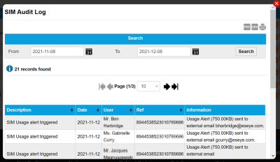

# View the SIM audit log

To display the settings for a SIM, on the SIM List menu, select  next to the chosen SIM. This displays the SIM Audit Log page in a dialog.

The SIM Audit Log displays a record of every action taken, and change made, to all SIMs associated with the selected SIM.

## Related tasks

Back to overview
