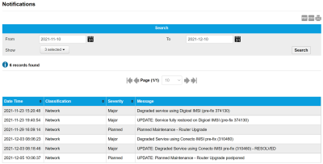
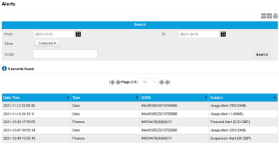
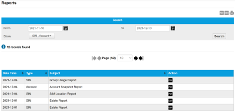
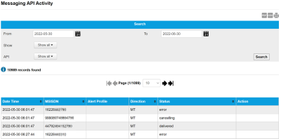

# Activity reference

The Activity menu provides the following pages which enable you to view notification, report and alert information:

* [Notifications page](activity-reference.md#notifications-page)
* [Alerts page](activity-reference.md#alerts-page)
* [Reports page](activity-reference.md#reports-page)

## Notifications page

The Notifications page displays all of the notification messages sent.

Select the export to PDF (), export to CSV () or print () buttons to export or print the information displayed on the page.

### Search

The search enables you to filter the notifications.

| Field   | Description                                                                                                                                                                                                                       |
| ------- | --------------------------------------------------------------------------------------------------------------------------------------------------------------------------------------------------------------------------------- |
| From To | Filter the list of notifications between the From and To dates. Select the calendar icon () to display a calendar from which you can select the required date. |
| Show    | Select which notification classifications to show. By default, all activities (Network, Management and Application) are shown.                                                                                                    |
| Search  | Select to filter the notification records using the values in the From, To and Show fields.                                                                                                                                       |

### Results

The following table describes the columns displayed for the SIM Audit Log records.

| Field          | Description                                                                            |
| -------------- | -------------------------------------------------------------------------------------- |
| Date Time      | The date and time of the notification.                                                 |
| Classification | Whether the notification is related to network, management or application information. |
| Severity       | The severity of the notification: Minor, Major or Severe.                              |
| Message        | The notification text.                                                                 |

## Alerts page

The Alerts page displays read-only information about Finance, Data, Messaging and IMEI Alerts. Alerts are also sent via e-mails to Engineering users.

Select the export to PDF (), export to CSV () or print () buttons to export or print the information displayed on the page.

### Search

The search enables you to filter the alerts.

| Field   | Description                                                                                                                                                                                                                                                                    |
| ------- | ------------------------------------------------------------------------------------------------------------------------------------------------------------------------------------------------------------------------------------------------------------------------------ |
| From To | Filter the list of alerts between the From and To dates. Select the calendar icon () to display a calendar from which you can select the required date.                                                     |
| Show    | Select which alerts type to show. By default, all types (Finance, Data, Messaging, IMEI and Calls) are shown.                                                                                                                                                                  |
| ICCID   | Integrated Circuit Card Identifier for SIM cards or profiles (when using an eUICC SIM). For more information, see [About eUICC SIM profiles](https://docs.eseye.com/Content/GettingStarted/eSIM/Profiles.htm#top). Contains 14 and 20 numeric digits and starts with 89 or 99. |
| Search  | Select to filter the notification records using the values in the From, To and Show fields.                                                                                                                                                                                    |

### Results

The following table describes the columns displayed for the SIM Audit Log records.

| Field     | Description                                                                                                                                                                                                                                                                    |
| --------- | ------------------------------------------------------------------------------------------------------------------------------------------------------------------------------------------------------------------------------------------------------------------------------ |
| Date Time | The date and time of the alert.                                                                                                                                                                                                                                                |
| Type      | Whether the alert is about Finance, Data, Messaging, IMEI or Calls.                                                                                                                                                                                                            |
| ICCID     | Integrated Circuit Card Identifier for SIM cards or profiles (when using an eUICC SIM). For more information, see [About eUICC SIM profiles](https://docs.eseye.com/Content/GettingStarted/eSIM/Profiles.htm#top). Contains 14 and 20 numeric digits and starts with 89 or 99. |
| Subject   | Whether reaching this limit triggered an alert or a suspension                                                                                                                                                                                                                 |

## Reports page

The Reports page displays a history of the generated reports.

Select the export to PDF (), export to CSV () or print () buttons to export or print the information displayed on the page.

### Search

The search enables you to filter the reports.

| Field   | Description                                                                                                                                                                                                                 |
| ------- | --------------------------------------------------------------------------------------------------------------------------------------------------------------------------------------------------------------------------- |
| From To | Filter the list of reports between the From and To dates. Select the calendar icon () to display a calendar from which you can select the required date. |
| Show    | Select which report type to show. By default, SIM and Account types are shown.                                                                                                                                              |
| Search  | Select to filter the notification records using the values in the From, To and Show fields.                                                                                                                                 |

### Results

The following table describes the columns displayed for the reports.

| Field     | Description                                                                                                                                                                                                             |
| --------- | ----------------------------------------------------------------------------------------------------------------------------------------------------------------------------------------------------------------------- |
| Date Time | The date and time of the report.                                                                                                                                                                                        |
| Type      | Whether the report is a SIM or Account report.                                                                                                                                                                          |
| Subject   | The subject of the report.                                                                                                                                                                                              |
| Action    |  – download a PDF version of the report.  – download a CSV version of the report. |

## Messaging API Activity page

The Messaging API Activity page displays a history of messaging activity on this account.

Select the export to PDF (), export to CSV () or print () buttons to export or print the information displayed on the page.

### Search

The search enables you to filter the reports.

| Field   | Description                                                                                                                                                                                                                 |
| ------- | --------------------------------------------------------------------------------------------------------------------------------------------------------------------------------------------------------------------------- |
| From To | Filter the list of reports between the From and To dates. Select the calendar icon () to display a calendar from which you can select the required date. |
| Show    | Select whether to show MO and/or MT messages in the results.                                                                                                                                                                |
| Search  | Select to filter the notification records using the values in the From, To and Show fields.                                                                                                                                 |

### Results

The following table describes the columns displayed for the reports.

| Field         | Description                                                              |
| ------------- | ------------------------------------------------------------------------ |
| Date Time     | The date and time of the report.                                         |
| MSISDN        | The MSISDN for the message.                                              |
| Alert Profile | The alert profile associated with the message.                           |
| Direction     | The direction of the message: MO or MT.                                  |
| Status        | The delivery status for the SMS message: cancelling delivered error sent |
| Action        | Not used.                                                                |
