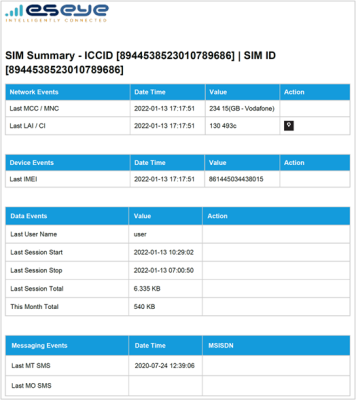
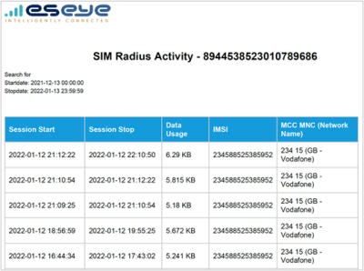
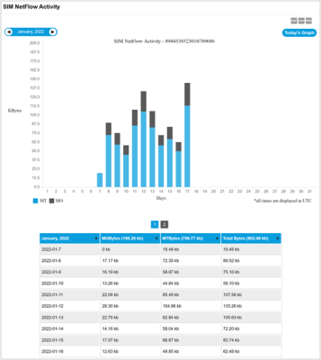
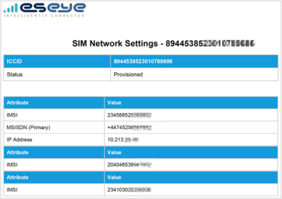
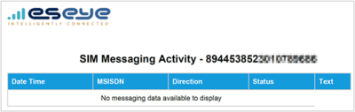

# Diagnostic reports

The following diagnostic reports help you to detect network and SIM card issues, and to track data usage to identify connectivity problems:

* [SIM summary report](diagnostic-reports.md#sim-summary-pdf-csv)
* [SIM RADIUS activity report](diagnostic-reports.md#sim-radius-activity-pdf-csv)
* [SIM NetFlow activity report](diagnostic-reports.md#sim-netflow-activity-pdf-csv-png)
* [SIM network settings report](diagnostic-reports.md#sim-network-settings-pdf-csv)
* [SIM messaging activity report](diagnostic-reports.md#sim-messaging-activity-pdf-csv)

## SIM summary (PDF, CSV)

Gives details about the SIM card, including the latest connection and location details, IMEI, last data session datetime stamp and data usage, cumulative data usage for the month, and last voice and messaging events.

To find and generate the report in Infinity Classic:

1. From the menu, select SIMs > SIM List.
2. Alongside a SIM card, select  to display the Summary of activity page.
3. To download the information in a particular format, select either:  or .

## SIM RADIUS Activity (PDF, CSV)

Shows SIM card data sessions, including start and stop times, data usage, IMSI and network operator.

Use this report to identify trends in your network usage and identify networking issues. For example, poor signal strength is often indicated where a device is constantly switching networks.

To find and generate the report in Infinity Classic:

1. From the menu, select SIMs > SIM List.
2. Alongside a SIM card, select  to display the RADIUS page.
3. To download the information in a particular format, select either:  or .

## SIM NetFlow Activity (PDF, CSV, PNG)

Graphic reporting daily data flows in kilobytes to a SIM card (MT) and from the SIM card (MO) either:

* Per day for a selected month
* Per hour for a selected day
* Per minute for a selected hour

Use this report to understand data usage and changes in SIM card behavior, which may be a result of network issues.

To find and generate the report in Infinity Classic:

1. From the menu, select SIMs > SIM List.
2. Alongside a SIM card, select  to display the NetFlow page.
3. To download the information in a particular format, select either: ,  or .

## SIM Network Settings (PDF, CSV)

Displays the current status and network information (IMSI, MSISDN, and if relevant, IP address) for an individual SIM. Use this report to understand your device connectivity. This report can feed into other reports to check if network changes have occurred that may affect the device.

To find and generate the report in Infinity Classic:

1. From the menu, select SIMs > SIM List.
2. Alongside a SIM card, select  to display the Network settings page.
3. To download the information in a particular format, select either:  or .

## SIM Messaging Activity (PDF, CSV)

Contains details about every SMS sent and received per MSISDN, as well as message status (such as Delivered) and Text details. Use this report to track SMS usage per SIM card.

To find and generate the report in Infinity Classic:

1. From the menu, select SIMs > SIM List.
2. Alongside a SIM card, select  to display the Messaging page.
3. To download the information in a particular format, select either:  or .
