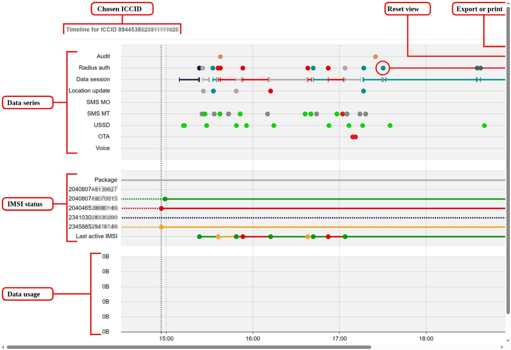

# Display SIM timelines

Only available in Infinity Classic.

The SIM Timelines feature provides an interactive graphical view of the previous 24 hours of connectivity, messaging and data usage for a SIM. After [displaying the timeline for a SIM](display-sim-timelines.md#ToDisplaySimTimeline), you can:

* [Show or hide information](display-sim-timelines.md#ShowHideSeries)
* [Zoom in to specific times](display-sim-timelines.md#Zoom)
* [Display detailed information for specific data points](display-sim-timelines.md#MoreInfo)

All times shown on the SIM timeline are in [UTC](https://docs.eseye.com/Content/Glossary/UTC.htm).

The SIM timeline displays the following:

* Chosen ICCID – displays the [ICCID](https://docs.eseye.com/Content/Glossary/Iccid.htm) of the SIM for this SIM timeline.
* Reset view – select to reset the SIM timeline view to the initial display.
* Export or print – select to export the current view of the SIM timeline to an image (PNG, JPEG, SVG or PDF formats supported) or to print the current view of the SIM timeline.
* Status – displays the current status of the SIM timeline:
*  – successful download of SIM data.
*  – error downloading some data. Hover on the icon to see a breakdown of the data that failed to download.
* Timeline information – displays data related to the selected data point on the SIM timeline. For example, in the screenshot above, the timeline information pane displays the [RADIUS](https://docs.eseye.com/Content/Glossary/RADIUS.htm) authentication data for the selected data point (circled in the above screenshot).
* Data series timelines – see [data series timelines](display-sim-timelines.md#data-series-timelines).
* IMSI status timelines – see [IMSI status timelines](display-sim-timelines.md#imsi-status-timelines).
* Data usage timelines – displays the number of bytes uploaded (shown in red) and downloaded (shown in green).

To display a SIM timeline for a SIM:

1. Log in to the Infinity Classic user interface.
2. Go to: SIMS > SIMs List.
3. On the table row containing the ICCID of the required SIM, under Action select  (SIM Control Panel). The SIM must be in an active state to display the SIM Control Panel.
4. On the SIM Control Panel, select SIM Timeline. The Infinity Classic user interface opens a new tab and loads the SIM timeline for the selected SIM.

To show or hide a timeline data series:

Select the name of the data series in the margin.

This can be useful to hide the RADIUS authentication data points, which can negatively impact the performance of the SIM timeline.

To zoom in to a specific time on the timeline:

Perform one of the following:

* Hold the CTRL key then left-click and drag your cursor across the region of the timeline to enlarge.
* Use the scroll wheel on your mice to zoom in and out of the timeline.

To display more information about a data point on the SIM timeline:

Select a data point (or series) on the timeline to display additional information about the data point (or series) in the Timeline information pane.

## Data series timelines

Displays multiple network and messaging data series for the SIM. The colour of the data points for the Audit, RADIUS auth, Data session and Location update series represent different service networks.

The following table describes the data series available on the SIM timeline.

| Data series           | Description                                                                                                                                                          |
| --------------------- | -------------------------------------------------------------------------------------------------------------------------------------------------------------------- |
| Audit                 | Each data point represents an audit log entry for a change to the [SIM lifecycle](https://docs.eseye.com/Content/Billing/Billing_SIMLifecycle.htm) state.            |
| RADIUS authentication | Each data point represents a successful RADIUS authentication performed by the SIM.                                                                                  |
| Data session          | Displays the start and end points of each data session.                                                                                                              |
| Location update       | Each data point represents a location update. Select a data point to display time stamp and status information retrieved from the live network via the MAP protocol. |
| SMS MO                | Each data point represents a successful mobile originated SMS sent by the SIM.                                                                                       |
| SMS MT                | Each data point represents a successful mobile terminated SMS received by the SIM.                                                                                   |
| USSD                  | Each data point represents a successful USSD message received by the SIM.                                                                                            |
| OTA                   | Each data point represents a successful over-the-air (OTA) message received by the SIM.                                                                              |
| Voice                 | Displays the start and end of every voice session.                                                                                                                   |

## IMSI status timelines

Displays the status of individual [IMSI](https://docs.eseye.com/Content/Glossary/Imsi.htm)s in the SIM over time.

The following table describes the data series on the IMSI status timelines.

| Data series      | Description                                                                                                                                                                                                                                                                                                                                                                                                           |
| ---------------- | --------------------------------------------------------------------------------------------------------------------------------------------------------------------------------------------------------------------------------------------------------------------------------------------------------------------------------------------------------------------------------------------------------------------- |
| Package          | Displays the [package](https://docs.eseye.com/Content/Glossary/Package.htm) assigned to the SIM. Select the package data series to display package information in the timeline information pane.                                                                                                                                                                                                                      |
|                  | Displays the provisioning status of the IMSI, where the colour of the data points and lines differ for each IMSI provider. Solid lines represent activated IMSIs and dotted lines represent provisioned but inactive IMSIs.                                                                                                                                                                                           |
| Last active IMSI | Displays the active IMSI in the SIM with each data point representing a change to a different IMSI. The colour of the data points and lines matches the colour of the individual IMSI series. This data series is calculated from the RADIUS authentication and Location update data series which must be visible. If either of these data series are disabled, the last active IMSI data will not display correctly. |
