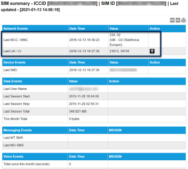
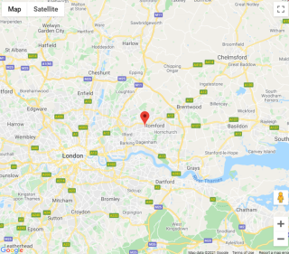
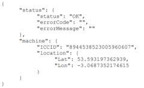

# Locate devices

You may require device tracking for all your devices, including those that exist in a fixed location.

Eseye can locate devices using a cellular connection in the following ways:

* Country location service
* Standard location service
* Premium location service

## Country location service

Provides the last recorded country in which the device was located, for billing purposes. Eseye records the three-digit Mobile Country Code (MCC) with each billable event so that the activity is billed correctly. For more information, see [http://en.wikipedia.org/wiki/Mobile\_country\_code](http://en.wikipedia.org/wiki/Mobile_country_code).

The system uses a variety of sources for this information, and updates when new information becomes available.

This feature is included in your monthly service charge. You can view MCC information using the CSV invoice, SIM Summary in the SIAM portal, or JSON API.

The SIM summary in the SIAM portal displays location information as follows:

## Standard location service

Provides an approximate location using information supplied by the mobile networks when the device authenticates on Eseye RADIUS servers.

The system uses a number of cell lookup databases, which update periodically with location information. The information varies – sometimes the network supplies a good approximation of the location, at other times only the country is available. Occasionally, no information is supplied at all.

This feature is included in your monthly service charge. This information is only available using the SIM Summary on the SIAM portal. If Location Area Identity (LAI) and Cell Identification (CI) information are available, you can view the device location on a map. Select  to view the map:

## Premium location service

Provides approximate device coordinates, both latitude and longitude, using information from the Home Location Register (HLR) and by performing a cell tower lookup from an application on the SIM. If the device is offline, then the last recorded location is used.

The Premium location service has a monthly subscription charge. This information is only available using the JSON Location API. As part of the service, users can also register to receive an HTTP POST notification if the location information changes. The Location API displays location information as follows:

For information about Location API, see the [Location API 1.0 Developer Guide (PDF)](https://docs.eseye.com/Content/Resources/Files/8313-Location-API-1.0-Developer-Guide.pdf).

If you want to subscribe to the Location API, speak to your Account Manager.

## Comparison of available location services

|                     | Country location                                             | Standard location                                                                                                                | Premium location                        |
| ------------------- | ------------------------------------------------------------ | -------------------------------------------------------------------------------------------------------------------------------- | --------------------------------------- |
| Detail supplied:    | Mobile Country Code (MCC)                                    | Map view                                                                                                                         | Latitude/ longitude coordinates         |
| Interface:          | CSV invoice, SIM Summary in the SIAM portal, or via JSON API | SIM Summary in the SIAM portal                                                                                                   | On request/ push using the Location API |
| Availability:       | Last billing record from host network                        | Last authentication                                                                                                              | On demand                               |
| Resolution:         | Country                                                      | Variable, depending on available network information. Maximum resolution: up to two decimal places of the latitude and longitude | Full latitude and longitude             |
| Cell database used: | N/A                                                          | Standard                                                                                                                         | Premium                                 |
