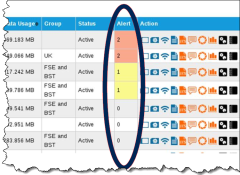

# Manage alerts

In this section, you will learn how to set up Alert Profiles for your Infinity Classic account.

Optionally, you can set up SIM alert notifications within a calendar month. You can also set up alerts for Suspending SIMs. You can receive SIM alert notifications via Infinity and via email.

You can receive SIM alert notifications via Infinity Classic and via email.

## Viewing alerts

To view alerts in Infinity Classic:

Go to: ACTIVITY > Alerts

OR

Go to: SIMS > SIM List

If a SIM has breached data limits defined in an alert, these are displayed in the SIM List Alert column:

## Using alert profiles

To create an alert profile in Infinity Classic:

Go to: SETTINGS > Alert Profiles

1. Select Add New Alert Profile
2. Type a Profile name.
3. Select the Default Profile check box if you want this profile to become the default profile for newly activated SIMs.
4. Set up the financial, data, messaging and device alerts for this profile.
5. Select Save. The profile saves and closes.

To assign an alert profile to an individual SIM in Infinity Classic:

1. Go to: SIMS > SIMs List > Action 
2. On the SIM Settings form, select Edit.
3. Using the Alert Profile drop-down menu, select the Alert Profile for the SIM.
4. Select Save to save your changes.
5. Close SIM Settings.

To assign an alert profile to multiple SIMs in Infinity Classic:

1. Using Infinity Classic, go to: SIMS > SIM List
2. Select the checkbox alongside each SIM you want to assign an Alert Profile to. Select the column header checkbox to select all SIMs in the list.
3. At the bottom of the SIM list, in the drop-down box, select Change Settings.
4. Select Perform Bulk Action.  The Bulk change SIM Settings form appears.
5. Using the Alert Profile drop-down menu, select the Alert Profile for the chosen SIMs.
6. Select Save to save your changes.
7. Close Bulk change SIM Settings.

To view or edit an alert profile in Infinity Classic:

1. Go to: SETTINGS > Alert Profiles.
2. Alongside the Alert Profile you want to edit, select .

## Enabling email alerts

To enable SIM alert emails in Infinity Classic:

If an account has multiple users, then each user must set up this feature if they want to receive alerts via email.

1. Go to: > Notifications
2. In the Alert Profile Notifications box, select the Enable Alert Notification check box.
3. Select Update to save your changes.

Alert notification emails are sent to the Account holder's email address.

To view or edit your email address, go to: > Details
