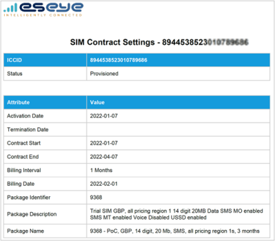
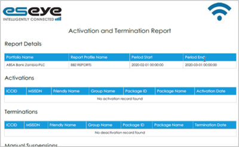

# Status and connectivity reports

The following status and connectivity reports hold information about a SIM card’s status and connection activity so that you can understand the SIM card’s current performance:

* [SIM contract settings](status-and-connectivity-reports.md#sim-contract-settings-pdf-csv)
* [Suspension and termination report](status-and-connectivity-reports.md#suspension-and-termination-report-pdf-csv)

## SIM Contract Settings (PDF, CSV)

Lists a SIM card’s status, activation and termination dates, and package, contract and costs information, for administrative purposes.

To find and generate the report in Infinity Classic:

1. From the menu, select SIMs > SIM List.
2. Alongside a SIM card, select  to display the Contract settings.
3. To download the information in a particular format, select either:  or .

## Suspension and Termination Report (PDF, CSV)

Details when a SIM card status was initiated, including all activations, terminations, manual suspensions, and alerted suspensions, by ICCID and MSISDN.

To generate the report in Infinity Classic:

* See Creating report profiles.

To find the report in Infinity Classic:

1. From the menu, select Activity > Reports to display the Reports page.
2. Alongside Suspension and Termination Report, select  or .
