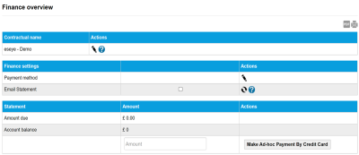
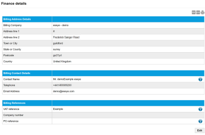
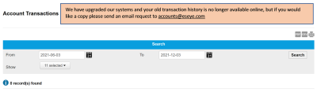
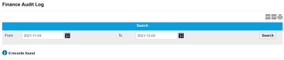

# Finance and payments

The Finance menu enables you to make payments, edit billing details and view transaction history using the following pages:

* [Overview page](finance-and-payments.md#overview-page)
* [Details page](finance-and-payments.md#details-page)
* [Transactions page](finance-and-payments.md#transactions-page)
* [Audit Log page](finance-and-payments.md#audit-log-page)

## Overview page

The Overview page enables you to download forms to change the contractual name and payment methods, and to make payments.

Select the export to PDF () or print () buttons to export or print the information displayed on the page.

The following table describes the fields on the Overview page.

| Field                                  | Description                                                                                                                                                                                                                                                                                                                                                                                                                       |
| -------------------------------------- | --------------------------------------------------------------------------------------------------------------------------------------------------------------------------------------------------------------------------------------------------------------------------------------------------------------------------------------------------------------------------------------------------------------------------------- |
| Contractual Name                       | The name of the portfolio who is liable for this account.  – select to download the party name change request form, which you must complete and upload to request the name change.                                                                                                                                                                          |
| **Finance Settings**                   |                                                                                                                                                                                                                                                                                                                                                                                                                                   |
| Payment method                         | Displayed the current payment method, which is one of: Invoiced – payments are made in response to invoices. Credit Card (Monthly) – Eseye will contact you to confirm credit card details. Direct Debit (Monthly) – Eseye will contact you and request you to complete a DirectDebit form.  – select to edit the payment method and select Request change. |
| Email Statement                        | Select the check box to enable receiving monthly statements via email. If you change this setting, select the update icon () to request the changes.                                                                                                                                                                                                      |
| **Statement**                          |                                                                                                                                                                                                                                                                                                                                                                                                                                   |
| Amount due                             | The amount overdue on this account.                                                                                                                                                                                                                                                                                                                                                                                               |
| Account Balance                        | The total amount outstanding on this account.                                                                                                                                                                                                                                                                                                                                                                                     |
| Amount                                 | The amount of the payment made using the Make Ad-hoc Payment by Credit Card button.                                                                                                                                                                                                                                                                                                                                               |
| **Make Ad-hoc Payment by Credit Card** | Select to make a payment to Eseye for the amount in the Amount field above.                                                                                                                                                                                                                                                                                                                                                       |

## Details page

The Details page enables you to view and edit billing details.

Select the export to PDF (), export to CSV () or print () buttons to export or print the information displayed on the page.

The following table describes the fields on the Details page.

| Field                       | Description                                                                                                                                                  |
| --------------------------- | ------------------------------------------------------------------------------------------------------------------------------------------------------------ |
| **Billing Address Details** |                                                                                                                                                              |
| Billing Company             | The name of the company that placed the order.                                                                                                               |
| Address Line 1              | The first line of the address to which the order will be sent.                                                                                               |
| Address Line 2              | The second line of the address to which the order will be sent.                                                                                              |
| Town or City                | The town or city to which the order will be sent.                                                                                                            |
| State or County             | The state or county to which the order will be sent.                                                                                                         |
| Postcode                    | The postcode to which the order will be sent.                                                                                                                |
| Country                     | The country to which the order will be sent.                                                                                                                 |
| **Billing Contact Details** |                                                                                                                                                              |
| Contact Name                | The name of the billing contact who will pay for this order. This should be a finance specific contact. For example, an employee in the accounts department. |
| Telephone                   | A contact number for the billing contact.                                                                                                                    |
| Email Address               | Email address of the billing contact.                                                                                                                        |
| **Billing References**      |                                                                                                                                                              |
| VAT reference               | The VAT reference number for the company.                                                                                                                    |
| Company number              | The unique company registration number for the company.                                                                                                      |
| PO reference                | The unique reference number for the purchase order.                                                                                                          |
| Edit                        | Select to edit the billing details.                                                                                                                          |

## Transactions page

The Transactions page displays a list of historical transaction records.

Select the export to PDF (), export to CSV () or print () buttons to export or print the information displayed on the page.

### Search

The search enables you to filter the transaction records.

| Field   | Description                                                                                                                                                                                                                             |
| ------- | --------------------------------------------------------------------------------------------------------------------------------------------------------------------------------------------------------------------------------------- |
| From To | Filter the list of transaction records between the From and To dates. Select the calendar icon () to display a calendar from which you can select the required date. |
| Show    | Select which transaction records are shown. By default, all activities (Data, SMS and Voice) are shown.                                                                                                                                 |
| Search  | Select to filter the billing records using the values in the From, To and Show fields.                                                                                                                                                  |

### Results

**Viewing more results**

Some pages return results in a continuous list. Select View More at the end of the list to see more items.

The following table describes the fields in the results table on the Transactions page.

| Field                            | Description                                                                                                                                                             |
| -------------------------------- | ----------------------------------------------------------------------------------------------------------------------------------------------------------------------- |
| Type of transaction              | The type of transaction, which is one of the following: Credit Note Cheque DirectDebit Bank Transfer Credit Card Debit Card Cash Standing Order Journal Payment Invoice |
| Transaction reference number     | Unique identifier for this transaction.                                                                                                                                 |
| Date of transaction              | The date of the transaction.                                                                                                                                            |
| Due date, only for invoices      | The due date for payments made after receiving invoices.                                                                                                                |
| Amount (in the agreed currency)  | The amount of money in the transaction (in the agreed currency).                                                                                                        |
| Tax                              | The amount of tax in the transaction (in the agreed currency).                                                                                                          |
| Balance (in the agreed currency) | The balance (in the agreed currency) before the transaction was made.                                                                                                   |

## Audit Log page

The Audit Log page enables you to search for all changes made on the Finance menu.

Select the export to PDF (), export to CSV () or print () buttons to export or print the information displayed on the page.

### Search

Filter the list of audit log records between the From and To dates.

Select the calendar icon () to display a calendar from which you can select the required date.

Select Search to update the records in the results table.

### Results

**Viewing more results**

Some pages return results in a continuous list. Select View More at the end of the list to see more items.

The following table describes the fields in the results table on the audit log page.

| Field       | Description                          |
| ----------- | ------------------------------------ |
| Description | The type of change made.             |
| Date        | The date of the change.              |
| User        | The user who made the changes.       |
| Reference   | The reference number for the change. |
| Information | Textual description of the change.   |
