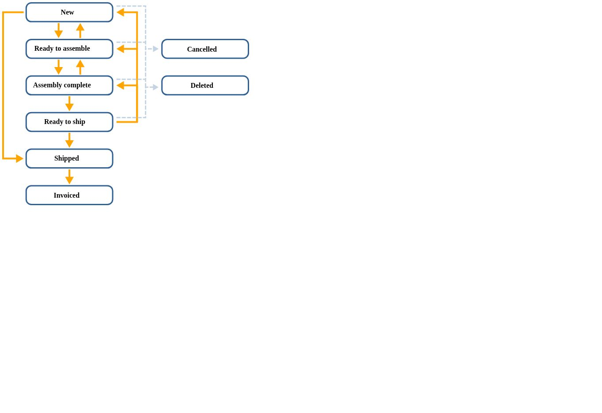
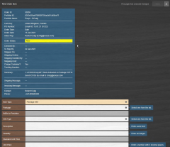

# Manage orders

An order is a request for AnyNet SIMs, other hardware, such as Hera routers, or non-hardware items, such as consultancy, onboarding, or a VPN.

Orders can be placed in the following ways:

* Customers can place orders in Infinity Classic
* Customers can send Purchase Order (PO) or email requests to orders@eseye.com
* Internal requests, for example, for trials or samples, can be sent to orders@eseye.com

When an order is placed, a Zendesk ticket is created to track the progress of the order.

Orders for SIMs or for hardware that includes a SIM, such as a Hera router must specify the package that the SIMs will be activated against.

## Order statuses and lifecycle

A new order is created when a customer places an order in Infinity Classic or by Sales Admin creating an order in Lynx in response to a PO or other request.

The lifecycle of an order is shown in the diagram below.

The following table describes the order states.

| Status            | Description                                                                                                                      |
| ----------------- | -------------------------------------------------------------------------------------------------------------------------------- |
| New               | An order has been created by placing an order in Infinity Classic or in Lynx by Sales Admin.                                     |
| Ready to Assemble | Sales Admin has completed the order details.                                                                                     |
| Assembly Complete | All the order items are complete, either assembled by the Logistics team or fulfilled by other functions for non-hardware items. |
| Ready to Ship     | The Logistics team has packed and shipped the hardware items for the order.                                                      |
| Shipped           | The Logistics team has shipped the hardware items for the order.                                                                 |
| Invoiced          | The Accounts team has invoiced the customer.                                                                                     |
| Cancelled         | The order was cancelled.                                                                                                         |
| Deleted           | The order was deleted.                                                                                                           |

## Displaying orders

Orders are only visible to Eseye internal staff and can not be viewed by customers in Infinity Classic or Infinity.

To display or search for an order in Lynx:

1. Display the Orders page.
2. Use one of the following methods to locate and display the order: Lynx displays the Order Information Page for the selected order.

* If you've recently viewed the order, select the order from the list under [Recently Viewed Orders](manage-orders.md#displaying-orders) to display order information.
* If you know the order number, use the [Quick Find](manage-orders.md#displaying-orders) to display the order.
* Select List Orders to display the [List Orders Page](https://docs.eseye.com/Content/Lynx/OrdersMenu.htm#List). which enables you to filter then select an order.
* Select Search Orders to display the Search Orders Page, which enables you to filter on multiple search criteria and select the order.

## Creating an order

Sales Admin is responsible for creating or updating an order when notified by Zendesk that the order has been placed:

* If the customer placed the order in Infinity Classic, an order is automatically created in Lynx with a status of New. You need to update the order to check and complete the order details.
* If the customer sent a purchase order or email order, you need to create the order in Lynx and complete the order details.
* If the details for an existing order need to be amended, you can update the order in Lynx.

### Before you begin

* Check the details of the order in the Zendesk ticket or the purchase order attached to the Zendesk ticket. If the customer placed the order in Infinity Classic, the Zendesk ticket will contain the order number of the Lynx order. If an order has been emailed to directly to an Eseye contact, forward the email to orders@eseye.com. Zendesk will generate the order ticket and send a notification email to the appropriate people.

To create a new order in Lynx:

1. Display the Orders page.
2. Select New Order.
3. On the Basic tab, replace the Sales Rep (defaults to you) with the name of the Account Manager or person who is responsible for managing the customer account as follows:
4. Select the name in the Sales Rep field to display a list of users.
5. Search for the user by name or username (email address).
6. Select the person to designate as the sales representative.
7. Select the portfolio, which is the account of the customer raising the order. The selected portfolio's delivery and billing details are used to populate the address details.
8. Complete the remaining fields on the Basic tab.
9. Select the Contact tab, which is pre-populated with the contact details of the portfolio selected above.
10. Select the Delivery Address tab, which is pre-populated with the delivery address of the portfolio selected above.
11. Update the address if the order will be sent to a different location.
12. Select the Shipping Details tab, and update
13. Display the Invoicing Details tab, and add a message.
14. Select Save, then select Yes on the confirmation dialog. Lynx displays the Order Information Page for the newly created order.
15. [Add items to the order](manage-orders.md#adding-order-items-to-an-order).

## Adding order items to an order

After creating an order, you can add order items to the order.

To add order items to an order:

1. Display the Orders page.
2. Display the order to which to add an order item. To add an order item, the status of the order must be New.
3. Select New Order Item, which displays the New Order Item page. 
4. Select Item Type and choose the type of item to add: Package SIM, Hardware or Miscellaneous. Selecting an item type, updates the fields on the New Order Item page to displays item-type-specific fields.
5. Select Package and choose the package required for the order, which should be included in the Summary field. The list of displayed packages will only include packages on which the customer is able to activate SIM cards. You must also select a package for the Hera routers that include embedded SIM cards.
6. Select the type of order:

* For SIMs, select SIM Type and choose the type of SIM (mentioned in the order's Summary field) from the list of SIM types available for the package.
* For Hardware, Hardware and choose the hardware item from the list of items.

7. Update the Description field, which must include:

* For SIM orders, the SIM Type and Package.
* For Hera orders, the configuration that the Hera is shipped with.

8. Update the Quantity and Unit Price.
9. Select Save, then Yes to confirm. The package item is displayed in the list of order items on the Order Information Page.
