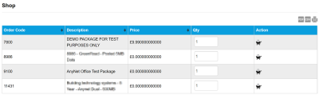
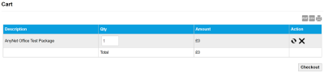
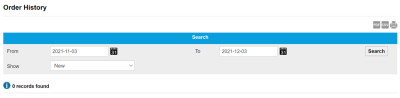
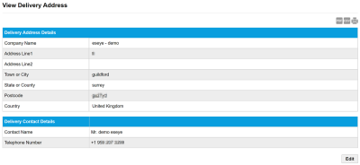

# Ordering reference

The Ordering menu enables you to manage previous and new orders using the following pages:

* [Shop page](ordering-reference.md#shop-page)
* [Cart page](ordering-reference.md#cart-page)
* [Order History page](ordering-reference.md#order-history-page)
* [Delivery Address page](ordering-reference.md#delivery-address-page)

## Shop page

The Shop page displays a list of products you can buy directly through the Infinity Classic portal.

For a full list of available products or services, contact your Eseye Account Manager.

Select the export to PDF (), export to CSV () or print () buttons to export or print the information displayed on the page.

The following table describes the fields on the Shop page.

| Field       | Description                                                                                                                                       |
| ----------- | ------------------------------------------------------------------------------------------------------------------------------------------------- |
| Order Code  | Code that uniquely identifies the order.                                                                                                          |
| Description | Textual description of the package which typically includes data limits or available services.                                                    |
| Price       | The cost of purchasing a single order.                                                                                                            |
| Qty         | The quantity of the item you wish to purchase.                                                                                                    |
| Action      |  – adds the order to the [shopping cart](ordering-reference.md#cart-page). |

## Cart page

The Cart page displays the items currently in the shopping cart.

Select the export to PDF (), export to CSV () or print () buttons to export or print the information displayed on the page.

The following table describes the fields on the shopping cart page.

| Field       | Description                                                                                                                                                                                                                                                              |
| ----------- | ------------------------------------------------------------------------------------------------------------------------------------------------------------------------------------------------------------------------------------------------------------------------ |
| Description | Textual description of the package which typically includes data limits or available services.                                                                                                                                                                           |
| Qty         | The quantity of the item you wish to purchase. If you update a quantity, select the  action to update the shopping cart.                                                                        |
| Amount      | Displays the cost of each item and the total cost of the order.                                                                                                                                                                                                          |
| Action      |  – select to update any changes made to the row item in the shopping cart.  – select to remove the item from the cart. |
| Checkout    | Select to proceed to the checkout page where you must: Supply or edit the delivery address and contact details. Specify a billing address. Edit order-specific delivery options Review and place your order.                                                             |

## Order History page

The Order History page enables you to search for and view all of the orders in the last four months.

Select the export to PDF (), export to CSV () or print () buttons to export or print the information displayed on the page.

### Search

The search enables you to filter the order history.

| Field   | Description                                                                                                                                                                                                                       |
| ------- | --------------------------------------------------------------------------------------------------------------------------------------------------------------------------------------------------------------------------------- |
| From To | Filter the list of order records between the From and To dates. Select the calendar icon () to display a calendar from which you can select the required date. |
| Show    | Select which types of orders are shown. By default, all order types (New, Pending and Dispatched) are shown.                                                                                                                      |
| Search  | Select to filter the order history records the values in the From, To and Show fields.                                                                                                                                            |

### Results

The following table describes the fields on the Order History page.

| Field     | Description                                                                                                       |
| --------- | ----------------------------------------------------------------------------------------------------------------- |
| Reference | The unique reference number for the order. Select the reference number to display delivery details and addresses. |
| Date      | The date of the order.                                                                                            |
| User      | The user that placed the order.                                                                                   |
| Status    | The status of the order: New, Pending or Dispatched.                                                              |

## Delivery Address page

The Delivery Address page is where you view and edit the device address and delivery contact details.

Select the export to PDF (), export to CSV () or print () buttons to export or print the information displayed on the page.

The following table describes the fields on the Delivery Address page.

| Field                        | Description                                                              |
| ---------------------------- | ------------------------------------------------------------------------ |
| **Delivery Address Details** |                                                                          |
| Company Name                 | The name of the company that placed the order.                           |
| Address Line 1               | The first line of the address to which the order will be sent.           |
| Address Line 2               | The second line of the address to which the order will be sent.          |
| Town or City                 | The town or city to which the order will be sent.                        |
| State or County              | The state or county to which the order will be sent.                     |
| Postcode                     | The postcode to which the order will be sent.                            |
| Country                      | The country to which the order will be sent.                             |
| Delivery Contact Details     |                                                                          |
| Contact Name                 | The name of the delivery contact who will receive this order.            |
| Telephone Number             | A contact number for the user.                                           |
| Edit                         | Select Edit to update the delivery address and delivery contact details. |
