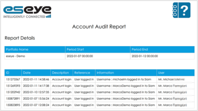
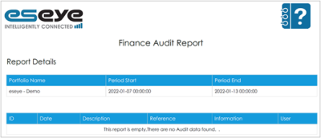
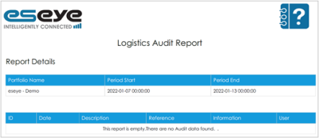
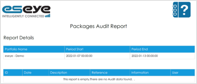
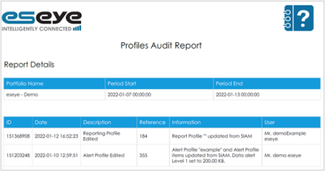
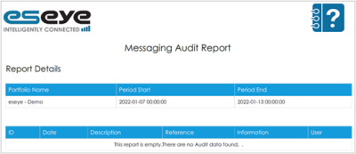
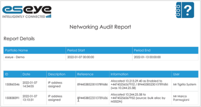
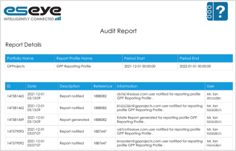
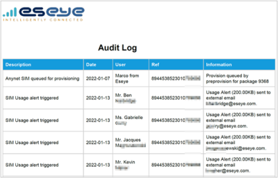
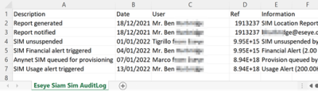

# Audit reports

The following audit reports give you visibility on your user interactions with the SIAM portfolio and the SIM card estate:

* [Account Audit Report (PDF)](audit-reports.md#account-audit-report-pdf)
* [Finance Audit Report (PDF)](audit-reports.md#finance-audit-report-pdf)
* [Logistics Audit Report (PDF)](audit-reports.md#logistics-audit-report-pdf)
* [Packages Audit Report (PDF)](audit-reports.md#packages-audit-report-pdf)
* [Profiles Audit Report (PDF)](audit-reports.md#profiles-audit-report-pdf)
* [Messaging Audit Report (PDF)](audit-reports.md#messaging-audit-report-pdf)
* [Networking Audit Report (PDF)](audit-reports.md#networking-audit-report-pdf)
* [SIM Audit Report (PDF)](audit-reports.md#sim-audit-report-pdf)
* [SIM Audit Log – per SIM (PDF, CSV)](audit-reports.md#sim-audit-log-per-sim-pdf-csv)
* [SIM Audit Log – Estate (PDF, CSV)](audit-reports.md#sim-audit-log-estate-pdf-csv)

## Account Audit Report (PDF)

Date and time stamps user access to the account, as well as notifications sent. Use this file to track Infinity Classic access and who is responsible for received notifications.

To generate the report in Infinity Classic:

1. From the menu, select Account > Reports to display the Account Reports page.
2. Select the Enable checkbox for each report you want to generate.
3. Select Run Now to generate the report.

To find the report in Infinity Classic:

1. From the menu, select Activity > Reports to display the Reports page.
2. Alongside Account Audit Report, select .

## Finance Audit Report (PDF)

Date and time stamps user changes to billing information, such as password and address updates, or payment method approval and so on.

To generate the report in Infinity Classic:

1. From the menu, select Account > Reports to display the Account Reports page.
2. Select the Enable checkbox for each report you want to generate.
3. Select Run Now to generate the report.

To find the report in Infinity Classic:

1. From the menu, select Activity > Reports to display the Reports page.
2. Alongside Finance Audit Report, select .

## Logistics Audit Report (PDF)

Date and time stamps user activity on an order, such as when the order is placed, shipping prepared, or dispatched.

To generate the report in Infinity Classic:

1. From the menu, select Account > Reports to display the Account Reports page.
2. Select the Enable checkbox for each report you want to generate.
3. Select Run Now to generate the report.

To find the report in Infinity Classic:

1. From the menu, select Activity > Reports to display the Reports page.
2. Alongside Logistics Audit Report, select .

## Packages Audit Report (PDF)

Date and time stamps when a signed Service Contract form is uploaded on a SIM package, and the user responsible for the change.

To generate the report in Infinity Classic:

1. From the menu, select Account > Reports to display the Account Reports page.
2. Select the Enable checkbox for each report you want to generate.
3. Select Run Now to generate the report.

To find the report in Infinity Classic:

1. From the menu, select Activity > Reports to display the Reports page.
2. Alongside Packages Audit Report, select .

## Profiles Audit Report (PDF)

Date and time stamps user activity on the Reporting Profile, such as when a new profile is created or edited.

To generate the report in Infinity Classic:

1. From the menu, select Account > Reports to display the Account Reports page.
2. Select the Enable checkbox for each report you want to generate.
3. Select Run Now to generate the report.

To find the report in Infinity Classic:

1. From the menu, select Activity > Reports to display the Reports page.
2. Alongside Profiles Audit Report, select .

## Messaging Audit Report (PDF)

Date and time stamps user activity on the SMS API or against an individual SIM card, such as password and MO POST URL changes.

To generate the report in Infinity Classic:

1. From the menu, select Account > Reports to display the Account Reports page.
2. Select the Enable checkbox for each report you want to generate.
3. Select Run Now to generate the report.

To find the report in Infinity Classic:

1. From the menu, select Activity > Reports to display the Reports page.
2. Alongside Messaging Audit Report, select .

## Networking Audit Report (PDF)

Details network changes, such as assigned IP addresses. This report gives system administrators visibility of network changes to help assess the impact of those changes on devices.

To generate the report in Infinity Classic:

1. From the menu, select Account > Reports to display the Account Reports page.
2. Select the Enable checkbox for each report you want to generate.
3. Select Run Now to generate the report.

To find the report in Infinity Classic:

1. From the menu, select Activity > Reports to display the Reports page.
2. Alongside Networking Audit Report, select .

## SIM Audit Report (PDF)

Details alert triggers on specified SIMs, and to whom they were sent. This is helpful for tracking high usage SIM cards and limiting costs, as well as who is responsible for the SIM cards.

To generate the report in Infinity Classic:

* See Creating report profiles.

To find the report in Infinity Classic:

1. From the menu, select Activity > Reports to display the Reports page.
2. Alongside SIM Audit Report, select .

## SIM Audit Log – per SIM (PDF, CSV)

Details every action taken and change made to a selected SIM card by description, date, user and reference. For example, a new SIM audit log entry is added when a SIM is queued for provisioning or for every usage alert that is triggered on the SIM.

To find and generate the report in Infinity Classic:

1. From the menu, select SIMs > SIM List.
2. Alongside a SIM card, select  to display the SIM Audit Log.
3. To download the information in a particular format, select either:  or .

## SIM Audit Log – Estate (PDF, CSV)

Details every action taken and change made across your SIM card estate by description, date, user and reference.

To find and generate the report in Infinity Classic:

1. From the menu, select SIMs > Audit Log.
2. To download the information in a particular format, select either:  or .
