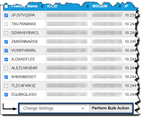

# Create and schedule reports

Eseye generate daily, weekly and monthly reports to help you to better understand your devices and portfolio. These include:

* Audit Reports – provide account usage and audit trails to keep staff accountable.
* Diagnostic Reports – provide information about SIM and network issues.
* Estate Reports – provide information to help you administer your SIM estate.
* Finance Reports – provide a range of information about the SIMs, such as data usage and costs involved.
* Status and Connectivity Reports – provide information about network connectivity and SIM statuses.

You can access all these reports using Infinity Classic. You need permission to see specific reports.

For information about Eseye's available reports and how to generate them, see [8680 Available Reports Overview (PDF)](https://docs.eseye.com/Content/Resources/Files/8680-Available-Reports-Overview.pdf).

## Creating report profiles

To create a report profile in Infinity Classic:

1. Go to: Settings > Reporting Profile
2. Select Add New Report Profile
3. Type a Profile Name.
4. Select the Default Profile check box if you want this profile to become the default profile for newly activated SIMs.
5. Select the Enable checkbox for each report you want to generate.
6. Select a report frequency using the Interval drop-down menu.
7. Select Save. The profile saves and closes.
8. If you edit the profile, the Run Now action is available to generate the report immediately.

## Managing report profiles

To view a report profile:

1. Go to: Activity > Reports
2. Alongside the report you want to see, select a format to instantly download. The following formats may be available, depending on the report: 

To edit a report profile:

1. Go to: Settings > Reporting Profile
2. Alongside the Report Profile you want to edit, select .

To enable report notification emails:

If an account has multiple users, then each user must set up this feature if they want to receive email notifications that a report has become available in Infinity Classic.

1. Go to: > Notifications
2. In the Report Profile Notifications box, select the checkbox alongside the notifications you want to receive for:

* SIM Admin Reports – reports describing what was done to the SIM
* SIM Usage Reports – reports describing service used by the SIM

3. Select Update to save your changes.

Report notification emails are sent to the Account holder's email address.

To view or edit your email address, go to: > Details

## Assigning report profiles to SIMs

To assign a report profile to an individual SIM:

1. Go to: SIMS > SIMs List > Action 
2. On the SIM Settings form, select Edit.
3. Using the Report Profile drop-down menu, select the Report Profile for the SIM.
4. Select Save to save your changes.
5. Close SIM Settings.

To assign a report profile to multiple SIMs:

1. Using Infinity Classic, go to: SIMs > SIM List
2. Select the checkbox alongside each SIM you want to assign the Report Profile to. Select the column header checkbox to select all SIMs in the list.
3. At the bottom of the SIM list, in the drop-down box, select Change Settings.
4. Select Perform Bulk Action.  The Bulk change SIM Settings form appears.
5. Using the Report Profile drop-down menu, select the Report Profile for the chosen SIMs.
6. Select Save to save your changes.
7. Close Bulk change SIM Settings.
