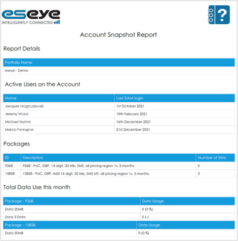
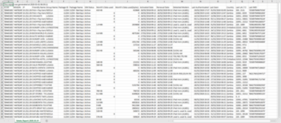
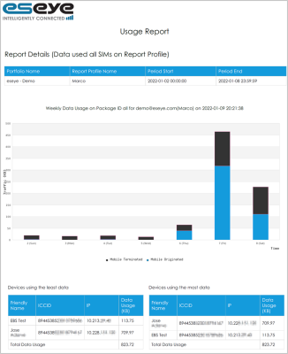
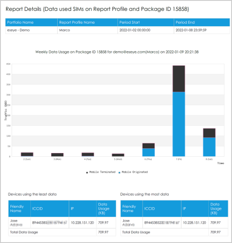
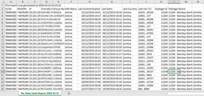
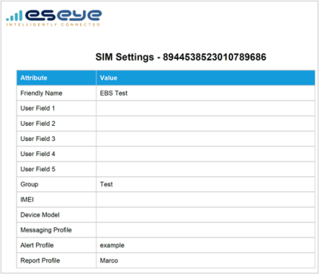
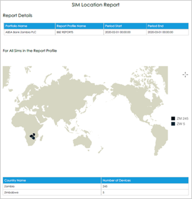

# Estate reports

The following estate reports help you administer your current SIM card estate, giving you a breakdown of individual SIM card usage and details, as well as contract terms, network changes, and SIM card status, authentication, and location information:

* [Account snapshot report](estate-reports.md#account-snapshot-report-pdf)
* [Estate report](estate-reports.md#estate-report-csv)
* [Group usage report](estate-reports.md#group-usage-report-pdf)
* [No data used report](estate-reports.md#no-data-used-report-csv)
* [SIM settings report](estate-reports.md#sim-settings-report-pdf-csv)
* [SIM location report](estate-reports.md#sim-location-report-pdf)

## Account Snapshot Report (PDF)

Lists portfolio details, including active users, current packages, total data usage. This report gives you a broad understanding of the data your SIM card estate consumes, and who is accessing the estate.

To generate the report in Infinity Classic:

* See Creating report profiles.

To find the report in Infinity Classic:

1. From the menu, select Activity > Reports to display the Reports page.
2. Alongside Account Snapshot Report, select .

## Estate Report (CSV)

Reports details about each SIM card in the portfolio estate, including current status, data usage in the last month, last authenticated, country, last IMEI.

This report is helpful for tracking and managing individual SIM cards. Use the CSV file to analyse your data usage and examine trends.

To generate the report in Infinity Classic:

* See Creating report profiles.

To find the report in Infinity Classic:

1. From the menu, select Activity > Reports to display the Reports page.
2. Alongside Estate Report, select .

## Group Usage Report (PDF)

Graph displaying daily data usage across all SIM cards, showing devices using the least data and devices using the most data.

This graph can help you analyse your data and troubleshoot changes in data usage.

Reports are generated for all SIMs (above) or for SIMs on specific packages (below).

To generate the report in Infinity Classic:

* See Creating report profiles.

To find the report in Infinity Classic:

1. From the menu, select Activity > Reports to display the Reports page.
2. Alongside Group Usage Report, select .

## No Data Used Report (CSV)

Details the ICCID and MSIDSN of active devices that have not used any data in the past month, including SIM status and where the device was last seen. This report helps you to troubleshoot device issues, or understand device usage, which can inform your decisions about the device.

To generate the report in Infinity Classic:

* See Creating report profiles.

To find the report in Infinity Classic:

1. From the menu, select Activity > Reports to display the Reports page.
2. Alongside No Data Used Report, select .

## SIM Settings Report (PDF, CSV)

Contains general information about an individual SIM card, including friendly name, users, IMEI, Alert Profile and Report Profile. This can feed into the administration and change management of the individual SIM cards.

To find and generate the report in Infinity Classic:

1. From the menu, select SIMs > SIM List.
2. Alongside a SIM card, select  to display the Settings page.
3. To download the information in a particular format, select either:  or .

## SIM Location Report (PDF)

World graphic displaying number of devices per country for all SIM cards in your estate. This visual representation helps you to understand the geographic spread of your SIM card estate, which may help you plan for expansion into other countries, or within a specific country.

To generate the report in Infinity Classic:

* See Creating report profiles.

To find the report in Infinity Classic:

1. From the menu, select Activity > Reports to display the Reports page.
2. Alongside SIM Location Report, select .
