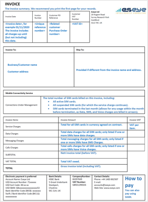
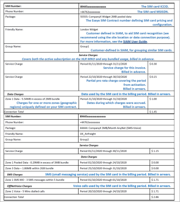
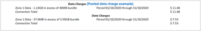
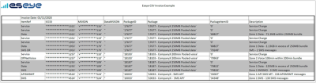
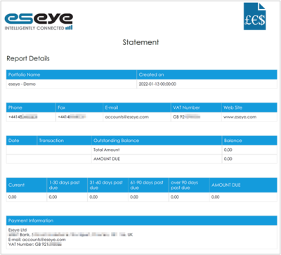
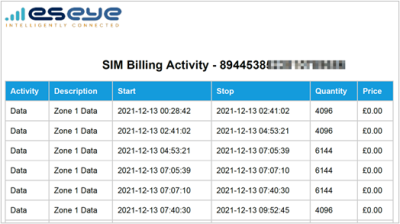
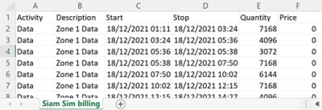
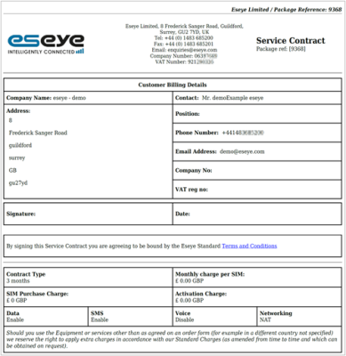
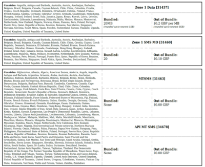

# Finance reports

The following finance reports help you to understand your agreed contract and current costs across your entire SIM card estate, or per SIM card:

* [Summary invoice](finance-reports.md#summary-invoice-pdf)
* [Detailed invoice](finance-reports.md#detailed-invoice-csv)
* [Account statement report](finance-reports.md#account-statement-report-pdf)
* [SMS billing activity](finance-reports.md#sms-billing-activity-pdf-csv)
* [Service contract](finance-reports.md#service-contract-pdf)

## Summary Invoice (PDF)

Billing overview for your SIM card estate. The amount owing is summarised on the first page of this report and the total (including VAT) is listed under the TOTAL field. You may want to print the first page (shown below) financial overview to keep on record.

The Eseye-specific payment information is also provided on the first page.

If the estate is under 1000 SIMs, a list of individual SIM card costs is summarised in the PDF. If the estate is over 1000 SIM cards, these records are not provided in the PDF. Use the Detailed Invoice to view the individual SIM card records instead, and to see more details about each SIM card.

If pooled usage is applied to the current invoice, the section below is also displayed in the billing report. Data, SMS, or Voice charges are listed if the usage is in excess of the pooled allowance. You can see further details in the CSV file (detailed invoice), for example: which package the charge was made against.

To generate the report:

* Automatically generated by Eseye.

To find the report in Infinity Classic:

1. From the menu, select Finance > Transactions to display the Transactions page.
2. Alongside Invoice, select .

## Detailed Invoice (CSV)

Detailed billing invoice for your SIM card estate, reporting accounts for each ICCID with details including charge type (Data, SMS, or Voice), charge amount in a chosen currency, charge period, activation, current MCC.

Use this file to analyse your data usage and examine trends.

The detailed invoice CSV contains the following fields: Invoice date, Item reference, ICCID, MSISDN, Data MSISDN, Package ID, Package, Package item ID, Description, Start, Stop, Quantity, Currency, Rate, Amount, Friendly name, Group name, Activated, Bundle quantity, In bundle quantity and MCC.

To generate the report:

* Automatically generated by Eseye.

To find the report in Infinity Classic:

1. From the menu, select Finance > Transactions to display the Transactions page.
2. Alongside Invoice, select .

## Account Statement Report (PDF)

Billing statement that enables you to quickly see any outstanding balance owed to Eseye. Your connectivity will cease functioning when bills are unpaid.

To generate the report in Infinity Classic:

1. From the menu, select Account > Reports to display the Account Reports page.
2. Select the Enable checkbox for each report you want to generate.
3. Select Run Now to generate the report.

To find the report in Infinity Classic:

1. In Infinity Classic, select Activity > Reports to display the Reports page.
2. Alongside Account Statement Report, select .

## SMS Billing Activity (PDF, CSV)

Displays Data, SMS, and Voice activity for an individual SIM, including start and stop date time stamps, usage quantity and cost information.

Use the CSV file to analyse your data usage and examine trends.

To find and generate the report in Infinity Classic:

1. From the menu, select SIMs > SIM List to display the SIM List page.
2. Alongside a SIM card, select  to display the Billing page.
3. To download the information in a particular format, select either:  or  .

## Service Contract (PDF)

Your service contract with Eseye contains agreed costs per SIM card, such as monthly charge, purchase charge, activation charge, and networking type.

The terms also include your designated countries for Zones 1, 2 and 3, and the costs for bundled and out of bundle usage for Data, SMS, and Voice, as well as contract length.

To find the document in Infinity Classic:

1. From the menu, select Settings > SIM Packages to display the SIM Packages page.
2. Alongside the Package ID, select .
