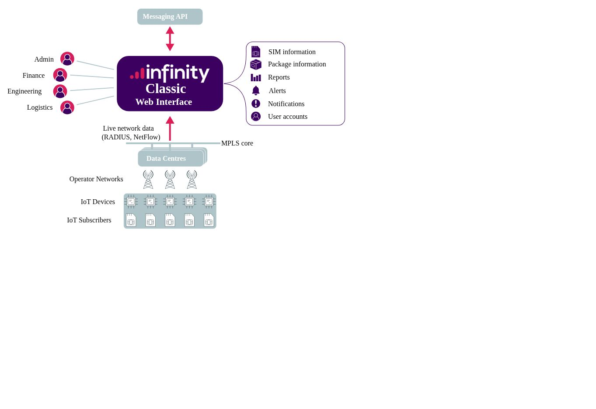
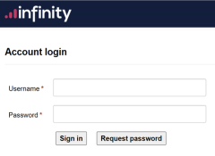

# About Infinity Classic

The Infinity Classic web interface enables users to manage SIM and account information. It contains all of the information about your SIM estate and pulls live network data for your subscribers via [Eseye's localised data centres](https://docs.eseye.com/Content/Connectivity/UnderstandingPoPs.htm).

The Infinity Classic web interface enables you to:

* Manage users and accounts
* Order, activate, suspend and terminate SIMs.
* Configure alerts to trigger on different threshold events (such as data usage or overage values) and take different actions (such as notifying users or suspending a SIM)
* View the connection and data flow metrics for individual SIMs
* Configure ad hoc or scheduled reports for areas such as finance, data usage, and lifecycle
* Manage SIMs (suspending, terminating, re-activating)
* Raise support tickets
* Display SIM Timelines

## Menus

The Infinity Classic user interface is organised into the following menus:

* SIMs – activate, suspend, terminate SIMs and manage SIM information.
* Settings – configure SIM packages, alert profiles, reporting profiles, devices and the messaging API.
* Activity – configure notifications, alerts, reports and the messaging API.
* Admin – configure users, referral codes and sub accounts.
* Finance – view and edit finance settings, billing details and account transactions.
* Ordering – order new SIMs and manage order history and delivery addresses.
* Support – raise, view, edit and close support tickets.
* Account – view account-specific details, notifications, reports, alerts and audit logs.

Some menus are hidden based on user roles.

## Accessing Infinity Classic

After purchasing Eseye SIMs and signing up for a Infinity Classic account, Eseye sends a verification email with the following details:

* From: support@eseye.com
* Subject: Your Eseye SIM management account
* Body: Contains an account verification link

Before you can log in, you must verify the account via the link in the email.

To log in to Infinity Classic:

1. Navigate to the following URL: [https://siam.eseye.com/user/login/](https://siam.eseye.com/user/login/)
2. Enter you supplied username and password and select Sign In. 
3. If two factor authentication is enabled for your portfolio, specify an authentication code and select Submit. 

To log out of Infinity Classic:

From the menu, select Logout.

To reset your Infinity Classic password:

1. Navigate to the following URL: [https://siam.eseye.com/user/login/](https://siam.eseye.com/user/login/)
2. Select Request password.
3. Specify your Username or Email address and select Reset Password. Support sends an email address with a link to reset your password.
4. Select the link in the Password Reset email.
5. Specify a new password and select Set new password.

To change your password in Infinity Classic:

1. Log in to Infinity Classic then go to: > Details.
2. Select Change Password.
3. In the Change Password dialog box, type your Current Password.
4. Type a New Password.
5. Alongside Confirm New Password, type the new password again.
6. Select Update to save your changes.
