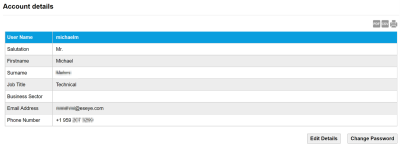
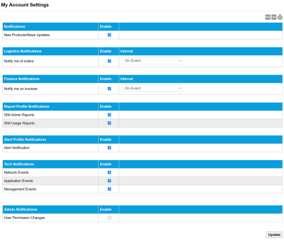
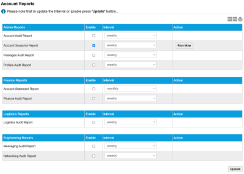
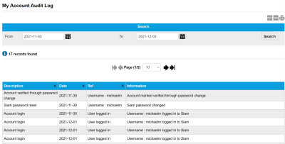

# Account settings and audit log

The Account menu provides the following menus which enable you to view and edit information specific to your user account:

* [Account Details page](account-settings-and-audit-log.md#account-details-page)
* [Notifications (My Account Settings) page](account-settings-and-audit-log.md#notifications-my-account-settings-page)
* [Account Reports page](account-settings-and-audit-log.md#account-reports-page)
* [Account Audit Log page](account-settings-and-audit-log.md#account-audit-log-page)
* Logout – logs the current user out of the Infinity Classic portal.

## Account Details page

The Account Details page enables you to view and edit your user details and password.

Select the export to PDF (), export to CSV () or print () buttons to export or print the information displayed on the page.

The following table describes the fields displayed on the account details page.

| Field           | Description                                                                                                                                                                                 |
| --------------- | ------------------------------------------------------------------------------------------------------------------------------------------------------------------------------------------- |
| User Name       | The username used to log in to the Infinity Classic portal. Must be between 6 and 32 characters in length, and should contain only letters, digits, '-', '\_', or be a valid email address. |
| Firstname       | First name of the user. Must be at least two characters long.                                                                                                                               |
| Surname         | Surname of the user. Must be at least two characters long.                                                                                                                                  |
| Job Title       | The job title of the user. This is useful to identify their required user privileges.                                                                                                       |
| Business Sector | Description of the business sector in which the user's company operates.                                                                                                                    |
| Email Address   | The email address for the user.                                                                                                                                                             |
| Phone Number    | A contact number for the user.                                                                                                                                                              |
| Edit Details    | Select to edit your user account details.                                                                                                                                                   |
| Change Password | Select to change your password.                                                                                                                                                             |

## Notifications (My Account Settings) page

The Notifications page configures when to notify you of certain events.

Select the export to PDF (), export to CSV () or print () buttons to export or print the information displayed on the page.

The following table describes the fields on the notifications page.

| Field         | Description                                                                                                                                                                                                                                                                                                                                                                                                                                                                                                                                                                                                                                                                                                                                                                                                                                                                                                                                                                                                                                                                                                                                                     |
| ------------- | --------------------------------------------------------------------------------------------------------------------------------------------------------------------------------------------------------------------------------------------------------------------------------------------------------------------------------------------------------------------------------------------------------------------------------------------------------------------------------------------------------------------------------------------------------------------------------------------------------------------------------------------------------------------------------------------------------------------------------------------------------------------------------------------------------------------------------------------------------------------------------------------------------------------------------------------------------------------------------------------------------------------------------------------------------------------------------------------------------------------------------------------------------------- |
| Notifications | NotificationsNew Products/News Updates – send notification emails about new products and news updates. **Logistics Notifications** Notify me of orders – send notification emails when there is a new order on your account. **Finance Notifications** Notify me on invoices – send notification emails when there is a new invoice available for your account. **Report Profile Notifications** SIM Admin Reports – send notification emails for updated SIM admin reports. SIM Usage Reports – send notification emails for updated SIM usage reports. **Alert Profile Notification** Alert Notification – send notification emails when there is a change to the SIM Settings. **Tech Notifications** Network Events – send notification emails when there are reported network issues. Application Events – send notification emails when there are any application-related issues. For example, any issues with the Infinity Classic portal. Management Events – send notification emails when there are reported management issues. **Admin Notification** User Permission Changes – send notification emails when there are changes to user permissions. |
| Enable        | Alongside each notification, select the enable check box to trigger sending noticiations emails.                                                                                                                                                                                                                                                                                                                                                                                                                                                                                                                                                                                                                                                                                                                                                                                                                                                                                                                                                                                                                                                                |
| Interval      | For some notifications, you can select when to trigger the notification emails. Currently, only On Event is supported.                                                                                                                                                                                                                                                                                                                                                                                                                                                                                                                                                                                                                                                                                                                                                                                                                                                                                                                                                                                                                                          |
| Update        | Select to save the changes to the enabled notifications.                                                                                                                                                                                                                                                                                                                                                                                                                                                                                                                                                                                                                                                                                                                                                                                                                                                                                                                                                                                                                                                                                                        |

## Account Reports page

The Accounts Reports page enables and updates the frequency of reports.

Select the export to PDF (), export to CSV () or print () buttons to export or print the information displayed on the page.

The following table describes the fields on the Accounts Reports page.

| Field    | Description                                                                                                                                                                                                                                                                                                                                                                                                                                                                                                                                                                                                                                                                                                                                                                                                                                                                                                                                                                                                                                                                                                                                                                                                                                                                                                                                                                                                                                                                                                                                                                                                                                                                                                                                                                                                                                                                                         |
| -------- | --------------------------------------------------------------------------------------------------------------------------------------------------------------------------------------------------------------------------------------------------------------------------------------------------------------------------------------------------------------------------------------------------------------------------------------------------------------------------------------------------------------------------------------------------------------------------------------------------------------------------------------------------------------------------------------------------------------------------------------------------------------------------------------------------------------------------------------------------------------------------------------------------------------------------------------------------------------------------------------------------------------------------------------------------------------------------------------------------------------------------------------------------------------------------------------------------------------------------------------------------------------------------------------------------------------------------------------------------------------------------------------------------------------------------------------------------------------------------------------------------------------------------------------------------------------------------------------------------------------------------------------------------------------------------------------------------------------------------------------------------------------------------------------------------------------------------------------------------------------------------------------------------- |
| Report   | Displays one of the following reports: Admin Reports Account Audit Report – date and time stamps user access to the account, as well as notifications sent. Use this PDF report to track Infinity Classic access and who is responsible for received notifications. Account Snapshot Report – lists portfolio details, including active users, current packages, total data usage. This report gives you a broad understanding of the data your SIM card estate consumes, and who is accessing the estate. Packages Audit Report – date and time stamps when a signed Service Contract form is uploaded on a SIM Package, and the user responsible for the change. Profiles Audit Report – date and time stamps user activity on the Reporting Profile, such as when a new profile is created or edited. Finance Reports Account Statement Report – billing statement that enables you to quickly see any outstanding balance owed to Eseye. Your connectivity will cease functioning when bills are unpaid. Finance Audit Report – date and time stamps user changes to billing information, such as password and address updates, or payment method approval and so on. Logistics Reports Logistics Audit Report – date and time stamps user activity on an order, such as when the order is placed, shipping prepared, or dispatched. Engineering Reports Messaging Audit Report – date and time stamps user activity on the SMS API or against an individual SIM card, such as password and MO POST URL changes. Networking Audit Report – details network changes, such as assigned IP addresses. This report gives system administrators visibility of network changes to help assess the impact of those changes on devices. For information about reports, see [8680 Available Reports Overview (PDF)](https://docs.eseye.com/Content/Resources/Files/8680-Available-Reports-Overview.pdf). |
| Enable   | Select to enable the report generation.                                                                                                                                                                                                                                                                                                                                                                                                                                                                                                                                                                                                                                                                                                                                                                                                                                                                                                                                                                                                                                                                                                                                                                                                                                                                                                                                                                                                                                                                                                                                                                                                                                                                                                                                                                                                                                                             |
| Interval | Specify the frequency of report generation: Daily, Weekly or Monthly.                                                                                                                                                                                                                                                                                                                                                                                                                                                                                                                                                                                                                                                                                                                                                                                                                                                                                                                                                                                                                                                                                                                                                                                                                                                                                                                                                                                                                                                                                                                                                                                                                                                                                                                                                                                                                               |
| Action   | Select Run Now to generate the report.                                                                                                                                                                                                                                                                                                                                                                                                                                                                                                                                                                                                                                                                                                                                                                                                                                                                                                                                                                                                                                                                                                                                                                                                                                                                                                                                                                                                                                                                                                                                                                                                                                                                                                                                                                                                                                                              |
| Update   | Select to save the changes.                                                                                                                                                                                                                                                                                                                                                                                                                                                                                                                                                                                                                                                                                                                                                                                                                                                                                                                                                                                                                                                                                                                                                                                                                                                                                                                                                                                                                                                                                                                                                                                                                                                                                                                                                                                                                                                                         |

## Account Audit Log page

The Account Audit Log page enables you to search for all changes made on the Account menu.

Select the export to PDF (), export to CSV () or print () buttons to export or print the information displayed on the page.

### Search

Filter the list of account audit log records between the From and To dates.

Select the calendar icon () to display a calendar from which you can select the required date.

Select Search to update the records in the results table.

### Results

**Viewing more results**

Some pages return results in a continuous list. Select View More at the end of the list to see more items.

The following table lists the fields in the results table on the account audit log page.

| Field       | Description                                 |
| ----------- | ------------------------------------------- |
| Description | The account event or change.                |
| Date        | The date (YY-MM-DD) of the audit log event. |
| Ref         | The user action or username of the account. |
| Information | Detailed description about the change made. |
