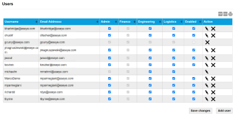
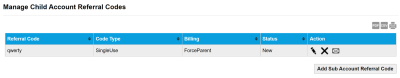
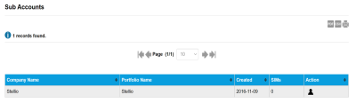
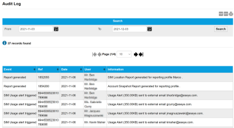

# Administration reference

The Admin menu provides management of user accounts and sub-accounts using the following sub-menu options:

* [Users page](administration-reference.md#users-page)
* [Referral Codes page](administration-reference.md#referral-codes-page)
* [Sub Accounts page](administration-reference.md#sub-accounts-page)
* [Audit Log page](administration-reference.md#audit-log-page)

## Users page

The Users page lists the users for this account and their user role privileges.

Select the export to PDF (), export to CSV () or print () buttons to export or print the information displayed on the page.

The following table describes the fields on the Users Page.

| Field         | Description                                                                                                                                                                                                                                                                                                                                                        |
| ------------- | ------------------------------------------------------------------------------------------------------------------------------------------------------------------------------------------------------------------------------------------------------------------------------------------------------------------------------------------------------------------ |
| Username      | The username used to log in to the Infinity Classic portal. Must be between 6 and 32 characters in length, and should contain only letters, digits, '-', '\_', or be a valid email address.                                                                                                                                                                        |
| Email Address | The email address for the user.                                                                                                                                                                                                                                                                                                                                    |
| Admin         | Select to give this user Admin user role privileges.                                                                                                                                                                                                                                                                                                               |
| Finance       | Select to give this user Finance user role privileges.                                                                                                                                                                                                                                                                                                             |
| Engineering   | Select to give this user Engineering user role privileges.                                                                                                                                                                                                                                                                                                         |
| Logistics     | Select to give this user Logistics user role privileges.                                                                                                                                                                                                                                                                                                           |
| Enabled       | Enable or disable the user's Infinity Classic account.                                                                                                                                                                                                                                                                                                             |
| Action        |  – edit  – delete  – email two factor authentication QR code to user. This icon indicates that two factor authentication is enabled for all users of this portfolio. |
| Save changes  | Select to save the changes to the user privileges.                                                                                                                                                                                                                                                                                                                 |
| Add user      | Select to display the Add User Details dialog where you can add information for a new Infinity Classic user.                                                                                                                                                                                                                                                       |

### Add/Edit User Details dialog

The Add/Edit User Details dialog lets you add or edit user details.

The following table describes the fields on the User Details dialog.

| Field           | Description                                                                                                                                                                                 |
| --------------- | ------------------------------------------------------------------------------------------------------------------------------------------------------------------------------------------- |
| Username        | The username used to log in to the Infinity Classic portal. Must be between 6 and 32 characters in length, and should contain only letters, digits, '-', '\_', or be a valid email address. |
| Email Address   | The email address for the user. This email address will be used to verify the user before they can log in to Infinity Classic.                                                              |
| Password        | The Infinity Classic login password for this user. Must be a minimum of 6 characters, and contain at least one lower case letter, one upper case letter, and a numeric digit.               |
| Salutation      | Salutation for the user. Choose between: Mr, Mrs, Dr, Ms, Miss, Sir or Prof.                                                                                                                |
| Firstname       | First name of the user. Must be at least two characters long.                                                                                                                               |
| Surname         | Surname of the user. Must be at least two characters long.                                                                                                                                  |
| Job Title       | The job title of the user. This is useful to identify their required user privileges.                                                                                                       |
| Phone Number    | A contact number for the user.                                                                                                                                                              |
| User privileges | Select which user role(s) to provide to this user: Admin, Finance, Logistics, Engineering.                                                                                                  |
| Save            | Select to save the changes.                                                                                                                                                                 |

## Referral Codes page

The Referral Codes page is where you create unique referral codes that you can send to [create new users](manage-user-access/) on this account. A referral code is a code or password you create to give a user access to a sub-account.

We recommend a secure password of a mixture of characters.

The following table describes the fields on the referral codes page.

| Field                         | Description                                                                                                                                                                                                                                                                                                                                                                                                                                                                                           |
| ----------------------------- | ----------------------------------------------------------------------------------------------------------------------------------------------------------------------------------------------------------------------------------------------------------------------------------------------------------------------------------------------------------------------------------------------------------------------------------------------------------------------------------------------------- |
| Referral Code                 | Specify a unique referral code, at least six characters in length, to send to the user.                                                                                                                                                                                                                                                                                                                                                                                                               |
| Code Type                     | Specify one of the following referral code types to send to the user: Single Use – creates a code for a sub account that can only be used once. Perpetual – creates a reusable code for sub accounts. Tie – creates a new user on your account.                                                                                                                                                                                                                                                       |
| Billing                       | Specify whether to add the user, who will be sent this referral code, to the Parent account or a Sub Account.                                                                                                                                                                                                                                                                                                                                                                                         |
| Status                        | Displays New for newly created referral codes.                                                                                                                                                                                                                                                                                                                                                                                                                                                        |
| Action                        |  – edit the referral code information (Referral Code, Type and Billing fields).  – delete the referral code.  – specify one or more email addresses to which to send the referral code. When specifying a list of email addresses, use commas (,) or semi-colons (;) to separate the email addresses. |
| Add Sub Account Referral Code | Select to add a new referral code by specifying the Referral Code, Type and Billing fields and selecting Create.                                                                                                                                                                                                                                                                                                                                                                                      |

## Sub Accounts page

The Sub Accounts page enables you to view and log in to Infinity Classic sub accounts.

The following table describes the fields on the sub accounts page.

| Field          | Description                                                                                                                                                                                                                                                                                         |
| -------------- | --------------------------------------------------------------------------------------------------------------------------------------------------------------------------------------------------------------------------------------------------------------------------------------------------- |
| Company Name   | The name of the company for which the user works.                                                                                                                                                                                                                                                   |
| Portfolio Name | The name of the portfolio assigned to the user.                                                                                                                                                                                                                                                     |
| Created        | The date on which the sub account was created. The date format is: YYYY-MM-DD.                                                                                                                                                                                                                      |
| SIMs           | The number of SIMs assigned to this sub account.                                                                                                                                                                                                                                                    |
| Action         |  – select to log in as the sub account, which only has access to the SIMs menu, Settings menu, Activity menu, Admin menu and Support menu menus. Logging in on a sub account will automatically log you out of your current account. |

## Audit Log page

The Audit Log page enables you to search for all changes made on the Admin menu options.

Select the export to PDF (), export to CSV () or print () buttons to export or print the information displayed on the page.

### Search

Filter the list of audit log records between the From and To dates.

Select the calendar icon () to display a calendar from which you can select the required date.

Select Search to update the records in the results table.

### Results

**Viewing more results**

Some pages return results in a continuous list. Select View More at the end of the list to see more items.

The following table lists the fields in the results table on the audit log page.

| Field       | Description                                                                                              |
| ----------- | -------------------------------------------------------------------------------------------------------- |
| Event       | Description of the admin event or change.                                                                |
| Ref         | A reference number for the event. Typically it's the ICCID of the SIM on which the user made the change. |
| Date        | The date (YY-MM-DD) of the audit log event.                                                              |
| User        | The name of the user that made the change.                                                               |
| Information | Detailed description about the change made.                                                              |
